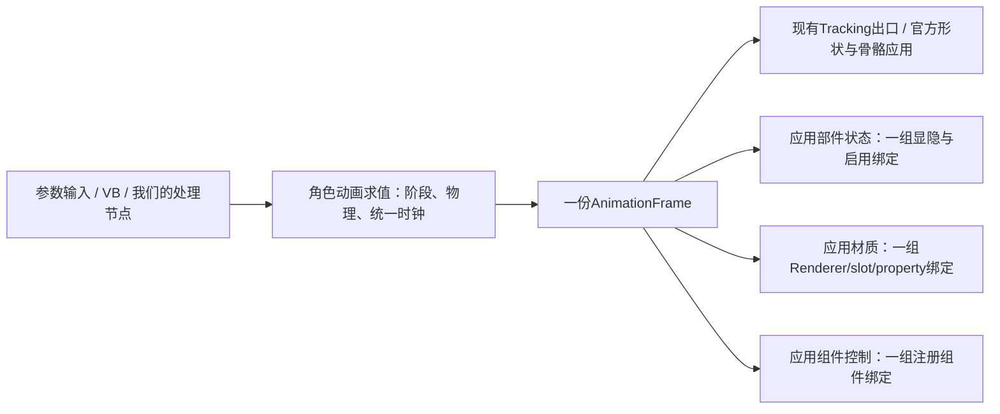

# 控制器求值的完整输出：属性、语义参数与物理阶段

日期：2026-09-25。针对“把复杂演出逻辑在Unity控制器里制作，再送进Warudo”的能力边界调查与方案。
**本轮做了独立Unity实验、修正文档；没有修改另一工程正在定型的Warudo节点，也没有实现下述扩展。**

## 1. 结论与必要纠正

**可以把当前求解node扩展成控制器求值节点，并增加按属性类别批量应用的节点。**
形态键/骨骼只是目前采集和输出的范围，不是Unity Animator的能力上限。

必须纠正旧文档的一条错误：**Unity原生支持动画曲线驱动Animator float参数，不是VRChat专属。**
本轮用普通`.anim`、`AnimatorController`，绑定`path="" / type=Animator / propertyName="Derived"`直接验证。
这不表示一个Animator的多个Layer会在同一次求值里像数据流节点一样按顺序相互供值。
[Unity参数曲线说明](https://docs.unity3d.com/2021.3/Documentation/Manual/AnimationCurvesOnImportedClips.html)

## 2. Warudo / Animancer约束的精确定义

用户提醒运行中角色可能被禁用Animator，这个限制必须覆盖。我们不接管、也不强制启用角色本体的Animator。
本仓库之前的实机记录实际是`Animator.enabled=True`、`runtimeAnimatorController=null`，由Warudo/Animancer负责角色动画；因此“Animancer存在”不等于“Animator组件一定禁用”。
Animancer仍利用Animator组件，其官方也支持以Playable等方式使用控制器。[Animancer组件](https://kybernetik.com.au/animancer/docs/manual/playing/inspector/)、[控制器支持](https://kybernetik.com.au/animancer/docs/manual/animator-controllers/)

**稳定前提是：角色的动画调度归Warudo；我们在独立求值rig上运行自己的控制器。**
最后通过宿主的应用节点/组件适配器把采样结果写入真实角色。这同时兼容本体Animator为enabled、disabled或没有Controller的情况；仍需正确处理与宿主输出的执行顺序和所有权。

当前Warudo实现已采用独立rig。2026-09-25读取的源码：
`D:/Unity_Project/BreakWarudo/Assets/HoWarudoModTests/Mods-Ho/HoFaceTracking/Core/HoFaceController.cs`。
它加载bundle内原配rig，在`Solve`中设置参数、`Update(0)`、读取形状及骨骼；头/根位置另由保留参数装配。
所以“输出通道窄”和“时间不主动推进”都属于当前实现选择。

## 3. 本轮实测结果

环境：**Unity 2021.3.45f2**（与Warudo Mod工程一致）和 **Unity 6000.3.15f1**（本包调试环境）。
各自独立的一次性工程，普通Unity组件，不加载Warudo、Animancer或VRC SDK。
除版本行外，两份59行结果逐行一致；数值/时序检查通过。

| 能力 | 实验 | 结果与实际意义 |
| --- | --- | --- |
| **曲线写Animator参数** | 输入P混合两个叶子，叶子把Derived分别写0/1 | P=.75时`GetFloat(Derived)=.75`，`IsParameterControlledByCurve=True` |
| **参数驱动下一Layer** | Layer0写Derived，Layer1用Derived控制另一个树 | P从.25变.75，第一次求值下游仍25，第二次才75；本实验为**一轮求值延迟** |
| **脚本float字段** | strength端点0/10 | P=.75得到7.5 |
| **脚本bool/int** | 端点0/1、0/10 | P=.25时bool为true、int为3；P=.75时int为8；这里使用FloatCurve绑定 |
| **Vector/Color字段** | vector.x端点0/2、tint.r端点0/1 | P=.75得到1.5与.75 |
| **部件/Renderer开关** | `GameObject.m_IsActive`、`Renderer.m_Enabled` | P=0关，P=.1已开；本实验不是以.5作为阈值 |
| **材质float/color** | `_ProbeFloat`端点0/4、`_Color.r`端点0/1 | P=.75时Renderer级MPB读到3、.75；sharedMaterial仍是原值0 |
| **材质对象替换** | object-reference curve在t=.5切材质 | t=0是MaterialA，t=.6是MaterialB |
| **手动求值已禁用Animator** | 独立rig保持active，Animator.enabled=false | `Animator.Update`在两个版本仍能求值；这不证明禁用整个rig也能求值 |
| **时间推进** | 0→1的一秒动画 | 连续`Update(0)`不前进；两次`Update(.1)`得到.2 |
| **显式同帧阶段** | A求值→GetFloat→B.SetFloat→B求值 | 输入.25/.75/.1，当次下游分别25/75/10，没有帧间等待 |

上述是**编辑器内batchmode/nographics实验**，验证引擎求值与可读属性，不是Warudo进程里的全链路验收，也不包含最终画面质量、所有Shader、所有Rig类型和所有Layer组合。
“一轮求值延迟”是本实验的具体结果，不应扩大成所有Controller/Playables组合的时序保证。

材料：`.research/controller-capabilities/Unity2021`、`Unity6`；结果各在`capability-results.txt`。
复核脚本`verify_results.py`及`verification.json`在上一级。实验工程和生成资产均在gitignore目录中。

## 4. 三种“内部语义”要区别

| 用户希望消费的值 | 是否已经存在 | 正确的接口 |
| --- | --- | --- |
| 混合树的输入轴，如Lid、Smile、Funnel | 它本来就是Animator参数 | 已经可直接读/转发，不必再让一层动画“生成一次同名值” |
| 根据姿势混合产生的新量，如JellyStrength、JellyDrive | 需要作者定义输出 | 叶子写Animator float曲线，或写可动画的代理组件字段；求值后采集 |
| 果冻/摆锤求解后的量 | 需要速度、位移、历史状态及dt | 由物理求解器积分，再作为下游阶段输入或最终属性输出 |

混合树内部的节点权重/中间姿势不自动变成公开语义信号。要供给其他组件，作者应明确添加导出参数或属性绑定。
导出参数与上游输入应有不同所有权，例如`In/*`、`Out/*`、`Physics/*`只是可选命名约定；不要每帧又从上游覆盖被曲线驱动的输出参数。
当前`HoFaceController`注释中“GetFloat只能读我们写进去的输入”也应在扩展时修正：它还可以读曲线驱动参数。

## 5. 果冻眼应该怎样解耦

**控制器完全可以给组件输出开关、强度、目标值、频率、阻尼。** 组件只消费数值，不需要认识Smile、ARKit、VTS等上游名字。
但“动画输出物理参数”与“物理积分在动画层中完成”是两件事。循环摆动动画可以制作视觉摇晃；响应实时输入、具有惯性和回弹的弹簧仍需要有状态的求解器。

最简单、无反馈的一条链：

```text
Lid / Smile 等语义
  → 控制器：JellyDrive、JellyEnabled、JellyStrength、Frequency、Damping
  → 写入果冻组件明确的输入字段
  → 果冻组件Step(dt)
  → 果冻专用形态键/Transform结果
```

本项目已有`HoFaceJelly.Step`阻尼弹簧实现；当前`HoSpringConstraint.ReadInput()`只读最终形态键，取最大值并归一化。
要实现用户希望的直接语义驱动，需为它增加**明确的数值输入模式/接口**，或用一个独立适配器喂给同一求解核心，保留原来的“读形态键”用法。
目前没有这个外部数值入口，不能仅靠把float参数命名相同便宣称已接通。

若物理结果还要经过一个姿势矩阵：

```text
阶段A：控制器生成控制量
  → 物理阶段：只积分一次，生成Physics/JellyX、Physics/JellyY
  → 阶段B：控制器/姿势图把物理量转换为最终造型
  → 应用结果
```

这可以封装在一个“角色动画求值”预设和求解node内部，Unity预览也用同一调度；用户不必把每根弹簧、每个值都拉成Warudo蓝图线。
**阶段≠Animator Layer。** 可以使用两个明确的Controller实例/求值阶段；不要靠同一个Controller反复`Update(0)`直到看起来收敛。
后者可能重复处理转换、回调、事件或反馈，且链深变化会影响需要几次求值；本轮只验证了一个简单双层场景第二次能够读到新值。
无闭环的代理组件字段写入后可以在本帧读取；需要反馈时必须明示上一帧缓冲或有向无环的多阶段安排。

## 6. 求解node建议输出什么

保留现有五个Tracking兼容出口用于接官方节点，新增一个**完整的求值帧**；旧出口是同一帧结果的投影，不各自重复求值。

概念结构（设计，不是已实现的C#类型）：

```text
AnimationFrame
  frameId / deltaTime / valid / controllerInstanceId
  blendShapes            名字或bindingId → 权重
  bonePoses              骨骼 → 旋转/位置/缩放 + 空间/偏移方式
  signals                导出语义名 → float（必要时区分bool/int）
  properties[]           bindingId + valueKind + typedValue
  events[]               可选的声明式事件及序号
```

| properties种类 | 示例 | 应用方式 |
| --- | --- | --- |
| Bool/离散开关 | 部件active、Renderer enabled、果冻开关 | 按明确布尔/离散规则写；不要擅自统一改成`.5`阈值 |
| Float/Int | JellyStrength、Frequency、组件档位 | 已注册字段/属性适配器；不是任意C#方法调用 |
| Vector/Quaternion/Color | 偏移、局部缩放、材质颜色 | 保留类型、空间与分量，不全部展成含义不明的float |
| Material属性 | renderer + material slot + shader property | 显式读取并合成MPB/材质实例；包括Renderer级与slot级差异 |
| Object引用 | 材质/贴图切换 | bundle资源ID或合法运行时资源引用；离散切换，不能把资源编号当连续量插值 |

signals是供其他阶段/系统消费的值，properties是已绑定的属性输出。二者可以同时存在：
`JellyStrength`可直接从曲线导出给应用器，也可通过代理组件采成绑定的属性值。
缺失绑定表示“本帧未声明该输出/不拥有它”，不能和“显式输出0/false”混同；切控制器、停用、换装时需要释放并按规则恢复或交还所有权。

Events与Trigger属于一次性命令，不能作为每帧Bool重复执行。任意AnimationEvent/StateMachineBehaviour带来的副作用无法仅靠采样一份属性快照完整移植。
建议首期禁用影子上的任意事件执行，仅支持声明过的事件出口；不声称支持任意控制器附带的C#逻辑、所有Humanoid IK或依赖外界物理的行为。

## 7. 要不要增加应用node

**建议增加，按输出类型批量应用，而不是按每个字段建node。**



| node/职责 | 粒度 |
| --- | --- |
| 现有形态键/骨骼/头根应用 | 沿用官方兼容口 |
| **应用部件状态** | 一次接整帧，批量处理active/renderer enable等 |
| **应用材质属性** | 一次接整帧，按renderer和slot合并提交，不是一种Shader参数一个node |
| **应用组件参数** | 一次接整帧，按已注册适配器批量写字段；含果冻等效果控制 |
| 可选应用普通Transform | 配件/非Humanoid局部TRS，不能混用骨骼“相对rest偏移”的口径 |

界面上还可以提供一个“应用角色动画结果”的组合node，在内部调用这些应用器；需要和官方逻辑混用的作者再拆开连接。
绑定清单随角色/动画rig导出，Warudo节点只选择目标角色与绑定配置，不要求重新在蓝图手拉每个字段。

**物理调度不能隐含在一个名字叫“写组件值”的node里。**
无后续阶段的真实组件物理可在明确的LateUpdate阶段运行；需要同帧回流到阶段B时，由求解器/阶段调度器显式调用一次Step。
两种模式都必须避免组件自动Update一次、宿主又Step一次。最终同一属性也要明确由谁写，防止Animancer、物理、材质控制等互相覆盖。

## 8. 怎样导出绑定而不依赖运行时反射

当前bundle里带rig+controller，但运行时不能用`UnityEditor.AnimationUtility`枚举绑定；Warudo插件沙箱也限制反射。
因此应在Unity导出时生成**绑定清单manifest**：

```text
bindingId
targetPath / componentAdapterId / componentSlot
propertyPath 或 shaderPropertyId / materialSlot
valueKind / referenceResourceId
space / absolute-or-offset / default / ownership / releasePolicy
```

导出阶段遍历`GetCurveBindings`与`GetObjectReferenceCurveBindings`，对受支持绑定分类；未知绑定明确报告，不静默漏掉。
运行时用稳定bindingId解析目标和已注册的类型访问器，不开放“任意字符串反射写任意组件”。
Unity本地也用同一份manifest和相同求值/物理调度，才保证预览与Warudo一致。

为自定义脚本提供两种实现方向：

1. 组件类型在运行时真实存在，并有已编译/注册的读写适配器。
2. 导出时把其动画字段曲线重绑到已知类型的**纯数据代理**，采样后由适配器写入真实组件。

第二种能避免在影子上运行实际果冻脚本/业务脚本，避免Awake/Update、全局注册、粒子等副作用。
但不能只重绑成float便忽略原类型：离散曲线、对象引用、Quaternion等必须保留对应求值语义。
资产bundle本身不能让宿主自动拥有任意新脚本；自定义类型及适配器需通过现有Mod脚本打包链加载，跨Mod类型身份和访问能力仍需实际验证。

材质读取尤需注意：本轮动画结果落在MPB，直接读sharedMaterial会得到旧值。应用器应按manifest中的已知属性合并目标MPB，只接管自己的属性，避免每帧替换整块MPB抹掉别人的参数。
材质引用替换或不能通过MPB表达的操作另走明确的资源/材质实例适配；不每帧克隆材质，不直接修改跨角色共享材质资产。

## 9. 时钟与预览是此次扩展的必要部分

当前Warudo`Solve`和Unity调试会话主要手动`Update(0)`，是静态姿势采样路径。
若影子Animator仍由Unity自动更新，动画时间也可能由那条隐含时钟推进；不能仅凭手动dt=0就断言当前进程所有动画都冻结。问题是时间与采样顺序没有由这次显式求值完整定义。
要支持有时间的表情动画、状态过渡、播放速度与物理，必须升级为**每帧一次的显式时钟**，并区分：

- 静态参数预览：允许dt=0重新采样。
- 正常播放：每个阶段按约定推进dt一次；物理也只积分一次。
- 暂停/跳转：控制器和物理按明确的重置/快照策略处理，不把持续播放和拖动预览混在一起。

本轮证明独立Animator组件disabled时仍可手动求值，可作为避免自动重复推进的候选方案；rig需保持active，并在Warudo内进一步验证。
也可以评估手动PlayableGraph时钟，但本轮没有以它替换现有求解器，不因更换调度顺便重写已经跑通的绑定机制。

下一步实现顺序：**先加入绑定清单与属性帧，打通显隐/组件float/材质MPB；再加入受控的内部语义导出与物理输入；需要物理回流时再支持显式多阶段。**
扩展的完整能力目标保持一致，按顺序打通是为了每步都能在Unity和Warudo用相同夹具验收。
