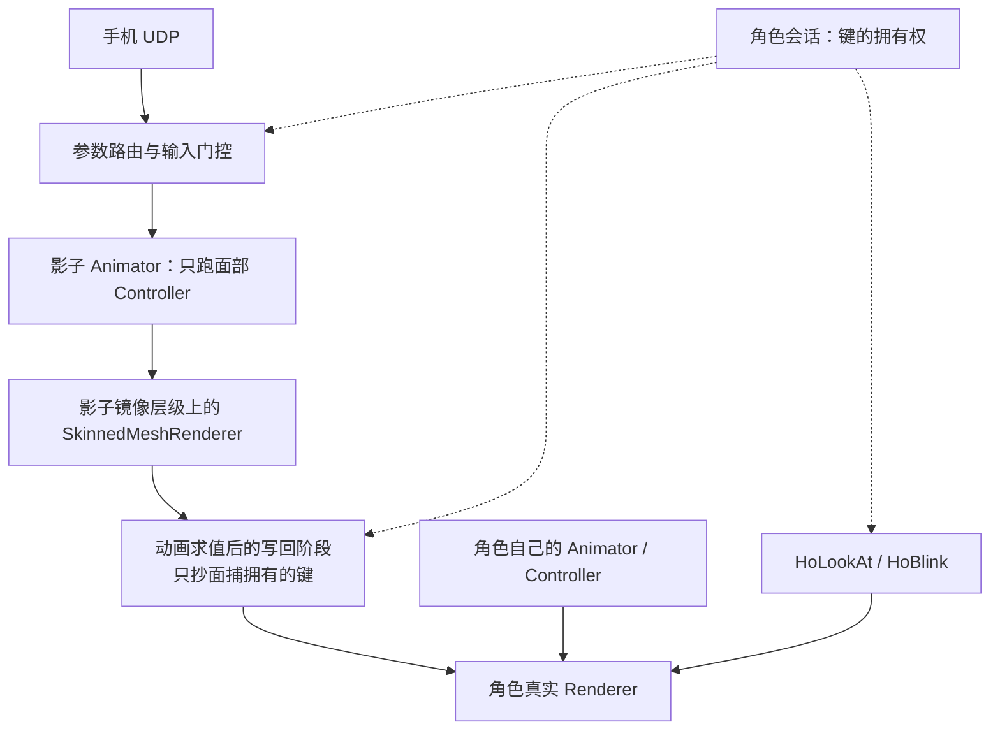

# Unity 编辑器面捕调试组件设计

日期：2026-09-22。状态：**P0–P2 已实现并在独立 Unity 工程中跑通自动化验收；P3 的挂钩已就位但未做真机与人类眼球骨骼验收；真机（手机）联调未做**。

> ## ⚠️ 架构已变更：**角色上不再挂任何组件**（目标态"裸角色预制件 + 菜单接管调试"已落地）
>
> | 以前 | 现在 |
> |---|---|
> | 角色上挂 `HoFaceTrackingDebugger`（MonoBehaviour） | **已删除**。角色预制件上零组件、零引用 |
> | 组件持有配置，并在 `Update`/`LateUpdate` 里发 tick | `HoFaceDebugSettings`（普通类，落盘成 `Assets/HoFaceDebugSettings.json`）+ `HoFaceDebugHost`（`[InitializeOnLoad]`，拥有每帧 tick） |
> | 组件 Inspector（40 KB） | 已删除，UI 并进面板 |
> | 面板三段（配置 / 参数 / 排查） | 面板四节：**对象**（调试对象 / 混合树控制器 / 配置文件对象 / 输入源 + 连接）→ **配置详情**（profile 逐行摊开）→ **参数输入**（纯调试：只看 VTS 裸值）→ **排查** |
> | 混合树装配混在组件 Inspector 里 | 独立的工具页 **`HoUnityTools/面捕/控制器编辑`**（从预置目录复制一份控制器到工程 → 就地填动画 → 重绑网格）。**面捕这套的三个入口统一收在 `HoUnityTools/面捕/` 下面**：调试面板 / 控制器编辑 / 配置文件 |
> | 输入协议：iFacialMocap + VTS | **只留 VTS**。iFacialMocap 给不出 `FaceFound`，而 Warudo 侧"丢追回中性"整条机制就靠它 |
> | profile 是 `TextAsset` | profile 是**磁盘文件路径**：Unity 侧与 Warudo 侧读的是**同一个 `.hoface.json`** |
> | 影子 Animator 靠 Unity 自己求值（Update 设参数 / LateUpdate 抄回） | 会话设完参数后自己 `shadow.Update(0f)` → **一次同步调用**里完成"设参数 → 求值 → 读值"，不再依赖回调顺序 |
>
> 所以：本文里讲**组件、组件面板分区、iFacialMocap 连接流程**的部分**都已作废**（§4.2 / §5.1 / §5.2 已就地标注）；
> **机制层仍然成立** —— 影子求值、占用表、为什么不用 PlayableGraph、门控与交还的语义（§6 / §7 / §8）。
>
> Warudo 侧的最终连线（2 个 mod / 5 个节点）见 [面捕方案总览](FACE_TRACKING_WARUDO_ROUTE.md) §2。

> **部分过期（2026-09-23）**：这份里的**机制层**（影子台、占用表、为什么不用 PlayableGraph、
> 门控与交还的语义）仍然成立；但**状态、UI 与操作流程**那部分已经变了 ——
> 现状看 [面捕工作流](FACE_TRACKING_WORKFLOW.md)（五个分区/六个动作）、
> [面捕中间层处理](FACE_TRACKING_MIDDLE_LAYER.md)（面板上那些处理项）、
> [面捕控制器结构](FACE_TRACKING_CONTROLLER_STRUCTURE.md)（控制器是作品，初始化只负责装配）。
> 果冻也已经搬出控制器，成为独立的 `HoSpringConstraint`。

> 实现与本文的差异以"第 7 节"和"第 10 节"为准。文档里保留的最初设想（用 PlayableGraph 把身体层与面部层叠起来）已被实测否掉，改为**影子求值 + 只写面捕拥有的键**，原因见 7.1。

## 1. 目标与首期决定

目标是在 Unity 编辑器中提供“全局连接面板 + 角色调试组件”：**直连 iFacialMocap 手机端**，驱动面部动画控制器，观察输入、混合树和最终形态键，能够与 HoLookAt 协作。根据本次讨论中的最新决定，首期不接 VRCFT；其调查保留为后续参考。

建议首期采用以下边界：

- **iFacialMocap UDP 直连为第一输入**，包含手动输入与少量确定性回放样例，便于没有设备时调试。输入直接保留 ARKit 语义，不绕经 VRCFT/Unified Expressions。
- **先在编辑器 Play Mode 执行动画**。非播放状态可连接、看网络数据及检查绑定；不在第一版宣称支持完整的编辑模式实时 Animator/IK 预览。
- **默认调试资产为 Animator Controller**；树是其中可选择查看的对象。提供一键生成纯 Unity ARKit 调试 Controller，免去用户手动搭 52 路树。高级的独立树预览使用临时包装 Controller。
- **核心不依赖 VRC SDK、VRCFury、Modular Avatar 或 Av3Emulator**。原版 Jerry 模板的完整运行先走原有 VRC 工具链；可选兼容后端与纯 Unity 后端分开验收。
- 首个受控配置针对 **ARKit 形态键输出 + LookAt 骨骼凝视**。不在首期重做 VRChat 全身模拟、网络同步或全部 VRC StateMachineBehaviour。
- 所有托管动画与约束通过一个角色级会话决定输入、**输出键的拥有者**和输出分工。会话**不接管角色的 Animator**（原因见 7.1）。显示组件之外的写入者时标为“未托管”，不宣称任意第三方脚本也已被控制。

### 1.1 已实现的落地形态与实测结论

| 事实 | 依据 |
| --- | --- |
| 手机直连、协议解析、52 项映射、一键生成 ARKit 控制器、角色 Inspector、全局面板 | 代码已在 `Editor/FaceTracking`、`Runtime/FaceTracking` |
| 面捕参数 → 混合树 → 形态键的链路真实可用 | 独立工程用真实 UDP 包驱动，混合树求值出 90/60/80/25/40 等预期值 |
| **不能用 `Animator.hasBoundPlayables` 判"是否被别的动画图接管"** | 实测：普通 Animator 只要挂了 Controller 它就是 `true`，会把任何正常角色误判成被 Timeline 接管 |
| **不能用 PlayableGraph 把"身体层 + 面部层"叠起来** | 实测：覆盖层会把图层自己没动的属性也写成默认值（基础动画的 `eyeLookInLeft=33` 被压成 0）；`AvatarMask` 不支持形态键，没法按属性设遮罩；改加算又会变成"基础 + 面捕"相加 |
| 改为**影子求值 + 只写拥有的键**后，上面两个问题都消失 | 实测：面捕没拥有的键保留基础动画值，身体变换动画不受影响 |
| Ho 写作器（HoBlink / LookAt 形态键）与面捕互不覆盖 | 实测：面捕拥有的键被占用后，Ho 写入与清理都不再动它；交还后基础动画接回 |

## 2. 调查依据与版本边界

本地参考代码保存在仓库 `.research/`，由根 `.gitignore` 忽略，不进入 Unity 包源码或提交。复现不依赖研究目录，以下为固定源码版本：

| 对象 | 本次依据 | 重要边界 |
| --- | --- | --- |
| HoUnityTools | `19fb1ea164c661c5d72659a6494d39c726145600` | package 声明 Unity 2021.3；无 VRC 程序集引用 |
| Jerry Templates | `14b650c9f6d18d24170e026fc84e94bc01aac48c` / 包 7.0.5 | package 声明 Unity 2022.3 |
| Av3Emulator | `e015d6c94921cabda19cfdb119c15243fb3de93f` / 包 3.4.14 | 这里是检出的源码版本，非 GitHub Releases 页版本断言 |
| VRCFT master | `6432e6a8d85fa7ec5115fc725c6abcb6dbdd4f35` | `Directory.Build.props` 声明 6.0.0.0；不能套作所有已发行版本行为 |
| VRCFT 历史发行标签 | `5.2.3.0` / `ad06f2967a2243d85ad161a397eb911522182c15` | 与 master 的 OSC 初始化、发现代码不同 |
| iFacialMocap | 官方开发者协议页 | 仅协议核对；未连接手机验证 |

GitHub 的 latest 链接本次指向 5.2.3.0，但该页明确说明此版本不再受支持并指向 Steam 分支。**不能据此称 5.2.3.0 是当前推荐版本，也不能把 master 的程序集版本当作用户安装版本。** 后续接 VRCFT 时应记录实际版本、渠道和模块；当前首期只需记录 iFacialMocap App、Unity 与模型配置。

依据：[VRCFT 发行页](https://github.com/benaclejames/VRCFaceTracking/releases/tag/5.2.3.0)、[master 版本](https://github.com/benaclejames/VRCFaceTracking/blob/6432e6a8d85fa7ec5115fc725c6abcb6dbdd4f35/Directory.Build.props)。

## 3. Av3Emulator 与 VRCFT：调查保留

这两块都是**未来后端**的调查，与首期的手机直连实现无关，已整段移入
[面捕的 OSC / VRCFT 后端：调查保留（已归档）](archive/FACE_TRACKING_OSC_BACKEND_RESEARCH.md)：
Av3Emulator 的能力清单与取舍、VRCFT 的链路、`forceRelevant`、OSCQuery 与发现过滤那些。

## 4. 输入路线：首期手机直连，VRCFT 后置

### 4.1 首期的数据路径与值域

```text
iFacialMocap UDP 文本        参数路由 / Controller             模型属性
jawOpen-60            →    ARKit/jawOpen = 0.60       →     blendShape.jawOpen = 60
mouthClose-20         →    ARKit/mouthClose = 0.20    →     blendShape.mouthClose = 20
eyeBlink_L-30         →    ARKit/eyeBlinkLeft = 0.30  →     blendShape.eyeBlinkLeft = 30
```

以上是我们拟定的纯 ARKit 线性调试预设，不是 Jerry 模板行为的简化声称。手机协议值先除以 100 得到 0..1 Controller 参数，片段以 0/100 姿势插值；不能在输入和动画两处重复放大 100 倍。`ARKit/` 是我们的参数命名约定，可在 Profile 中映射到自定义 Controller 名字。

通过显式表将 `_L/_R` 映射到 `Left/Right`，保留 `jawOpen`、`mouthClose` 等原名；不靠随意替换字符串猜全部语义。设备左/右按被追踪者自身定义，不因 Scene 镜像画面自动互换。缺失形态键、未知协议字段、支持但尚未收到的参数分别显示。

ARKit 基础预设的系数中性值为 0，输出最多 52 个模型实际存在的形态键。`eyeBlinkLeft = 0` 表示不施加闭眼形变；它与 VRCFT 的 EyeLid 开合定义不同。`jawOpen` 与 `mouthClose` 是两路独立输入，不构造互补公式。模型可能有自定义静止权重，因此允许保存“模型中性姿势”覆盖默认中性值。

原始值、标准化值、门控后值和 Controller 实值分开显示。首期预设默认不额外平滑，避免手机已有处理与 Unity 处理叠出延迟；需要时由用户开启。头姿和眼球旋转字段可监视，但默认不写 Transform，保留给 LookAt。

### 4.2 iFacialMocap 首期连接流程 —— ⛔ **已作废**

> ⛔ **整节作废**：iFacialMocap 支持**已从包里删除**（`IFacialMocapReceiver.cs` 连同它的默认源条目）。
> 原因见文首那张表 —— 它给不出 `FaceFound`，而 Warudo 侧"丢追回中性"整条机制靠它。
> 现在只剩 VTS 手机那一条请求式协议：**我们每秒向 `手机:21412` 发一次请求，它把数据发回请求的源 IP**，
> 手机那边没有"目标地址"可填。下面这段文字仅作历史保留。

```text
Unity 先监听本机 UDP 49983
    → 向手机 IP:49983 发送官方启动命令
    ← 手机返回 ARKit 形态键和姿态文本
    → 参数表确认收到数据
    → 选择角色，开始驱动动画
```

用户只需：手机与电脑位于可互通的局域网，打开 iFacialMocap → 在全局面板填手机 IP → 点“连接手机” → 看到参数变化 → 在角色组件选择 Animator 并生成/选择 ARKit Controller → 点“开始驱动”。面板显示电脑各网卡 IP 和实际收包来源，避免把手机 IP 与电脑 IP 填反。UDP 的状态以实际收包为准。

首次连接使用官方 v1 UDP 命令 `iFacialMocap_sahuasouryya9218sauhuiayeta91555dy3719`。**先绑定接收端口，再发送命令**，避免丢掉早期响应。返回目标端口为 PC 的 49983，不能因为发送 Socket 使用了临时源端口，就只在该临时端口等待回复。可复用已绑定 Socket 发送；网络实现需实测多网卡路由。

协议默认形态键格式是 `名称-数值`，各字段以 `|` 分隔；姿态使用 `=head#...`、`rightEye#...`、`leftEye#...`。v2 通过启动命令追加 `|sendDataVersion=v2` 请求 `&` 形态键分隔。首期默认 v1，解析器兼容两种，Facemotion3d 的额外值域不计入首期已支持范围。

官方描述发送约 60 FPS，热降频等情形可能降到 30 FPS；本工具只显示测得的包率，不假定固定采样率或固定网络延迟。首期一个活动手机连接，多角色共享其数据；更换手机时清掉旧来源快照，避免两台手机混流。手机桌面桥接程序可能也占用 PC 49983，面板报出绑定失败，不能静默换端口后仍承诺收到默认手机流。

“断开”首先停止本机驱动并关闭本机接收资源；官方页面给出的 TCP 停止命令不能误当作 UDP 停止命令。首期不承诺远程停止手机发送，必要时在手机停止。`lookForward` 校准命令以后可作为明确按钮，连接时不自动改用户校准。

依据：[iFacialMocap 官方通信协议](https://www.ifacialmocap.com/for-developer/)。手机侧填写电脑 IP 的替代流程需按实际 App 版本验证，首期使用上述官方 PC 发起方式。

### 4.3 VRCFT：调查保留

链路、`forceRelevant`、OSCQuery 与发现过滤那些都移入了
[面捕的 OSC / VRCFT 后端：调查保留（已归档）](archive/FACE_TRACKING_OSC_BACKEND_RESEARCH.md) §2。
一句话：**首期不接 VRCFT**；将来接的时候，别把它当成"多开一个 UDP 端口"。

## 5. 用户看到的组件与全局面板 —— ⛔ **本节已作废**

> ⛔ **§5.1 / §5.2 均作废**：角色上那个组件已经删掉了，面板也从三段变成四节。
> 现状见文首那张表，以及：
> - `Editor/FaceTracking/HoFaceTrackingWindow.cs` —— 四节面板
> - `Editor/FaceTracking/HoFaceDebugSettings.cs` / `HoFaceDebugHost.cs` —— 全局设置与宿主
> - `Editor/FaceTracking/HoFaceControllerToolWindow.cs` —— 「控制器编辑」工具页（`HoUnityTools/面捕/控制器编辑`）
>
> 下面两节只作历史保留。

### 5.1 角色组件 `HoFaceTrackingDebugger`（已删除）

挂在角色根或工具子物体上，显式选择 **Target Animator**。绑定根就是该 Animator 的 Transform；不允许随便选一个不一致的“根”而隐式更改 Unity 的绑定规则。

**面板长什么样看 [面捕工作流](FACE_TRACKING_WORKFLOW.md) §3**（五个分区：接线 / 初始化 /
控制器输出参数设置 / 参数生产 / 输入参数；栏名不带序号；折叠只有一层，每栏内部只用 box 分块）。
这里只记组件这一层的两条约定：

**驱动对象列表是必填项（2026-09-23 改）**：早先设计成"从 Clip 绑定和 Animator 根自动解析受影响对象、只把 Renderer 选择器当路径重映射的来源"，理由是"少一个必填项"。改成装配模型后**反过来**了：模板与动画文件夹里的曲线绑在**作者自己的层级**上（模板可能写 `Source/Face`、基础动画生成器按你的预制件写路径），**必须**由用户指定的网格列表来回答"这些动画写到谁身上"。于是路径重映射这一栏删掉了 —— 它做的事情被"装配时重绑"取代，而且做得更彻底（一个键可以扇出到列表里所有有这个键的网格）。

**但"不默认扫全部、缺键不创建形变、不重命名模型、不改模板与动画文件夹"这几条不变**：扫描只在"按 Animator 填充"这个**显式动作**里做一次，扫描结果摆在列表上等你删改；模板本身、以及它引用到的外部 `.anim`，一个字节都不动（要用就复制出来再改）。

### 5.2 全局面板 `HoUnityTools/面捕调试`

负责连接、设备与会话，不存角色的动画曲线绑定。界面只有三块：**配置**（手机 IPv4 + 电脑 IPv4 + 连接/断开，以及调试组件 + 开始/停止驱动）、**参数**（52 路的键名 / 模式 / 原值 / 横条 / 面捕输入）、**排查**。UDP 49983 作为协议默认值，不要求普通用户理解双向端口。手机目前手动填 IP，不宣称自动扫描发现设备。

**排版原则：平时安静，出事才响。** 面板常态只留三类东西 —— 状态胶囊、当前该点的按钮、参数读数。具体做法：

- **默认只展开"必须动手填"的那一块**（配置），参数与排查都收起；收起时摘要行仍然报关键数字（包率 / 已收到 N 路 / 驱动中），所以不展开也知道有没有在跑。
- **手机连接与角色合成一块「配置」。** 它们本来是两块，但属于同一件事 —— "把输入接到这个角色上"；拆成两块会让首次使用的人在两处来回找。
- **折叠标题栏用 `HoConstraintEditorSectionGui.DrawSectionHeader`**，也就是注视 / 跟随 / 摆锤 / 漂浮四个面板用的那一套。之前误用了眨眼面板刚迁移过去的 `HoConstraintEditorControls.Section`，两者视觉不同（渐变 + 色条 vs 纯色染底），摆在一起不一致。
- **说明文字一律进 tooltip**，不占版面。以前常驻的整段话（局域网要求、App 要前台、排查四条…）现在挂在对应控件的 tooltip 上。
- **「排查」默认收起**，但它会在**出现新问题时自己弹开一次**，之后再不和用户较劲（用户收起就是收起）。这样"正常"时它是安静的，"出事"时它主动出现。
- **`HelpBox` 只用于真问题**（端口占用、socket 异常、绑定缺失），而且**不受折叠状态影响**——收起"配置"时错误照样显示，真问题不能被折叠藏起来。操作结果（例如防火墙授权成功/失败）用一行小字，不用框。
- 参数表从「一路三行」压成**一路一行**：52 路以前是一面两三百行的墙。

当前实现的状态字面量是：**已停止 / 等待响应 / 接收中 / 已断流**，外加端口占用与接收异常的错误框。「无匹配参数」「暂停驱动」是后续要补的（暂停驱动与断开是两件事，现在只有断开）。基础协议未给出明确的人脸有效标志时，不根据全零表情声称「未检测到人脸」。UDP Socket 已打开不叫「设备已连接」。面板与 Inspector 各自按约 10 Hz 刷新，动画按 Unity 帧率执行，不因每个 UDP 包 Repaint。

角色 Inspector 用同一套排版：标题行带状态胶囊（驱动中 / 播放中），五个分区见
[面捕工作流](FACE_TRACKING_WORKFLOW.md) §3，通道压成一路一行、模式用带 tooltip 的下拉。
组件上必须直接填的字段（Animator、混合树模板、动画文件夹、驱动对象）不放进折叠。

手机 IP 等本机连接设置放 `UserSettings/HoUnityTools/...`，角色映射 Profile 作为项目资产共享。一个端口只由全局服务打开一次，多个角色订阅同一来源；每个角色只允许一个活动驱动会话，防止多个窗口反复接管同一 Animator。

**「等待手机响应」必须会自己解释原因。** 这句话底下其实是三种完全不同的故障，混着显示会把排查引向错方向：手机根本没发、包在电脑这一侧被丢了、或者包来了但来源 IP 对不上被我们拒了。所以：

- 来源不符时直接说「收到了来自 X 的 N 个包，但和你填的 Y 不一致」，并把 X 报出来 —— 这是填错 IP 时最直接的线索（接收器因此会记录被拒包的来源地址）。
- 监听超过 3 秒一个包都没来、且没有来源不符的证据，就按「手机 → 电脑」这一侧排查：优先指向下面的防火墙按钮（网络被判为「公用」时，针对 `Unity.exe` 的入站「阻止」规则会把手机的 UDP 回包直接丢掉，而「阻止」优先于「允许」），再检查网段是否真的同 /24、以及手机 App 里填的 PC IP。

这两条来自一次真实故障：端口的的确确在监听、握手命令也发出去了，但网络被判为「公用」，防火墙里那条 `Unity <版本> Editor` 的入站阻止规则让回包根本到不了 socket，面板却一直只显示「等待手机响应」。

**防火墙权限做成面板上的按钮（Windows）。** 手机的 UDP 回包是入站流量，而 Windows 防火墙按**程序**放行，所以「Unity.exe 有没有入站许可」直接决定能不能连通。实测过一台机器：`Warudo.exe` 有一条覆盖 Domain/Private/Public 的入站允许规则，而同机的 `Unity.exe` 只有 Domain 允许 + Public 阻止 —— 同一个手机、同一个端口，Warudo 通、Unity 不通。

按钮能做和不能做的事必须说清楚：

- **不能**静默改：改防火墙需要管理员，Unity 编辑器通常是普通权限进程。按钮的作用是「把命令写对 + 把 UAC 叫出来」，用户要在系统弹窗里点「是」。这个边界绕不过去，也不该绕过去。
- 规则范围收窄到「指定 exe + UDP 49983」，并且提供「撤销」。比直接开一个端口安全，也比让人去翻防火墙界面直观。
- **必须同时做两件事**：先按程序路径禁用该 exe 的入站「阻止」规则，再加允许规则。因为「阻止」优先于「允许」，只加允许完全无效。
- 提权走 `powershell -EncodedCommand`（base64），不拼命令行字符串 —— exe 路径带空格和括号，拼字符串在各种引号转义下迟早出错。

这里踩过一个坑值得记下（**已收进 [踩过的坑 · Warudo 打包与工具链](pitfalls/BUILD_AND_TOOLING.md) §8**）：
把 `-Direction`/`-Action` 和 `-AssociatedNetFirewallApplicationFilter` 写在同一条 `Get-NetFirewallRule` 上，
在 `-EncodedCommand` 下会 `ParameterBindingException`（而 `-File` 模式下会被 `-ErrorAction SilentlyContinue` 掩盖，
看起来像是成功了）。所以脚本改成只按程序筛规则、方向和动作在客户端判断。
**验证方式是不提权跑同一段脚本：它应该停在 `New-NetFirewallRule` 的「拒绝访问」，而不是停在参数绑定上。**

## 6. 两级门控：参数选择与最终输出权限

### 6.1 输入门控

| 模式 | 语义 |
| --- | --- |
| 实时 | 使用当前来源数据，可进行显式缩放、限幅和可选平滑 |
| 手动 | 使用调试滑杆；网络数据仍可观察但不覆盖滑杆 |
| 保持 | 保持进入该模式时的值；这是冻结，不是释放控制权 |
| 中性 | 写 Profile 定义的中性值，不是统一写 0 |
| 交还 | 撤销本来源对该参数的拥有权，转给明确定义的其他来源或默认值 |

输入使能、最终输出使能与整套会话权重分开。首期为眼睑与眼球方向提供各自开关。未来接 VRCFT 时，`EyeTrackingActive` / `LipTrackingActive` 等设备状态也不能作为所有眼部/嘴部权限的万能开关。

入站值与有效值分开保存；关闭再开启实时输入时按当前数据接续，不重放队列中的旧值。非有限浮点数、类型不匹配、重复映射冲突应显示并拒绝或依规则转换。

**停止 SetFloat 不会把参数复位，也不会让树停止写属性。** 一个零值姿势仍可能每帧写眼睑、凝视键或骨骼，所以输入门控不能替代输出权限。

### 6.2 输出所有权

输出绑定的键是 `(角色实例, 相对路径, 组件类型, 属性名)`；单靠“眼睛组”或形态键名字不够。组用于操作，绑定用于执行和冲突检查。

| 属性组 | 默认拥有者 | 失效 / 关闭时 |
| --- | --- | --- |
| 口部、眉、脸颊 | 面部 Controller | 淡向显式中性或交还基础动画 |
| 眼睑闭合、眯眼、睁大 | 面部 Controller | 自动眨眼仅接回它配置的键，其他键回 Profile 中性 |
| 凝视形态键 | **面捕**（默认开） | 与 LookAt 的眼球开关**二选一**。两边都开就是转两次，肉眼可见 —— **不做检测** |
| LeftEye / RightEye 旋转 | HoLookAt | 回到本帧基础动画姿势，避免逐帧叠加漂移 |
| 头颈与脊椎 IK | HoLookAt | 权重淡出，交还身体动画 |
| 高光 / 果冻键 | HoBlink 相应规则 | 仅在绑定与上面分离时并行 |

首期同一属性采用明确单拥有者；手动可以临时覆盖输入，但不产生第二套 Mesh 写入。未来需要交叉淡化时由协调器混合两个显式请求，不能靠脚本执行顺序碰运气。

**AvatarMask 不能作为同一 Renderer 内逐形态键权限表。** 对受控面部 Controller，扫描并复制 Clip，通过曲线过滤移除不允许的输出绑定，包括写零的曲线；路径重写在同一构建步骤完成。树及控制器引用替换到临时副本，原始资产不改动。

该步骤是支持范围受限的“预览编译”，不是任意 Controller 的通用净化器：递归检查状态、子树、片段、OverrideController 实际覆盖、曲线驱动参数、事件、对象引用曲线与行为；首期只接收已审查的面部 Float 曲线与标准状态/树。未知行为、材质/激活状态/骨骼曲线等超出支持范围时给出诊断，不静默丢弃后声称等价。

切换输出拥有者会在帧边界重新准备过滤后的动画配置并重置相关状态；首期允许有提示的重建，不承诺任意原控制器状态无缝迁移。关闭面部输出时，用规定的交还流程恢复该属性，而不是认为删除曲线自然会恢复旧值。

Write Defaults 会影响未显式写入属性。自建受控 Controller 用 **WD 开**（Direct 树的前提）并给出完整的满值姿势定义；旧的 `Simple1D + WD Off` 控制器也仍然接受，但**「Direct 树 + WD Off」会发散，已在编译期拒绝**（见 9 节与控制器结构对比文档）。原版 Jerry 的 WD On、参数曲线与行为逻辑仍属兼容后端范围，不能批量关闭或仅过滤几个 Clip 就承诺隔离成功。

依据：[AvatarMask](https://docs.unity3d.com/2021.3/Documentation/Manual/class-AvatarMask.html)、[读取动画绑定](https://docs.unity3d.com/2021.3/Documentation/ScriptReference/AnimationUtility.GetCurveBindings.html)、[修改临时曲线](https://docs.unity3d.com/2021.3/Documentation/ScriptReference/AnimationUtility.SetEditorCurve.html)。

## 7. 动画执行与 LookAt 接入

### 7.1 面捕怎么落到模型上：影子求值，不接管 Animator

**最初的设想（已被实测否掉）：** 由一个会话接管目标 Animator 的动画输出，让"基础 Controller"和"面部 Controller"进同一个 PlayableGraph，用 `AnimationLayerMixerPlayable` 组合，面部走 Override。

否掉它的两条实测/文档依据：

1. **覆盖层会连图层自己没动的属性一起覆盖。** 实测场景：基础动画把 `eyeLookInLeft` 写成 33，面部层不含这条曲线，最终结果是 **0** 而不是 33。原因是 `AnimatorControllerPlayable` 输出的是一份完整姿势（没写的属性被填成默认值），覆盖层再整份替换。
2. **没法按属性设遮罩，也没法改用加算绕过。** `AvatarMask` 只覆盖变换与人体部位，**不覆盖形态键**，所以做不出"这一层只管 `jawOpen`"的遮罩；改成加算层则面捕值会与基础动画相加（基础 17 + 面捕 60 = 77），而且 Unity 有"两个 `AnimatorControllerPlayable`、第二个设加算会把动画搞乱"的已知问题（[AnimationLayerMixer messes up Animation…](https://issuetracker-mig.prd.it.unity3d.com/issues/animationlayermixer-messes-up-animation-when-mixing-2-animatorcontrollerplayables-with-the-second-playable-set-to-additive)）。

结论：**"身体 + 面捕"用两层 Playable 合成，这条路本身不成立。**

**实际采用的架构 —— 影子求值 + 只写拥有的键：**



1. 建一个隐藏的镜像层级（按编译出的曲线路径搭），挂一个只跑面部 Controller 的影子 Animator，`forceRenderingOff` 的 `SkinnedMeshRenderer` 共享同一个 Mesh。混合树照常被 Unity 真实求值。
2. **动画求值之后**（角色的 LateUpdate 阶段）把影子上算出的形态键值抄到角色真实 Renderer 上，**且只抄面捕拥有的键**。
3. 角色的 Animator、Controller、其它任何动画**完全不被触碰**。

这样做的直接好处：

- 面捕没拥有的键（基础动画的、HoLookAt 的、HoBlink 的）**在构造上就不可能被面捕影响**，不需要依赖分层语义或遮罩这种微妙的东西。
- 不需要摘掉用户的 Controller，也就不需要保存/恢复 Animator 状态与参数；不限制 Animator 的更新模式，也不改它的 Culling Mode。
- Timeline / Av3Emulator / 别的图驱动同一个 Animator 时不再冲突 —— 因为面捕根本不参与那张图。
- 与脚本写入者的关系只由**键的拥有权**决定，与时序无关。

代价与边界：影子台与被驱动的 Renderer 之间是"抄值"而不是"动画系统直接写"，所以只支持形态键曲线（正好是首期范围）；影子层级在 PlayMode 里是临时对象（`HideAndDontSave` + 会话结束时销毁）。

**为什么原来那个"检查是否被别的动画图接管"的预检被删掉了：** `Animator.hasBoundPlayables` 在"Animator 挂了 Controller"时就是 `true`（实测），拿它当"被别人接管"的判据会把所有正常角色判错；Unity 也没有公开 API 可以枚举所有 `PlayableGraph`。与其给一个会误报的结论，不如不猜 —— 现在架构上不再争用 Animator，这个预检也就不需要了。

参数写入作用于**影子** Animator 的参数；`AnimatorOverrideController` 不暴露 `parameters`，所以 Float 参数清单在编译阶段就收集好（`HoFaceCompiledController.floatParameters`）。

### 7.2 当前 HoLookAt 的真实情况

本次以代码为准：

- `HoLookAtConstraint.HandleAnimatorIK` 调用 `Animator.SetLookAtPosition/Weight`；Unity LookAt 的眼睛权重传 0，眼睛由组件自己应用。
- `LateUpdate` 调用 `ApplyEyes`。EyeBones 模式通过 `ApplyEyeBones` 对当前眼球旋转乘方向增量；ShapeKeys 模式交给独立的 `HoShapeKeyWriter`。
- 不与 Animator 同物体时，通过 `HoLookAtIkRelay` 转发 IK 回调，转发器在播放时装配。
- 已有 `Weight / SpineWeight / HeadWeight / EyeWeight / Enabled` 等公开控制接口，适合做控制器参数桥接；并没有一个已经实现的统一动画图宿主。
- `HoBlinkConstraint` 可选 Update/LateUpdate/FixedUpdate；和 LookAt 各自持有 Writer。`HoShapeKeyWriter` 是共享实现，不是全场景共享的写入注册表。

代码：[HoLookAtConstraint](../Runtime/Constraints/HoLookAtConstraint.cs)、[IK 转发](../Runtime/Constraints/HoLookAtIkRelay.cs)、[HoBlinkConstraint](../Runtime/Constraints/HoBlinkConstraint.cs)、[HoShapeKeyWriter](../Runtime/Constraints/HoShapeKeyWriter.cs)。历史 LookAt 文档存在演进段落，不能拿早期描述替代当前实现。

### 7.3 时序契约（已实现）

1. **Update**：主线程消费输入快照、处理手动/保持/中性/交还优先级，算出有效值，写进**影子** Animator 的参数。
2. **动画求值**：影子的混合树在正常动画阶段被 Unity 求值；角色自己的 Animator 照常跑自己的 Controller。
3. **LateUpdate**：`HoFaceTrackingDebugger` 触发写回，把影子上的形态键值抄到真实 Renderer —— 只抄面捕拥有的键。这一步在动画之后，所以拿到的是本帧刚算完的值，没有延迟一帧的近似。
4. **HoBlink / HoLookAt** 照常在自己的阶段写自己的键；它们与面捕的边界由 `HoFaceOutputOwnership` 的键级占用决定，不靠执行顺序碰运气。不能简单禁用整个 HoBlink，否则独立的高光规则也一起消失。
5. 面板读取同一份有效值与真实键值。首期不承诺推断任意复杂树对单一属性的精确贡献率；状态、参数和最终值必须可靠。

原先设想的"协调器统一调用眼睛阶段、给 LookAt/HoBlink 加外部调度入口"**不再需要** —— 因为面捕不再接管 Animator，LookAt 仍然按自己的 LateUpdate/IK 回调运行，两者只在"写同一个键"时通过占用表互斥。

眼球骨骼的累计漂移风险（`ApplyEyeBones` 在当前旋转上乘增量、而 `RestoreEyeBones` 原先只在禁用时调用）按下面方式处理，属于本次一并落地的改动：

- `Update` 阶段先撤销上一帧自己叠加的眼球增量（`RestoreEyeBones`），眼骨没有动画曲线时不会把上一帧的程序结果当成下一帧基础。
- 记录与比较统一用 `localRotation`（原来 `rotation` 存、`rotation` 恢复，与世界空间叠加对不上）。
- 只有"当前值仍等于自己上一帧写下的值"时才恢复，别人（动画或其它脚本）改过就不动它。
- 同一帧多个图层都开了 IK Pass 时只推进一次平滑状态（`lastIkFrame`）。
- 新增 `EyeOutputEnabled` 等只读属性供面捕会话做冲突检查。

**这些补丁经过代码复核，但没有自动化验收**：验证工程里没有 humanoid Avatar，构造一个可用的最小 humanoid 骨架 + `AvatarBuilder` 不在本轮范围内。所以"眼球无累计漂移"仍属未验收项。

需要控制器操纵 LookAt 时，增加 `HoLookAtAnimatorBridge`（仍为拟定）：从实际运行控制器读明确的启用、头/眼权重、目标选择参数，在规定阶段调用已有 API。桥接只传控制值，LookAt 继续负责空间解算；不把屏幕鼠标或动态目标硬编码进面部 Clip。

依据：[Unity 执行顺序](https://docs.unity3d.com/2021.3/Documentation/Manual/ExecutionOrder.html)、[OnAnimatorIK](https://docs.unity3d.com/2021.3/Documentation/ScriptReference/MonoBehaviour.OnAnimatorIK.html)。

## 8. 参数、线程、断流与资源生命周期

### 8.1 内部数据与职责

拟定接口保持小而清楚：

| 部分 | 职责 |
| --- | --- |
| `IFaceInputSource` | 启停手机输入，产出带来源、时间戳、字段有效性的参数帧 |
| `FaceInputHub` | 拥有网络连接，按来源保存最新值并服务多个角色 |
| `FaceParameterProfile` | 协议字段 → ARKit 语义 → Controller 参数，含范围、中性值、转换和能力声明 |
| `FaceBindingReport` | 输出路径、Renderer、形态键、缺失项、写入冲突 |
| `FaceAnimationSession` | 影子求值台、输入优先级、键的拥有权与停止恢复 |
| `IAnimationParameterSink` | 实际 Animator/Playable/兼容后端的类型化参数写入与读回 |

手机 Profile 保留 ARKit 语义，不为了未来 VRCFT 提前把 52 个系数转换成 Unified Expressions。以后增加 VRCFT 时另建 Profile，使用显式、版本化映射，标明直通、组合、近似和不支持。控制器内部生成的参数不允许网络或调试滑杆竞争写入。

### 8.2 手机 UDP 接收与主线程

网络线程只解析数据，不调用 Animator、Renderer、Editor API。iFacialMocap 原生 UDP 是文本，**不是 OSC**，第一版无需实现 OSC Message/Bundle。解析使用固定区域文化的数值规则，设置最大包长/字段数，拒绝非有限浮点数；`head#`、眼球姿态与普通系数字段分别处理，不能按每个 `-` 字符切开负角度。未知字段可观察但不会任意驱动场景属性。

一个数据报中的合法字段形成不可变帧快照，在主线程一起提交；保留字段有效位。缺失项不默认为“本帧值为零”，沿用最近有效值并标注时间；长期缺失进入单项缺失状态。格式损坏部分如何处理要固定：无效字段不覆盖旧值，完全无法识别的包不刷新有效输入的健康时间。

采用有界的最新帧缓存，渲染帧读取最近完整解析结果，积压时丢旧帧并计数，不重放导致延迟。官方基础格式没有序号，不承诺识别所有 UDP 丢包或乱序，也不把收到时间当作手机采样时间。首期 Trigger 不参与持续面捕参数流；回放测试可以额外携带本地序号。

### 8.3 断流不是所有参数都清零

按来自当前手机的有效帧时间判断流健康。基础协议中的头/眼姿态或全零表情不代表明确的“追踪无效”标志；界面区分网络静默、字段缺失和用户暂停，不猜测设备内部状态。时间戳表示“上次收到更新”，不冒充设备采样延迟。

建议初始可调策略：当前手机超过 0.5 秒没有有效帧，显示长时间未更新；超过 1 秒进入回退，约 0.2 秒淡向中性/交还。**这些是待实测默认值**，需覆盖手机退后台、锁屏和 Wi-Fi 中断。未来若输入适配器按值变化才发送且无心跳，就不能复用这个持续帧超时判断。

每组分别定义中性、保持或交还策略。有效眼睑面捕时暂停自动眨眼；失联淡出后由协调器恢复自动眨眼。重新连接时丢弃旧会话的过期快照，从新鲜值恢复。

### 8.4 启停与恢复（已实现）

因为不接管 Animator，启动时**不需要**保存 Controller 或 Animator 设置。要保存的只有两样：每条会写的键的**基准值**（`HoFaceBinding.initial`），以及占用表上的键级占用。临时片段/Controller 与影子层级都不落到源资产里（`HideAndDontSave` + 内存副本）。

停止（组件禁用、退出播放、窗口显式停止、脚本重编译、编辑器退出）时：先停写入并撤销占用，把仍属于自己、且 Mesh 没被换过的键还原成基准值，再销毁影子层级与临时资产。只有没有接替者的属性才还原保存值；旧 Writer 的 `RestoreWritten` 不能在新拥有者已写完后再次覆盖（这就是 6.2 那个键级占用钩子的作用）。

断流（超过 `staleSeconds`）走的是同一套路径：该键退出"拥有"集合 → 重新编译 → 基准值还回去 → 基础动画按自己的节奏继续写。

Domain Reload 开/关、退出 Play Mode、脚本重编译、场景卸载、组件禁用、窗口关闭与编辑器退出，都要有确定行为。窗口关闭默认仅关闭 UI，显式会话仍可在组件停止；退出播放停止动画会话，是否保留纯接收由面板选项决定。全局服务释放 Socket、任务和回调，重复启动不残留端口。

编辑模式动画预览作为下一阶段：独立预览实例或严格的 AnimationMode 快照恢复，不能把实时输出当作连续 Undo 修改场景；Humanoid IK 不直接沿用 Play Mode 成功结论。

## 9. 资产支持与实际代码位置

实际落地的文件（与上面的拟名不同）：

```text
Runtime/FaceTracking/
  HoFaceTrackingDebugger.cs        角色组件：Animator、面部 Controller、混合树模板、动画文件夹、驱动对象、中间层配置、输入通道
  HoFaceTrackingChannels.cs        52 项 ARKit 键名、协议别名（_L/_R）、区域归类与**输入通道**（模式 / 中性 / 输入曲线）
  HoFaceExpression.cs              表达式求值器（递归下降；语法照 VBridger：函数表 / 惰性 if / 非有限折 0）
  HoFaceMiddleware.cs              **中间层的数据模型**：一行 = 参数名 + 表达式 + 曲线 + 有序修饰符；以及内置默认表
  HoFaceProfile.cs                 中间层配置文件的读写（我们自己的 JSON：format/version + 曲线关键点）
  HoFaceOutputOwnership.cs         键级占用表：(Renderer, blendShapeIndex) → owner
Editor/FaceTracking/
  HoFaceTrackingWindow.cs          全局面板：手机 IP、连接状态、参数监视、姿态监视、角色会话
  HoFaceTrackingDebuggerEditor.cs  角色 Inspector：五个分区、52 路输入表（含输入曲线）、绑定检查、装配、动画填充折叠框
  HoFaceProfileWindow.cs           **面捕配置窗口**：左边行列表，右边选中行的表达式 / 曲线 / 修饰符
  HoFaceInputHub.cs                全局服务：UDP 接收、最新值、会话注册表、连接设置持久化
  IFacialMocapReceiver.cs          UDP 49983：先绑定再握手、来源校验、最新帧缓存与计数
  IFacialMocapPacket.cs            数据报解析：v1/v2、区域文化无关、拒绝 NaN/Inf
  HoFaceAnimationAssets.cs         装配（复制模板 + 填动画文件夹 + 重绑驱动对象）与预览编译（临时 OverrideController + 过滤后的临时 Clip）
  HoFaceAnimationSession.cs        影子求值台、输入整形、中间层求值（表达式 → 曲线 → 修饰符）、键拥有权、写回与停止恢复
Editor/AnimationTools/              通用动画工具（不属于面捕；面捕只是它们的用户）
  HoBlendShapeClipBuilder.cs        形态键基础动画：每个键一份 `<键名>.anim`（值 100 常量，一个片段写所有有这个键的网格）
  HoBlendShapeClipBuilderWindow.cs  它的窗口（菜单 HoUnityTools/形态键基础动画）
Tests~/FaceTrackingValidation.cs   独立验证工程的批处理用例（114 条断言，2026-09-25 Unity 6000.3.15f1 全绿）
```

网络接收和调试启动只存在于编辑器流程，组件随角色导出时不自动开端口。由于本仓库还服务 Warudo 构建，添加新 Runtime 组件时需验证 FastBuild 对组件和程序集的收集；正式运行时面捕宿主另定范围。

不要在第一次迭代同时实现任意 Controller 转换器、完整 VRC 模拟器和通用动画框架。面部 Controller 的接受范围是受限的"预览编译"：纯 Unity `AnimatorController`、无 Behaviour、只含形态键 Float 曲线、无同步图层；Write Defaults 两种都收，但**「Direct 树 + WD Off」会被拒**（实测会发散）；超出范围时明确报错，不静默丢弃。

初始化（**装配**）**不生成树、也不生成姿势**（2026-09-23 删除生成器）。它做三件事：把**混合树模板**
整份复制到目标路径 → 按**槽位名**把**动画文件夹**里的同名 `.anim` 填进去（找不到就保留模板自带的那份）
→ 把每条形态键曲线重绑到**驱动对象**列表里的网格上。文件夹里的片段是外部资产，会先复制成本文件的
子资产再改。目标文件已存在时**保留 GUID**（引用它的 Animator 不会断）。
"每个槽位被填成了什么、缺哪些"由「动画填充」折叠框实时列出（它读模板与文件夹本身，不用先装配）。

> **这一段改过两次，理由一次比一次干净。**
> 1. 最初是"每个形态键一个独立 Override 图层"（52 键 ≈ 52 层），理由是"Direct 树的归一化会让同时张嘴与微笑互相削弱"——**实测否定**：Direct 树不归一化，`jawOpen=0.6` 与 `mouthSmileLeft=0.8` 同时给就是精确的 60 / 80。真正不可用的是**「Direct 树 + 写默认值关闭」**（逐帧拿当前值当基准混合，会发散）。
> 2. 然后改成"按模板生成一棵 Direct 树 + 眼睑 2D 树"（模板是代码里的数据表）。**这一步也删了**：那等于在代码里重新发明一遍混合树编辑器，还得把"轴的值怎么算"这种中间层的事写进控制器。
> 3. 现在是"**树是模板的、姿势是动画文件夹的、写谁是驱动对象列表的**"，代码只做装配。动画与模型解耦：装配按形态键名重绑，所以同一份动画可以用在任何模型上。
>
> 代价是诚实的：**我们不再保证控制器的形状**，面板因此改成**从资产读实况**（几层几个状态、写哪些键、哪些键模型上没有）。详见 [面捕控制器结构](FACE_TRACKING_CONTROLLER_STRUCTURE.md) §3。

凝视输出**默认也开**（LookAt 不是一定存在）；要不要把凝视让给 LookAt 由两边各自的开关决定。两边都开就是眼睛方向被写两遍、肉眼可见，**不做冲突检测** —— 检测要每帧扫一遍 LookAt 组件，为一个用户自己看得见的问题付这个代价不值得。眼睑默认保留；自定义额外键通过 Profile 配置。**运行预览所需的过滤副本（只含我们拥有的键）仅保存在内存**；落盘的只有装配产出/覆盖的那一个控制器文件与形态键基础动画那批片段。

模板可以带 Jerry 那份血统的形状（甚至它自带的风格化联动），只要它在运行期范围内：
纯 `AnimatorController`、无 Behaviour、无同步图层、只含形态键曲线、`Direct 树必然 WD On`。
超出范围时**开始驱动会明确报错并指出是哪一条**，不静默丢弃。
要不要用它的参数语义（`FT/v2/*` 那些）则取决于中间层喂什么 —— 控制器只等着被喂。

## 10. 实施顺序与验收

| 阶段 | 状态 | 验收结果 |
| --- | --- | --- |
| P0：连接验证 | **协议与接收侧已用自动化验证；真机未验** | UDP 先监听再握手、来源校验、端口占用显式报错、v1/v2、`_L/_R` 别名、0..100 归一化、负姿态、区域文化无关、NaN/Inf 拒绝、坏字段不影响好字段、纯姿态包不刷新表情健康 —— 全部通过 |
| P1：手动动画 | **已通过** | 手动值驱动装配出来的控制器得到 60/80/25/40；同时张嘴与微笑不被归一化削弱；`mouthClose` 与 `jawOpen` 独立；文件夹里的片段按槽位名顶替模板自带的、并按形态键名重绑到真实 Renderer（含一个键扇出到两个网格）；凝视键排除后基础动画的 33 与身体变换的 2 都保留；停止后交还 |
| P2：实时输入 | **已通过（本地回环替代手机）** | 手动/实时/交还互不抢写；真实 UDP 包驱动混合树到 90；断流 0.6s 后回退基础动画 17；占用表在交还与停止后清空；会话可重启；组件禁用立刻释放 |
| P3：LookAt 协作 | **部分**：键级互斥与冲突检测已通过；眼球漂移修复未经自动化验收 | 面捕拥有的键被占用后 Ho 写入与清理都不覆盖面捕值；凝视分组与 LookAt 眼球同时启用时明确报冲突。眼骨 60s 无漂移、高光保留需真机/人形 Avatar 验收 |
| 后续 A：编辑模式 | 未开始 | 预览停止不污染场景；IK 行为单独验证 |
| 后续 B：VRCFT / 原模板 | 未开始 | 输入发行版兼容；用原始 VRC 工具链作对照，验证特殊行为、本地分支与眼球层，不隐藏未支持项 |
| **后续 C：VRC 后端 + 曲线驱动参数桥** | **已明确推迟（短期不做）** | 见 [已归档的研究日志](archive/FACE_TRACKING_PIPELINE_SPLIT.md) 第 14 节的**推迟项备忘**：触发条件、要做成什么样、证据出处都记在那里。不是放弃，是等触发条件 |

P0–P2 构成第一版可用的 **iFacialMocap 直连面捕调试组件**。完整 Jerry 模板作为学习材料与未来兼容目标，不阻塞这条手机直连路径。

重点回归场景（✅ = 已自动化覆盖）：

- ✅ 面捕输入后交还通道，验证不冻结在旧值；`eyeBlink` 回中性并交还基础动画。
- ✅ 相同 Renderer 的 `jawOpen` 允许、`eyeLookInLeft` 禁止，验证过滤精确到属性。
- ✅ 基础动画正在改变某个键时切换拥有者，交还后由基础动画继续写，旧快照不回盖。
- ⬜ LookAt 静止目标连续运行 60 秒、基础动画不写眼骨，检查无累计漂移（需 humanoid Avatar）。
- ⬜ 双角色订阅同一源，一个暂停不影响另一个；两个会话不能拥有同一 Animator（注册表已实现，未自动化）。
- ⬜ 端口被占（✅ 已覆盖）、填错手机 IP、突发输入、手机锁屏、编辑器暂停与恢复。
- ⬜ Domain Reload 关闭情况下反复进出播放，端口、临时资产与回调无泄漏。
- ⬜ Unity 2021.3 纯核心环境验收（目前只在 Unity 6000.3 上跑过）。

## 11. 仍须实测的事项

已完成的验证（**组件拆掉、改成"裸角色 + 全局面板"之后重跑过**）：独立 Unity 6000.3.15f1 工程里用**本地回环 UDP** 替代手机，跑通了协议解析、接收器、装配（模板整份复制 / 按槽位填文件夹动画 / 外部片段复制 / 重绑驱动对象 / 覆盖不改 GUID / 缺槽位如实报出）、形态键基础动画生成器（一个键一份片段、一个片段写多网格、重跑不改 GUID）、**中间层配置文件**（表达式求值器、曲线、Smooth 修饰符、JSON 读写往返、UDP → 配置 → 混合树整条链 —— 线名映射走配置文件里的**输入行**，不再有内置兜底）、绑定重映射、混合树求值、键占据与交还、停止恢复，**114 条断言全绿**（`HO_FACE_TESTS_ALL_PASSED`，2026-09-25）。

> 这一轮抓到的两个真问题，都记在代码里了：
> ① **两个时钟**：会话判"这一包新不新鲜"读 `EditorApplication.timeSinceStartup`，而接收端在**后台线程**给包打的时间戳读 `Stopwatch` —— 差一个恒定偏移，症状是"包到了、合并里也有、通道就是不写"。
> 现在唯一定义在 `HoFaceClock`（`Stopwatch` 实现：任何线程可读、单调、域重载不影响）。
> 用例里那条 `HO_LIVE` 日志就是为这类故障留的（打印接收端统计 + 合并值 + 输入行落点）。
> ② **配置文件一旦指定，线名 → 规范名就只认它的输入行**（内置默认表只在"还没指配置文件"时兜底）：
> 夹具那份只有输出行的配置会让实时那条链静默失效 —— 用例现在显式断言输入行也读进来了。

仍然不是既成结论的：

- **真机联调**：手机 App 的实际包率、多网卡路由、App 退后台/锁屏行为、`lookForward` 校准命令，都只有官方协议文档依据。
- **人形 Avatar 相关**：眼球骨骼的 60 秒无漂移、多个 IK 层不重复推进、HoBlink 高光保留。
- **Unity 2021.3**：包声明的最低版本，只在 6000.3 上验证过。
- **带 Behaviour / 同步图层 / 非形态键曲线的控制器**：装配不拦，**开始驱动会被拒**；还没试过把这类控制器放到影子台上跑。
- **姿势片段的来源**：形态键基础动画生成器只会出"一个键一份 100"的基础片段；眼睑 2D 树那种**组合姿势**（`眯 = blink 90 + squint 100`）要作者自己做，面板只负责报"哪个槽位缺"。
- **VRCFT**：完全没有实施。

下一步最有价值的两件事：**用真手机验证 P0 的实际链路**，以及在带 humanoid Avatar 的角色上验证 P3 的眼睛分工。
