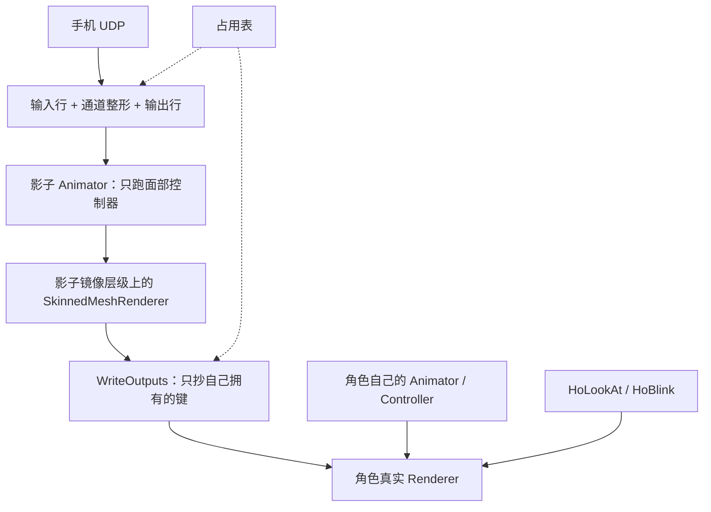

# 面捕设计：已验证的机制层

日期：2026-09-25。这份只讲**今天仍然成立**的东西：输入路线、中间层配置的语义、影子台、键的占用表、时钟与线程、验收。

- **怎么用、面板长什么样** → [面捕工作流](FACE_TRACKING_WORKFLOW.md)
- **值是怎么被加工的（输入行 / 输出行 / 表达式 / 曲线 / 修饰符）** → [面捕中间层处理](FACE_TRACKING_MIDDLE_LAYER.md)
- **控制器是作品、代码只做装配** → [面捕控制器结构](FACE_TRACKING_CONTROLLER_STRUCTURE.md)
- **Warudo 侧的最终连线** → [面捕方案总览](FACE_TRACKING_WARUDO_ROUTE.md) §2

一句话：**角色预制件上零组件。** 调试状态是一个普通对象 + 一个宿主，动画在影子台上求值，只写自己拥有的形态键。

## 1. 目标与首期决定

目标是在 Unity 编辑器里把手机面捕接到角色上、观察中间过程、并**在播放模式下真的驱动模型**；同一套机制要能原样搬到 Warudo 侧（两边读同一份 `.hoface.json`、共用同一份求值代码）。

仍然成立的首期边界：

- **输入只有 VTS 手机一条。** 收包端**只交"线名 → 原值"**，改名、量纲、左右合并在中间层配置里（见 §4）。
- **只在播放模式执行动画。** 会话的构造函数直接拒绝非播放模式（`Editor/FaceTracking/HoFaceAnimationSession.cs:103`）。编辑模式实时预览没有被实现。
- **核心不依赖 VRC SDK、VRCFury、Modular Avatar 或 Av3Emulator**。原版 Jerry 模板的完整运行走它原有的 VRC 工具链，与这条路分开验收。
- **写动画的只有一条路**：一个角色级会话决定"值从哪来、哪个键归谁、写出去多少"。它**不接管角色的 Animator**（原因见 §7）。
- **我们不规定控制器的形状。** 控制器是搬来的作品；代码只按槽位名填动画、按形态键名重绑曲线（`HoFaceAnimationAssets.Adopt`，`Editor/FaceTracking/HoFaceAnimationAssets.cs:110`）。

已经落地并被实测钉住的四条（前两条是否掉 PlayableGraph 那条路的直接依据）：

| 事实 | 依据 |
| --- | --- |
| **不能用 `Animator.hasBoundPlayables` 判"是否被别的动画图接管"** | 实测：普通 Animator 只要挂了 Controller 它就是 `true`，会把任何正常角色误判成被 Timeline 接管。Unity 也没有公开 API 能枚举全部 `PlayableGraph`，所以这个预检连同它的误报一起删了 |
| **不能用 PlayableGraph 把"身体层 + 面部层"叠起来** | 实测：覆盖层会把图层自己没动的属性也写成默认值（基础动画的 `eyeLookInLeft=33` 被压成 0）；`AvatarMask` 不支持形态键，做不出"这层只管 `jawOpen`"；改加算又变成"基础 + 面捕"相加 |
| 改为**影子求值 + 只写拥有的键**后，上面两条问题消失 | 实测：面捕没拥有的键保留基础动画值，身体变换动画不受影响 |
| Ho 的写作器（HoBlink / LookAt）与面捕互不覆盖 | 实测：面捕拥有的键被占用后，Ho 写入与清理都不再动它；交还后基础动画接回 |

## 2. 调查依据与版本边界

本地参考代码存在仓库 `.research/`（被根 `.gitignore` 忽略）。复现不依赖它，以下是当初取的固定版本：

| 对象 | 依据 | 重要边界 |
| --- | --- | --- |
| HoUnityTools | `19fb1ea164c661c5d72659a6494d39c726145600` | package 声明 Unity 2021.3；无 VRC 程序集引用 |
| Jerry Templates | `14b650c9f6d18d24170e026fc84e94bc01aac48c` / 包 7.0.5 | package 声明 Unity 2022.3 |
| Av3Emulator | `e015d6c94921cabda19cfdb119c15243fb3de93f` / 包 3.4.14 | 检出的源码版本，不是 Releases 页版本 |
| VRCFT master | `6432e6a8d85fa7ec5115fc725c6abcb6dbdd4f35` | `Directory.Build.props` 声明 6.0.0.0；不能套作所有已发行版本 |
| VRCFT 历史发行标签 | `5.2.3.0` / `ad06f2967a2243d85ad161a397eb911522182c15` | 与 master 的 OSC 初始化、发现代码不同 |
| VTS 手机 | 官方 Blendshape UDP Receiver 样例仓库 | 字段名与请求格式的来源；**真机联调仍未做** |

**别把 master 的程序集版本当作用户安装版本，也别把 GitHub 的 latest 当作推荐版本。** 将来接 VRCFT 时先记录实际版本、渠道和模块。

## 3. Av3Emulator 与 VRCFT：调查保留

这两块都是**未来后端**的调查，与现在的 VTS 路线无关，内容已整段移入
[面捕的 OSC / VRCFT 后端：调查保留（已归档）](archive/FACE_TRACKING_OSC_BACKEND_RESEARCH.md)：
Av3Emulator 的能力清单与取舍、VRCFT 的链路、`forceRelevant`、OSCQuery 与发现过滤。

一句话结论：**VRCFT 完全没有实施**。将来接的时候别把它当成"多开一个 UDP 端口"。

## 4. 输入路线：VTS 手机一条

### 4.1 数据路径

```text
手机（VTS，3rd Party PC Clients）
  ← 我们每秒发一次请求（JSON，向 手机:21412，time=5 秒）
  → 手机按帧把 JSON 发回**请求的源 IP**、端口用请求里报的那个
       ↓
HoVtsPacket.TryParse        “线名 → 原值”（不改名、不换算、不合并）
       ↓
HoFaceInputHub.Merged       按环境顺序合并（逐线名判新鲜度）
       ↓
中间层「输入行」            规范名 = 曲线(表达式(线名…)) + 有序修饰符
       ↓
通道整形 / 输出行 / 影子台
```

**接收端只交原样。** `HoFaceInputPacket` 就是一份 `线名 → 原值`（`Editor/FaceTracking/HoFaceInputPacket.cs:23`），
线名大小写照协议原样；姿态这种"一字段多分量"按 `<字段>_<下标>` 摊平（VTS 的 `Rotation` → `Rotation_x/_y/_z`，
`Runtime/FaceTracking/HoVtsPacket.cs:133`）。哪一段是角度、要不要 `* 0.0174533`、左右怎么并，全写在中间层的输入行里。

### 4.2 协议的确切形状（照官方样例，不是逆向）

- **不是手机主动推流。** 手机上除了打开那个开关**没有要填的东西**：它把数据发回请求包的源 IP、端口用请求里 `ports` 指定的。
- 请求原文由 `HoVtsPacket.BuildRequest` 手写：
  `{"messageType":"iOSTrackingDataRequest","time":5,"sentBy":"HoFaceTracking","ports":[<本机端口>]}`
  （`Runtime/FaceTracking/HoVtsPacket.cs:62`）。官方允许 `time` ∈ [0.5, 10]，所以要**每秒续一次**（`VtsIphoneReceiver.cs:41`）。
- 本机默认监听 **49984**（`VtsIphoneReceiver.DefaultPort`），手机侧默认 **21412**（`VtsIphoneReceiver.PhonePort`）。
- ⚠️ **不发请求就一个包都收不到**：VTS 是请求式，手机不会主动推。所以"只看原始值"也必须先连上（编辑模式下就能连，见 §7.4）。
- 载荷字段名来源是官方样例仓库的 `VTubeStudioRawTrackingData.cs`：`Timestamp` / `Hotkey` / `FaceFound` /
  `Rotation` / `Position` / `EyeLeft` / `EyeRight` / `BlendShapes`（`HoVtsPacket.cs:15-22`）。
  README 原话："Some fields may be **added** to this payload in the future" → **未知字段一律跳过**，不许因为多了个字段就整包失败。
- **`BlendShapes` 的 52 个键是我们自己抠出来的**（见 §9.2 的事故③）。

### 4.3 `IsTracked` 跟 `FaceFound`

- `FaceFound` 落到线名空间就是 `FaceFound`（1/0，`HoVtsPacket.FaceFoundKey`），和形态键一起进合并表 ——
  所以中间层的输入行可以读它，面板也显示它。
- **丢掉的脸不会被我们"补"成 0**：接收端如实报状态，"丢追回中性"是在**下游**做的
  （Warudo 侧在图上，且两条权重方向不同：`角色看向目标` 吃 **`IsTracked`**、
  官方待机生成器吃 **`1 − IsTracked`** —— 见 [面捕方案总览](FACE_TRACKING_WARUDO_ROUTE.md) §3.2）。
- 这就是为什么 **iFacialMocap 被删掉**：它给不出这个标志（`HoFaceInputEnvironment.cs:13`）。
  收包端仍然只交原样，不代任何一方猜"脸还在不在"。

### 4.4 本机这一侧的约定

| 约定 | 证据 |
| --- | --- |
| **先绑定端口、再发第一个请求**（免得丢掉早期响应） | `HoFaceReceiverBase.Start` 先 `Bind`，再 `worker.Start()`，最后 `OnStarted`（`HoFaceReceiverBase.cs:144-151`） |
| **来源 IP 校验**，只收手机那个 IP；被拒的包记下来源 | `HoFaceReceiverBase.cs:211-218`（`RejectedSource`） |
| "一个包都没来"和"有包但来源不对"是两种故障，必须分开报 | 同上 + `HoFaceReceiverBase.cs:38-39` |
| 坏包 / 丢旧帧 / 主动请求各有计数 | `Packets` / `Invalid` / `Replaced` / `Rejected` / `Recoveries` / `Requests`（`HoFaceReceiverBase.cs:41-47`） |
| 瞬时 socket 错误不退出收包循环 | `IsTransient`（`HoFaceReceiverBase.cs:184`） |
| 单包长度上限 16384 | `MaxPayload`（`HoFaceReceiverBase.cs:72`） |
| 手机地址必须是合法 IPv4，且不是 Any/Broadcast | `HoFaceReceiverBase.cs:126` |
| 解析必须与区域文化无关（`0.5` 不能被读成 5） | `HoJsonReader.ReadNumber` 明确用 `InvariantCulture`（`HoJson.cs:115`） |
| **所有数据路径都不用 `JsonUtility`** | `HoJson.cs` 记的三次事故（§9.2） |

输入环境是工程级的一份有序源列表（`HoFaceInputEnvironment`，落盘 `UserSettings/HoUnityTools/FaceInput.asset`）：
顺序就是优先级，某个线名由"排在最前、且这一帧带来了它的新鲜源"胜出（`HoFaceInputHub.cs:280-288`）。
现在只有 VTS 一项；加设备的形状是固定的（加一个接收端子类 + 在工厂里加一行），差异只在接收端那个 `TryParsePacket` 里。

### 4.5 中间层配置：面板当它必填，留空 = 空表、这一层不做事

`*.hoface.json` 是**映射表的唯一来源**，面板把它当**必填总闸**（空着就把下面各栏锁住）：
**留空 / 没指定配置文件 ⇒ 两类行都是空表，这一层不做事**，**没有内置默认兜底**
（2026-09-25 起与 Warudo 侧统一为"空 = 空表"；**2026-09-26 起连那份默认表本身都删了** ——
仓库里不存在任何一份默认配置，见 [中间层 §6.1](FACE_TRACKING_MIDDLE_LAYER.md)）。
两类行都只认配置文件（`HoFaceDebugSettings.Inputs()` / `Outputs()`）：

| 行 | 取哪一份 | 有配置文件但**那一类是空的**时 |
| --- | --- | --- |
| **输入行** `Inputs()` | 只认配置文件的 `inputs`；没指定配置文件 ⇒ **空表** | 空表 ⇒ **等于不做改名**（规范名必须与线名同名） |
| **输出行** `Outputs()` | 只认配置文件的 `outputs`；没指定配置文件 ⇒ **空表** | 空表 ⇒ **不写任何参数**（"新建配置"写出来的就是空的） |

所以"没指定配置文件"**就是这一层不做事**：会话压根起不来，运行期也不会自动起
（那等于"什么都不做还每秒重试一次"）。真正的坑在**指定之后**：
输入行**只认配置文件里的那一份**，配置里漏了一条线名，那条链就静默失效（见
[踩过的坑 · 面捕流水线](pitfalls/FACE_TRACKING_PIPELINE.md) §3）。

- 两类行同一套形状：**输入行** `规范名 = 曲线(表达式(线名…))` + 有序修饰符；**输出行** `参数名 = 曲线(表达式(规范名…))` + 有序修饰符（`Runtime/FaceTracking/HoFaceMiddleware.cs` 的 `HoFaceMiddleware` / `HoFaceOutput`）。
- 表达式取变量分三级：① 52 个规范名（走通道整形后的值）→ ② 其它输入行的结果（`headRotX`…）→ ③ 合并后的**原始线名**（`EyeBlinkLeft`、`Rotation_x`…）（`HoFaceAnimationSession.Lookup`，`HoFaceAnimationSession.cs:304-311`）。
- **同名输入行：最后一行生效**（`HoFaceAnimationSession.cs:496` 的 `inputIndex[...] = i` 顺着覆盖 —— 有意的覆盖 / 优先级机制，想在别人的表上盖一行就写在后面）。
  ⚠️ 因为"后写的赢、且缺数据不回退"，**同一格别混两种方言**：以后声明的那行没数据时会把有数据的行顶掉 ⇒ 值恒 0
  （2026-09-25 现场：调试配置混写安卓 + iPhone 命名，表现为"只有 head 系和眨眼在动"）。**一份配置对一台设备。**

## 5. 为什么没有门控

**旧的"两级门控"（区域闸 / 输入使能 / 输出使能）已经删掉了。**

它想解决的问题是"哪一块脸算数"。这个决定现在归**使用者自己的混合树**：要哪个区域生效，就在树里用那个区域的参数当权重；要在外面关掉，就把那一行的值压成 0。我们不在参数生产这一层注入开关 —— 否则"面板里看到什么"和"Warudo 里是什么"就会分叉。

代码里的直接痕迹：

- 通道循环里明确写着"**这里没有区域门控**：哪些键算数由使用者自己的混合树/参数决定，不由我们注入开关"（`HoFaceAnimationSession.cs:205`）。
- 编译时不再排除凝视键：没有门控之后，控制器里 52 个键全部编译进来，含 8 个凝视键（用例断言 `Tests~/FaceTrackingValidation.cs:135`）。
- `HoFaceRegion` / `HoFaceSmoothGroup` 这两个类型**还在**（`Runtime/FaceTracking/HoFaceTrackingChannels.cs:8/21`），但只剩两处用途：调试面板的观察值分组、以及用例里按区域取样。它们**不再是写不写的开关**。

通道层还剩什么（`HoFaceChannel`，`HoFaceTrackingChannels.cs:32`）：

| 模式 | 语义 |
| --- | --- |
| `Live`（实时） | 用当前来源数据，再过这条通道的**输入曲线** |
| `Manual`（手动） | 用调试滑杆；网络数据仍可观察但不覆盖滑杆 |
| `Hold`（保持） | 保持进入该模式时的值。这是冻结，不是释放控制权 |
| `Neutral`（中性） | 写这条通道的中性值，**不是**统一写 0 |
| `Release`（交还） | 撤销对这个键的拥有权 |

两条语义细节：

- **输入曲线只作用在实时输入上**（手动滑杆是调试用的，不该被它整形）—— `HoFaceAnimationSession.cs:199-201`。
- **平滑不在这里**：它现在是**每一行输出自己的修饰符**（照 VBridger 的粒度）。要平滑哪一路就在那一行加（`HoFaceAnimationSession.cs:207-208`）。

### 5.1 占用表：谁拥有哪个键

门控删掉之后，唯一还在的"权限"机制就是这张表。

**键的身份是 `(SkinnedMeshRenderer 实例, 形态键下标)`**，不是键名、也不是"眼睛组"——
`Runtime/FaceTracking/HoFaceOutputOwnership.cs:10`。

| 接口 | 语义 |
| --- | --- |
| `Reserve(mesh, index, owner)` | 登记。**同一个键已属于别的 owner 时直接抛异常**（"此形态键已由另一个面捕会话接管"），不静默抢 |
| `Release(owner)` | 交还这个 owner 拥有的全部键 |
| `IsReserved(mesh, index)` | Ho 的写作器（HoBlink / LookAt）**在还原自己写过的键之前问这句话** —— 被占用的键它就不还原 |
| `Reset()` | `[RuntimeInitializeOnLoadMethod(SubsystemRegistration)]`：进播放时清空 |

会话这一侧的生命周期（`HoFaceAnimationSession.cs`）：

1. **建**：编译出绑定表后逐个 `Reserve`，并记下每条键的**基准值** `binding.initial`（`:504-509`）。
2. **重建**：先给"这次不再属于自己"的键写回基准值，再 `Release(this)`，然后才让新拥有者写（`:492-497`）。
   顺序有意如此 —— 旧拥有者不能在新拥有者写完之后再盖一次。
3. **写**：`WriteOutputs` 只遍历 `owned` 里的键，从影子代理读值写到真 Renderer（`:386-396`）。
4. **停 / 退出播放 / 出错**：`Dispose` 把自己拥有的、且 Mesh 没被换过的键还原成基准值，再撤销占用、销毁影子（`:534-551`）。

两条边界要说清楚：

- **模型 Mesh 在运行中被换掉就停会话**，不往错的网格上写（`Tick` 里的 Mesh 引用检查，`:165-166`；还原时也再查一次 `:539`）。
- **同一个 Animator 只允许一个会话**（`HoFaceInputHub.Start` 里的检查，`HoFaceInputHub.cs:165-166`）。

## 6. 影子台：不接管 Animator

**被否掉的设想：** 由一个会话接管目标 Animator 的动画输出，让"基础 Controller"和"面部 Controller"进同一个 `PlayableGraph`、用 `AnimationLayerMixerPlayable` 组合、面部走 Override。
否掉它的两条依据见 §1 的表（覆盖层会连图层没动的属性一起覆盖；`AvatarMask` 不支持形态键、加算层又会相加）。

**实际采用的架构 —— 影子求值 + 只写拥有的键：**



### 6.1 具体做法（都在代码里）

| 步骤 | 实现 |
| --- | --- |
| 影子根 | 一个 `HideAndDontSave` 的空物体 + 一个 `Animator`，`cullingMode = AlwaysAnimate`（`HoFaceAnimationSession.cs:119-127`） |
| 镜像层级 | 按编译出来的曲线路径逐段搭同名节点，每格挂一个 `SkinnedMeshRenderer`，**共享真网格的 Mesh**、`forceRenderingOff = true`、`updateWhenOffscreen = false`（`:130-156`） |
| 跑哪份控制器 | 编译产出的 `AnimatorOverrideController`（只含我们拥有的键的过滤副本，内存里）（`HoFaceAnimationAssets.Compile`，`HoFaceAnimationAssets.cs:418`） |
| 设参数 | 只对**控制器里真有的** Float 参数 `SetFloat`；没有那个名字就跳过（不猜、不补）（`:242`） |
| **求值** | 设完参数后**自己 `shadow.Update(0f)` 强制求值一次**（`:252-259`） |
| 抄回 | `WriteOutputs` 从影子代理读 `GetBlendShapeWeight` 写到真 Renderer，只遍历 `owned`（`:386-396`） |
| 调试接入 | 影子向 `HoFaceShadowLink` 登记自己，混合树观察台（`HoFaceBlendTreePeek`）从那里取（`HoFaceShadowLink.cs:20`、`HoFaceBlendTreePeek.cs:48`） |

**为什么必须 `Update(0f)` 一次同步调用：** 以前是组件的 `Update`/`LateUpdate` 一对（设参数在 `Update`、抄回在 `LateUpdate`，中间让 Unity 自己算完）。组件删掉之后，如果"设参数"和"读结果"还分在两个编辑器回调里，就是在**赌回调顺序**。自己 `Update(0f)` 之后，这一步变成"设参数 → 求值 → 读值"一次调用里完成；影子是活动对象，Unity 之后还会再算一次，参数没变所以无害。

**为什么不用 PlayableGraph：** 见 §1 —— 这条路本身不成立，不是"暂时没做"。

这样做的直接好处：

- 面捕没拥有的键（基础动画的、HoLookAt 的、HoBlink 的）**在构造上就不可能被面捕影响**，不依赖分层语义或遮罩这种微妙的东西。
- 不需要摘掉用户的 Controller，也就不需要保存/恢复 Animator 状态与参数；不限制 Animator 的更新模式，也不改它的 Culling Mode。
- Timeline / Av3Emulator / 别的图驱动同一个 Animator 时不再冲突 —— 面捕根本不参与那张图。
- 与脚本写入者的关系只由**键的占用**决定，与时序无关。

代价与边界：影子台与真 Renderer 之间是**抄值**而不是动画系统直接写，所以只支持形态键曲线（正好是首期范围）；影子层级与过滤副本都是播放期临时对象（`HideAndDontSave` + 会话结束时销毁）。

**控制器的接受范围**（`HoFaceAnimationAssets.Compile` 的检查，`:418-522`）：

| 接受 | 拒绝 |
| --- | --- |
| 纯 Unity `AnimatorController` | `AnimatorOverrideController` 当源（`:421`） |
| 只含形态键 Float 曲线 | 片段里的**事件 / 对象引用曲线 / Humanoid 动画**（`:461`） |
| 无 Behaviour | 状态机或状态上的任何 `StateMachineBehaviour`（`:508`、`:511`） |
| 无同步图层 | `layer.syncedLayerIndex >= 0`（`:425`） |
| Write Defaults 开/关都收 | **Direct 树 + Write Defaults 关**（实测会逐帧发散：0.6 的输入 → 98.98 → 246.28 → 1059.33；`:513-519`） |
| 通道里 `Release` 的键、以及输出过滤掉的键不编译 | 其余非形态键曲线（点名报错，不静默丢弃）（`:471-472`） |

超出范围时**开始驱动会明确报错并指出是哪一条**，不静默降级。

### 6.2 HoLookAt 的接入

以代码为准（[HoLookAtConstraint](../Runtime/Constraints/HoLookAtConstraint.cs)）：

- `OnAnimatorIK` → `HandleAnimatorIK` 调 `Animator.SetLookAtPosition/Weight`；**Unity LookAt 的眼睛权重传 0**，眼睛由组件自己应用。不与 Animator 同物体时由 `HoLookAtIkRelay` 转发 IK 回调（`:671-697`）。
- `LateUpdate` → `ApplyEyes`。EyeBones 模式走 `ApplyEyeBones`，ShapeKeys 模式交给独立的 `HoShapeKeyWriter`（`:660-668`）。
- `HoBlinkConstraint` 可选 Update/LateUpdate/FixedUpdate，和 LookAt 各自持有 Writer。`HoShapeKeyWriter` 是共享实现，**不是**全场景共享的写入注册表。
- 已有 `Weight / SpineWeight / HeadWeight / EyeWeight / Enabled / EyeOutputEnabled` 等公开接口（`:258-270`、`:264`）。
- 眼球骨骼的累计漂移处理（当年补的三条，都在代码里）：`Update` 阶段先撤销上一帧自己叠加的眼球增量（`:653-658`）；记录与比较统一用 `localRotation`（`:1541`、`:1578`）；只有"当前值仍等于自己上一帧写下的值"时才恢复，别人改过就不动它（`:1578-1586`）；同一帧多个图层开 IK Pass 时只推进一次平滑状态（`lastIkFrame`，`:684-686`）。
  ⚠️ **这些补丁没有自动化验收**（验证工程里没有 humanoid Avatar）。
- 需要控制器操纵 LookAt 时要有 `HoLookAtAnimatorBridge`：**仍然只是拟定，代码里不存在**。

## 7. 参数、线程与生命周期

### 7.1 唯一的时钟：`HoFaceClock`

`Editor/FaceTracking/HoFaceClock.cs` 是调试侧**唯一**的时间源：

```csharp
public static double Now => Stopwatch.GetTimestamp() / (double)Stopwatch.Frequency;
```

为什么是 `Stopwatch`：**同一次开机内单调**（不受系统时钟调整影响）、**任何线程可读**（不碰托管状态）、**域重载不影响**。原点在哪无所谓 —— 所有用法都是**算差值**。

两条硬约束写在那个文件的注释里，都被实测咬过：

| 症状 | 原因 |
| --- | --- |
| "包到了、合并里也有，通道就是不写"（实测记录：`packets=121 hasJawWire=True hubJaw=0.9 weight=17`） | 会话读 `EditorApplication.timeSinceStartup`，接收端后台线程读 `Stopwatch` —— 两个时钟差一个恒定偏移，那个"这一包新不新鲜"的差值永远越界 |
| "连不上"（`packets=0`、面板显示已断流，但 socket 与端口都是好的） | 把会话那边改成 `timeSinceStartup` 之后，接收端（**后台线程**）也要读它 —— 一读就抛 `get_timeSinceStartup can only be called from the main thread`，接收线程当场死掉 |

接收端与面板都只是这个时钟的别名（`HoFaceReceiverBase.cs:120`、`HoFaceInputHub.cs:324`），**不许另起一个实现**。

### 7.2 线程分工

| 谁 | 在哪 | 干什么 |
| --- | --- | --- |
| 接收线程 | 后台（`Thread`） | 只 `Receive` + `TryParsePacket` + 给包打时间戳（`HoFaceClock.Now`），把最新一包放进 `pending`（`HoFaceReceiverBase.cs:201-250`） |
| `HoFaceInputHub.UpdateInput` | 主线程 | `TryTake` 拿走最新包 → 按环境顺序逐线名合并进 `Merged`（`HoFaceInputHub.cs:263-289`） |
| `HoFaceInputHub.Tick` | 主线程 | 会话推进：输入行 → 通道 → 输出行 → 写影子参数 → `shadow.Update(0f)`（`HoFaceAnimationSession.Tick`） |
| `HoFaceInputHub.LateTick` | 主线程 | `WriteOutputs` 抄回真模型 |
| 面板 | 主线程 | 只读：约 10 Hz 刷新（`HoFaceTrackingWindow.cs:88`） |

**网络线程不调用 Animator、Renderer 或任何 Editor API。** 一个数据报解析成的帧是不可变的，在主线程一起提交。

`HoFaceDebugHost`（`[InitializeOnLoad]`）是**唯一拥有每帧 tick 的东西**，而且**只在播放模式推会话那一段**
（`HoFaceDebugHost.cs:85-94`）。输入侧（收包 / 重连 / 清理死会话）由 `HoFaceInputHub` 自己的静态构造订阅驱动，
与播放模式无关 —— 因为"连上手机、看原始值"这一步在编辑模式里也要能做（`HoFaceInputHub.cs:67-76`）。
窗口随时会被关掉，所以 tick 不能挂在窗口上。

### 7.3 断流回中性

判据与参数：

| 项 | 值 / 位置 |
| --- | --- |
| 多久没收到包算断流 | `staleSeconds`，默认 **1 秒**（`HoFaceDebugSettings.cs:78`） |
| 回中性的淡出时长 | `neutralFadeSeconds`，默认 **0.2 秒**（`:81`） |
| 合并层认为一条源"不新鲜" | 1 秒（`HoFaceInputHub.FreshSeconds`，`HoFaceInputHub.cs:24`） |
| 通道判"新鲜" | `inputFresh`（这一帧真的带来了它引用的全部线名）**且** 至少有一条源在跑 **且** 包龄 ≤ `staleSeconds`（`HoFaceAnimationSession.cs:182-187`） |

- **从没收到过实时数据的通道不占用模型属性**（`:186` 的注释与 `mayWrite`）。
- 断流后不是硬切：`Effective` 按 `deltaTime / fade` 朝中性走（`:201`），走完 `staleSeconds + fade` 之后 `mayWrite` 变假 →
  这个键退出"拥有"集合 → 重建 → 基准值还回去 → 基础动画按自己的节奏继续写。
- **输入行的缺键语义照 VBridger**：表达式引用到的线名只要有一个这一帧没来，这一行就**不写** —— 值保持上一帧、并标记为"不新鲜"（`EvaluateInputs`，`:262-294`）。

### 7.4 播放模式切换时的收摊与接回

这是"组件删掉之后"最容易漏的一块：**进播放会域重载**，静态字段连同"用户想连着"这个意图一起被清掉。
处理办法是把这个意图**持久化**（`HoFaceInputEnvironment.wantConnected`），并在两个生命周期钩子上做对称动作：

| 时刻 | 做什么 | 位置 |
| --- | --- | --- |
| `ExitingPlayMode` / `ExitingEditMode` | `Shutdown`：停所有会话、释放 socket（不收的话端口占着，新域绑不上端口）。**如果这一刻还连着，先把 `wantConnected = true` 记下来** | `HoFaceInputHub.cs:291-321` |
| `EnteredPlayMode` | 清掉"用户停过 / 报错 / 重试"这些状态，立刻 `TryReconnect()`，别让用户看到"未连接" | `:294-301` |
| `ExitingPlayMode`（宿主） | 再收一次会话：影子对象是 `HideAndDontSave`，不收会留在场景里 | `HoFaceDebugHost.cs:96-103` |
| `EnteredPlayMode` + `startOnPlay` | 自动开会话（**不会**自动连手机） | `HoFaceDebugHost.cs:105-109` |
| 每帧 | `TryReconnect`：只有在**用户想连着**时才接回来；刚连上给 3 秒宽限（`Thread.IsAlive` 在 `Start()` 之后有一瞬间还是 `false`，免得把刚建好的接收线程掐掉重来）；重试用 2 秒网隔 | `HoFaceInputHub.cs:246-257` |
| `beforeAssemblyReload` / `quitting` | `Shutdown` | `HoFaceInputHub.cs:74-75` |
| 接收端 `Dispose` | 停线程（`Join(1000)`）、关 socket、清 `pending` | `HoFaceReceiverBase.cs:252-260` |
| 占用表 | 进播放时 `Reset()` 清空 | `HoFaceOutputOwnership.cs:28` |

**用户按的「停止」和"系统收摊"是两件事**：用户停过之后本次 Play 内不再自动拉起（`UserStopped`）；
组件禁用 / 退出播放 / 出错属于后者，之后还能自动拉回来（`HoFaceInputHub.cs:174-188`）。

## 8. 代码位置：逐个文件的真实清单

### 8.1 Runtime（`Runtime/FaceTracking/` —— 会进玩家构建）

| 文件 | 是什么 |
| --- | --- |
| `HoFaceNaming.cs` | 参数命名规则的**唯一出处**（`Ho/Drive/...`）。只剩"要有哪些参数"；树的形状、每格写什么键不由代码规定 |
| `HoFaceTrackingChannels.cs` | 52 个 ARKit 规范名、`_L/_R` 别名表、区域与平滑分组、**输入通道**（模式 / 手动 / 中性 / 输入曲线） |
| `HoFaceExpression.cs` | 表达式求值器（递归下降；语法照 VBridger：函数表 / 惰性 `if` / 非有限折 0） |
| `HoFaceMiddleware.cs` | 中间层的**数据模型**：一行 = 参数名 + 表达式 + 曲线 + 有序修饰符；曲线求值（**范围外按端点算，不外推**）；修饰符 / 维持。**没有"内置默认表"了**（`HoFaceMiddlewareDefaults` 2026-09-26 删，见 [中间层 §6.1](FACE_TRACKING_MIDDLE_LAYER.md)），`HoFaceMiddleware.displayName` 的默认值也从 `"ho-2d"` 改成**空串** |
| `HoFaceProfile.cs` | 配置文件（`.hoface.json`）的格式名与入口（`format: ho-face-middleware` / `version: 2`） |
| `HoFaceProfileJson.cs` | 配置文件的**自写 JSON 读写器**（`JsonUtility` 已咬过三次，见 §9.2） |
| `HoJson.cs` | 极小的 JSON **读取器**：我们所有数据路径共用的那一份；未知字段跳过、报错带字符位置、数字用不变文化、容忍 BOM |
| `HoVtsPacket.cs` | VTS 手机包的解析（纯静态、不碰 socket）：请求包原文 + `线名 → 原值` 摊平 |
| `HoFaceOutputOwnership.cs` | **键级占用表**（§5.1） |
| `HoFaceShadowLink.cs` | 会话 → 调试观察台的唯一联系点：登记"正在生效的影子 Animator" |
| `HoFaceBlendTreePeek.cs` | 混合树观察台（`MonoBehaviour`）：把影子的参数与层权重抄到一个可见 Animator 上，好在 Animator 窗口里看红点。无渲染器、不读输出，**无损**。Inspector 上**只有 `controller` 一个字段**（2026-09-27 简化：参数值的来源固定是"正在生效的会话"，不再有"跟随别的 Animator"那条路）；运行时自己补的 Animator 带 `HideInInspector`，不在 Inspector 上占一行 |
| `HoFaceJelly.cs` | 一维阻尼谐振子（纯函数）。现在由独立的 `HoSpringConstraint` 使用（`Runtime/Constraints/HoSpringConstraint.cs:83`）——果冻**不在**面捕这条链里 |

### 8.2 Editor（`Editor/FaceTracking/`）

| 文件 | 是什么 |
| --- | --- |
| `HoFaceDebugSettings.cs` | **调试状态**（普通类，不是组件）。落盘 `Assets/HoFaceDebugSettings.json`，自写 JSON 读写。角色按层级路径、控制器按 GUID + 路径兜底；`profilePath` 指向那份 `.hoface.json`（**Unity 侧与 Warudo 侧读同一份**） |
| `HoFaceDebugHost.cs` | `[InitializeOnLoad]`：**唯一**的每帧 tick 来源，只在播放模式推会话那一段；进出播放时收摊 / 自动开 |
| `HoFaceClock.cs` | **唯一**的时间源（§7.1） |
| `HoFaceInputHub.cs` | 输入的汇聚点：拉起源、每帧合并"线名 → 原值"、会话注册表、断线重连 |
| `HoFaceInputEnvironment.cs` | 工程级的有序源列表（`UserSettings/HoUnityTools/FaceInput.asset`）+ 类型 → 接收端的工厂 |
| `HoFaceReceiverBase.cs` | 所有设备输入源的**基类**：socket、后台线程、来源校验、统计、"最新一包"交接；子类只实现 `TryParsePacket` |
| `VtsIphoneReceiver.cs` | VTS 手机那一路（socket 与节奏，解析在 `HoVtsPacket`） |
| `HoFaceInputPacket.cs` | 一帧原始输入：只有"线名 → 原值" |
| `HoFaceAnimationAssets.cs` | 控制器**装配**（复制模板 / 按槽位名填动画 / 重绑驱动对象 / 保留 GUID）与**预览编译**（过滤后的内存副本 + 接受范围检查）；`Inspect` 读控制器实况、`Slots` 读槽位清单 |
| `HoFaceAnimationSession.cs` | **影子台 + 输入行 / 通道 / 输出行 + 键的拥有权 + 写回与停止恢复** |
| `HoFaceTrackingWindow.cs` | 调试面板（菜单 `HoUnityTools/面捕/调试面板`）：对象 / 配置详情 / 参数输入 / 排查。**面板怎么用见 [面捕工作流](FACE_TRACKING_WORKFLOW.md)** |
| `HoFaceControllerToolWindow.cs` | 「控制器编辑」页（`HoUnityTools/面捕/控制器编辑`）：把**已经在工程里**的那份控制器**就地**装配 —— 只做两件事：填片段、重写曲线路径。不新建资产、不改名、不动 GUID |
| `HoFaceProfileWindow.cs` | 「配置文件」页（`HoUnityTools/面捕/配置文件`）：编辑输入行与输出行 |
| `HoFaceFirewall.cs` | Windows 防火墙放行（入站 UDP）。提权走 `powershell -EncodedCommand`（base64），不拼命令行字符串 |
| `HoFaceBlendTreePeekEditor.cs` | 观察台的 Inspector |

**面捕这套的入口就三个菜单**：`HoUnityTools/面捕/调试面板`、`HoUnityTools/面捕/控制器编辑`、`HoUnityTools/面捕/配置文件`
（`[MenuItem]` 分别在 `HoFaceTrackingWindow.cs:56`、`HoFaceControllerToolWindow.cs:41`、`HoFaceProfileWindow.cs:33`）。

### 8.3 面捕只是用户的通用工具

| 文件 | 是什么 |
| --- | --- |
| `Editor/AnimationTools/HoBlendShapeClipBuilder.cs`（生成逻辑）+ `HoAnimationToolsWindow.cs`（菜单 `HoUnityTools/动画工具` 的「形态键动画」栏） | 形态键动画：每个形态键一份 `<键名>.anim`（值 100 常量，一个片段写所有有这个键的网格）；重跑**覆盖同名片段**（保留资产、GUID 不变，只重写曲线），并可一并**清掉这次没写到的旧片段**（面板上默认开；那个文件夹是产物目录）。**不属于面捕**，只是它的上游 —— 同一个页面里还挂着「轨道处理」（旧「动画处理」：只留 Float 曲线的 YAML 处理，`HoAnimationClipProcessor.cs`） |
| `Tests~/FaceTrackingValidation.cs` | 独立验证工程的批处理用例（**116 条断言**；2026-09-25 Unity 6000.3.15f1 全绿，**2026-09-26 改过夹具之后还没重跑** —— 当天 Unity 编辑器都开着、批处理起不来；已验的是它能编译 + 离线两套用例全绿） |
| `Tests~/AnimationClipPreviewValidation.cs` | 另一套用例（动画剪辑预览），与面捕无关 |

网络接收与调试启动**只存在于编辑器流程**：接收端、宿主、面板全在 `Editor/` 下，所以它们不进玩家构建。
由于本仓库还服务 Warudo 构建，添加新 Runtime 组件时要验证 FastBuild 对组件和程序集的收集
（见 [Warudo FastBuild](WARUDO_FAST_BUILD.md)）。

## 9. 实施状态与验收

### 9.1 已完成

| 阶段 | 状态 | 验收结果 |
| --- | --- | --- |
| P0：连接与协议 | **接收侧已自动化验证；真机未验** | 先绑定再请求、来源校验、端口占用显式报错、VTS 载荷解析、52 个键全在、NaN/Inf 拒绝、未知字段不影响好字段 |
| P1：装配与手动驱动 | **已通过** | 模板整份复制（层/参数一个不少）、按槽位名填文件夹动画、外部片段复制成子资产、按形态键名重绑到真 Renderer（含一个键扇出到两个网格）、覆盖不改 GUID、缺槽位如实报出；手动值驱动混合树得到预期值 |
| P2：实时输入 | **已通过（本地回环替代手机）** | 真实 UDP 包驱动到 60；中间层整条链（表达式 → 曲线 → 修饰符 → 参数 → 混合树）；断流回退；占用与交还在停止后清空；一个 Animator 一个会话 |
| P3：LookAt 协作 | **部分** | 键级互斥已通过（面捕拥有的键被占用后 Ho 写入与清理都不覆盖它）；眼骨无漂移**未经自动化验收**（没有 humanoid Avatar） |
| 后续：编辑模式实时预览 | 未开始 | — |
| 后续：VRCFT / 原版 Jerry 模板 | 未开始 | 见 [已归档的研究](archive/FACE_TRACKING_OSC_BACKEND_RESEARCH.md) |

### 9.2 三次真事故（都已修，规则因此变硬）

同一类坑咬了三次，**共同点都是"症状离原因很远"**：

| # | 症状 | 原因 | 现在怎么办 |
| --- | --- | --- | --- |
| ① | 写 profile 只出 **342 字节**（只剩头部四个字段，`inputs` / `outputs` 两个数组整个没了，末尾 `}` 还是完整的） | `JsonUtility` 在**播放器里**静默丢掉 `List<嵌套类>` 字段（编辑器里是好的） | 配置读写走 `HoFaceProfileJson` + `HoJsonReader` |
| ② | 读 profile 报"配置文件里一行输出都没有"，而可用配置明明列出了那两个文件 | 同一个原因，读路径也是坏的（解析出了空列表） | 同上 |
| ③ | VTS 包"解析成功"、字段名也对，但**52 个形态键全丢**（运行期实测 `本帧键 15`，12 个头眼分量全在） | 还是同一个原因 —— `BlendShapes` 是 `List<VTSTrackingDataEntry>` | 解析搬到 `HoVtsPacket.cs`（纯静态，所以能脱离 Unity 离线测） |

**规则（覆盖所有数据路径）：我们的数据一律不用 `JsonUtility`。** 详见 `Runtime/FaceTracking/HoJson.cs:7-24`。

另外两件已经修好、不要再当现存问题的：

- **两个时钟**（症状与原因见 §7.1）：现在唯一定义在 `HoFaceClock`。
- **`HoFaceInputEnvironment.OnEnable` 里当场 `Save(true)` 被 Unity 拒收**（`You may not pass in objects that are already persistent` —— 那一刻资产已经持久化了），清理结果反而没落盘。现在改成 `EditorApplication.delayCall += () => Save(true)`（`HoFaceInputEnvironment.cs:58-70`）。

### 9.3 怎么重跑验收

```powershell
# 1) 把用例拷进一次性工程（工程根必须有 .ho-face-validation 这个空文件当标记）
Copy-Item "Tests~\FaceTrackingValidation.cs" "$proj\Assets\Editor\FaceTrackingValidation.cs" -Force

# 2) 跑；日志别放以点开头的目录
& "C:\Program Files\Unity\Hub\Editor\6000.3.15f1\Editor\Unity.exe" -batchmode -nographics `
  -projectPath $proj -executeMethod HoFaceTrackingValidation.RunBatch -logFile "$env:TEMP\val.log"

# 3) 看结果
$c = [IO.File]::ReadAllLines("$env:TEMP\val.log", [Text.Encoding]::UTF8)
$c | Select-String "error CS"                      # 编译不过 → 一条断言都不会跑
$c | Select-String "HO_FACE_TEST" | Select-Object -Last 3
```

成功标记是 **`HO_FACE_TESTS_ALL_PASSED`**（`Tests~/FaceTrackingValidation.cs:1008`）；失败会抛 `HO_FACE_TEST_FAILED: <断言名>` 并 `Exit(1)`。
断言总数 **116**（`Check` / `Near` 的调用点计数与之一致）。环境、会绊人的地方、一次性工程怎么搭，见
[批处理验证这套用例怎么跑](pitfalls/VALIDATION_LOOP.md)。**UDP 端口被占时用例会明确跳过接收端那几条，而不是假装通过。**

两条实时 UDP 断言**几帧内没驱动上来**时，用例会自己打一条 `HO_LIVE`（接收端统计 + 合并后的线名值 + 输入行落点）。
看到它就照那几项往下切：`packets=0` 看 socket/端口，`hasJawWire=False` 看协议解析，`hubJaw=0.9` 但值不动看时钟与输入行。

## 10. 仍须实测的事项

这些**不是既成结论**：

- **真机联调**：手机 App 的实际包率、多网卡路由、App 退后台 / 锁屏时的行为、手机那边"目标地址"在真实版本里的表现。现在只有官方样例仓库的依据。
- **人形 Avatar 相关**：眼球骨骼 60 秒无累计漂移；同一帧多个 IK Pass 只推进一次平滑状态；HoBlink 高光键的保留。验证工程里没有 humanoid Avatar。
- **Unity 2021.3**：package 声明的最低版本，只在 6000.3.15f1 上验证过。
- **Warudo 侧的节点连线与行为**：bundle 打包、`HoVtsTrack` / `HoVtsTrackController` 两个 mod（**仍是目标，没拆**）与官方三个 apply 节点的实际连线与行为；**今天这一边 10 个节点一次都没在图里跑过**。见 [面捕方案总览](FACE_TRACKING_WARUDO_ROUTE.md) §2 与 §7 的待办。
- **带 Behaviour / 同步图层 / 非形态键曲线的控制器**：装配不拦，**开始驱动会被拒**（§6.1 的接受范围）；把这类控制器放到影子台上跑还没试过。
- **组合姿势片段的来源**：动画工具的「形态键动画」只会出"一个键一份 100"的基础片段；眼睑 2D 树那种组合姿势（`眯 = blink 90 + squint 100`）要作者自己做，「控制器编辑」只负责报"哪个槽位缺"。
