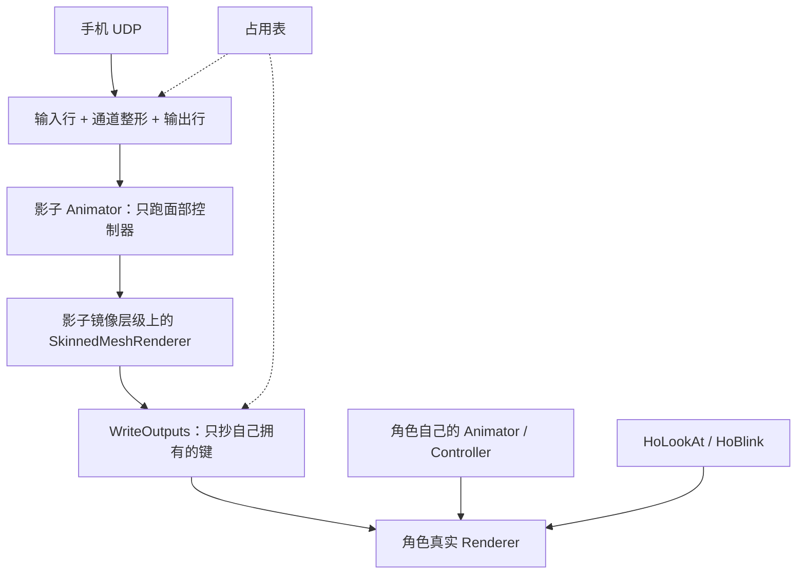

# 面捕流水线（现状权威）：VTS 裸输入 → 中间层 → 控制器 → Warudo / 输出

> **本文写的是现状**：这条链**现在**怎么跑、每一步的权威文件在哪、出了问题去哪儿看。
> **历史决策见 [DECISIONS.md](DECISIONS.md) 与 [`archive/`](archive/)** —— 被推翻的方案、带日期的快照、别家血统的取证都留在那边，
> 本文不复述"当初为什么被否掉"。
>
> 合并来源（都还在仓库里，保留作历史参考）：`FACE_TRACKING_MIDDLE_LAYER.md`（中间层机制）、
> `FACE_TRACKING_DESIGN.md`（影子台 / 占用表 / 线程与生命周期）、`FACE_TRACKING_WORKFLOW.md`（怎么用）、
> `FACE_TRACKING_WARUDO_ROUTE.md`（Warudo 侧的现状部分）。
> 相邻权威：[`CONTROLLER.md`](CONTROLLER.md)（控制器结构与命名 + 混合树实测边界）、
> [`PARAMETERS.md`](PARAMETERS.md)（参数规范与设备实测）、[`AXES.md`](AXES.md)（每根轴的口）、
> [`README.md`](README.md)（入口）。

---

## 0. 一句话

**参数进、参数出。** 面捕**不接管角色的 Animator**：它在**中间层**把手机发来的裸线名加工成参数，
在一台**隐藏的影子台**上跑一份面部控制器，只把"我们拥有的那些形态键"抄回真实模型。
身体的动画、Timeline、LookAt、别的约束全都照常。

```
① 原始输入            ② 中间层（配置文件）              ③ 影子台                ④ 写回 / 出口
VTS 手机 UDP     →   输入行：线名 → 规范名          →   会话把参数喂给      →   只写占用表里
（请求式，0..1）      （+ 曲线 + 有序修饰符）            影子上的那份控制器       自己拥有的形态键
                     输出行：参数名 = 曲线(表达式)
```

两条硬纪律：

- **① 只交原样**：接收端给的是手机发来的线名与原始值（外加 `FaceFound` / 热键）。**改名、量纲换算、合并不在接收端做** ——
  换个设备只改配置，不动代码。
- **轴是参数算术，必须在表达式里做完**（`开合 = eyeBlinkLeft − eyeWideLeft`）—— **树只消费参数**，它没有 `min`/`max`/除法/记忆
  （判据与实测数字见 [`CONTROLLER.md`](CONTROLLER.md) §8）。

---

## 1. 四段流水线，各段归谁

| 段 | 干什么 | 权威落点 |
| --- | --- | --- |
| **① 接收** | 每秒发一次请求；收 UDP 包；`线名 → 原值` 摊平；来源校验与统计 | `Runtime/FaceTracking/HoVtsPacket.cs`、`Editor/FaceTracking/HoFaceReceiverBase.cs`、`Editor/FaceTracking/VtsIphoneReceiver.cs`、`Editor/FaceTracking/HoFaceInputPacket.cs` |
| **② 中间层** | 输入行（线名 → 规范名）、通道整形（过渡期）、输出行（规范名 → 参数名），表达式 + 曲线 + 有序修饰符 | 数据：`Editor/FaceTracking/Profiles/*.hoface.json`；模型：`Runtime/FaceTracking/HoFaceMiddleware.cs`；求值：`Runtime/FaceTracking/HoFaceExpression.cs`；读写器：`Runtime/FaceTracking/HoFaceProfileJson.cs` + `HoJson.cs`；会话侧求值顺序：`Editor/FaceTracking/HoFaceAnimationSession.cs` |
| **③ 影子台** | 隐藏镜像层级 + 独立 Animator 跑控制器；设参数 → `shadow.Update(0f)` → 读回 | `Editor/FaceTracking/HoFaceAnimationSession.cs`（`BuildShadow`）、`Editor/FaceTracking/HoFaceAnimationAssets.cs`（`Compile` 过滤副本） |
| **④ 写回** | 只抄**占用表里属于本次会话**的键回真 Renderer；停 / 退出播放 / 出错时还原 | `Runtime/FaceTracking/HoFaceOutputOwnership.cs`、`HoFaceAnimationSession.cs` 的 `WriteOutputs` / `Dispose` |
| **出口（Warudo / 下游）** | 同一份 profile 在 Warudo 侧再跑一遍：接收器 → `HoFace参数处理` → `HoFace控制求解` → 官方 3 个应用节点 | 另一个仓库 `Assets/HoWarudoModTests/Mods-Ho/HoFaceTracking/`（**本仓库只读不改**）；契约见本文 §7 |

**Unity 侧与 Warudo 侧读同一份 `.hoface.json`**（同一个格式、同一份真源码；**不是同一个路径** —— Warudo 读插件沙箱里那份，
Unity 读 `profilePath` 指的那份。改完要自己同步过去）。

---

## 2. ① 输入：VTS 手机这条链

### 2.1 数据路径

```text
手机（VTS，设置里打开「3rd Party PC Clients」）
  ← 我们每秒发一次请求（JSON，发往 手机:21412，time=5 秒）
  → 手机按帧把 JSON 发回**请求的源 IP**、端口用请求里报的那个
       ↓
HoVtsPacket.TryParse        “线名 → 原值”（不改名、不换算、不合并）
       ↓
HoFaceInputHub.Merged       按环境顺序合并（逐线名判新鲜度）
       ↓
中间层「输入行」            规范名 = 曲线(表达式(线名…)) + 有序修饰符
       ↓
通道整形 / 输出行 / 影子台
```

- **不是手机主动推流。** 手机上除了打开那个开关**没有要填的东西**：它把数据发回请求包的源 IP、端口用请求里 `ports` 指定的。
- 请求原文由 `HoVtsPacket.BuildRequest` 手写：
  `{"messageType":"iOSTrackingDataRequest","time":5,"sentBy":"HoFaceTracking","ports":[<本机端口>]}`（`Runtime/FaceTracking/HoVtsPacket.cs:62`）。
  官方允许 `time` ∈ [0.5, 10]，所以要**每秒续一次**。
- **不发请求就一个包都收不到** —— 所以"只想看原始值"也必须先连上（编辑模式下就能连）。
- 载荷字段名来源是官方样例仓库的 `VTubeStudioRawTrackingData.cs`：`Timestamp` / `Hotkey` / `FaceFound` /
  `Rotation` / `Position` / `EyeLeft` / `EyeRight` / `BlendShapes`。官方 README 原话：有些字段将来可能**新增**
  ⇒ **未知字段一律跳过**，不许因为多了个字段就整包失败。
- 姿态这种"一字段多分量"按 `<字段>_<下标>` 摊平（VTS 的 `Rotation` → `Rotation_x/_y/_z`，`Runtime/FaceTracking/HoVtsPacket.cs:133`）。
  哪一段是角度、要不要 `* 0.0174533`、左右怎么并，全写在中间层的输入行里。

### 2.2 端口与地址

| 项 | 值 | 出处 |
| --- | --- | --- |
| 手机侧端口 | **21412**（App 上显示的 / `VtsIphoneReceiver.PhonePort`） | `VtsIphoneReceiver.cs` |
| Unity 调试面板本机监听 | **49984**（`VtsIphoneReceiver.DefaultPort`） | 同上 |
| Warudo 节点接收器本机监听 | **49985** | `FACE_TRACKING_WARUDO_ROUTE.md` §4.7 |
| 官方 iFacialMocap 接收器资源 | 占 **49983**（要用那个得先关掉它） | 同上 |
| 手机地址 | 必须是合法 IPv4，且不是 Any/Broadcast；**来源 IP 校验**只收那个 IP | `HoFaceReceiverBase.cs:126`、`:211-218` |

⚠️**两边各管自己的默认**（Unity 49984 / Warudo 49985），别以为其中一个是错的。

### 2.3 `FaceFound` 与"丢追"：接收端如实报，回中性在下游

- `FaceFound` 落到线名空间就是 `FaceFound`（1/0，`HoVtsPacket.FaceFoundKey`），和形态键一起进合并表 ⇒ 中间层的输入行可以读它。
- **丢掉的脸不会被我们"补"成 0**：接收端如实报状态，"丢追回中性"在**下游**做：
  Unity 侧是会话的断流逻辑（§5.4），Warudo 侧在图上（两条权重方向不同：`角色看向目标` 吃 **`IsTracked`**、
  官方待机生成器吃 **`1 − IsTracked`** —— 见 §7.3）。
- 这就是为什么 **iFacialMocap 被删掉**：它给不出这个标志。

### 2.4 本机这一侧的约定（都是实测咬出来的）

| 约定 | 证据 |
| --- | --- |
| **先绑定端口、再发第一个请求**（免得丢掉早期响应） | `HoFaceReceiverBase.Start` 先 `Bind`，再 `worker.Start()`，最后 `OnStarted`（`HoFaceReceiverBase.cs:144-151`） |
| "一个包都没来"和"有包但来源不对"是**两种故障**，必须分开报 | `HoFaceReceiverBase.cs:38-39`、`:211-218` |
| 坏包 / 丢旧帧 / 主动请求各有计数 | `Packets` / `Invalid` / `Replaced` / `Rejected` / `Recoveries` / `Requests`（`HoFaceReceiverBase.cs:41-47`） |
| 瞬时 socket 错误不退出收包循环 | `IsTransient`（`HoFaceReceiverBase.cs:184`） |
| 单包长度上限 **16384** | `MaxPayload`（`HoFaceReceiverBase.cs:72`） |
| 解析必须与区域文化无关（`0.5` 不能被读成 5） | `HoJsonReader.ReadNumber` 明确用 `InvariantCulture`（`HoJson.cs:115`） |
| **所有数据路径都不用 `JsonUtility`** | `HoJson.cs:7-24` 记的三次事故（§9.2） |
| 输入环境是工程级有序源列表，顺序 = 优先级 | `HoFaceInputEnvironment`，落盘 `UserSettings/HoUnityTools/FaceInput.asset`；`HoFaceInputHub.cs:280-288` |
| 现在只有 VTS 一项；加设备的形状是固定的 | 加一个接收端子类 + 在工厂里加一行，差异只在那个 `TryParsePacket` 里 |

### 2.5 设备方言：**一份配置对一台设备**

- **iPhone VTS 是干净的方言**（67 键）：形状那半边是**纯 VTS PascalCase**（`JawOpen` / `MouthSmileLeft`…），
  52 个形状全部到位、0 个对不上；标量那半边 `Rotation_*` / `Position_*` / `EyeLeft_*` / `FaceFound` / `Hotkey` / `Timestamp`。
- ⚠️⚠️ **"VTS 手机 = PascalCase"只对官方那台 iOS App 成立**：**安卓版 VTS**（用户实测那台）形态键发的是
  **iFacialMocap 命名**（`jawOpen` / `eyeBlink_L` / `mouthSmile_L` / `browInnerUp_R`…），标量发的才是 VTS 命名，
  另加 PascalCase 的 `EyeBlinkLeft/Right` —— **一份 payload 里两套方言并存**。
- 完整的逐设备实测键表见 [`PARAMETERS.md`](PARAMETERS.md) / `PARAMETER_DEVICE_VERIFICATION.md`；
  两份"纯直通参考"配置 `ho-debug-iphoneVTS.hoface.json`（67 输入 / 67 输出）与
  `ho-debug-androidVTS.hoface.json`（65 / 65）就是那些实测表的落盘形式。
- ⚠️ **`ho-debug-*` 不能当能跑的配置用**：它们是"原样记录"（`parameter = expression = 线名`，两层曲线恒等）。
  中间层是靠**输入行的 `parameter`** 去 `HoFaceTrackingChannels.IndexOf` 解析通道的，而那个索引表是 **88 条**
  （52 个规范名 + `Left`/`Right` 结尾者的 `_L`/`_R` 别名）、比较是 `StringComparer.Ordinal`（**逐字**）。
  实测：`ho-iPhoneVTS` 67 输入行 → **52/52** ✅；`ho-debug-iphoneVTS` 67 → **0/52**；`ho-debug-androidVTS` 65 → **40/52**。
- ⚠️ **同名输入行 = 最后一行生效（后写的赢）**，而且**缺数据时不回退**（那一格就是 0）
  ⇒ **别在同一份配置里混两种方言**：后声明的那行若没数据，会把前面有数据的行顶掉 ⇒ 值恒 0。
  **要兼容多方言就写多份配置，一份对一台设备。**
  （唯一允许"同一条通道写两行"的情况是安卓那对眨眼：两行读的是**同一个通道**，不存在顶掉。）

---

## 3. ② 中间层：值是怎么被加工的

> 形状照 **VBridger**（同类里最成熟的那个，我们逆过它的存档与 UI，见 [`archive/VBRIDGER_MIDDLE_LAYER_RESEARCH.md`](archive/VBRIDGER_MIDDLE_LAYER_RESEARCH.md)）：
> **每一行 = `名字 = 曲线(表达式(变量…))` + 一串有序修饰符**。

### 3.1 两类行

| 行 | 左值（写出去的） | 变量（读进来的） | 干的事 |
| --- | --- | --- | --- |
| **输入行** | **规范名**（`jawOpen`、`headRotX`…） | 手机发来的**线名**（`JawOpen`、`Rotation_x`…） | **改名 + 量纲 + 姿态分量**，全在这一层 |
| **输出行** | **控制器参数名**（`Ho/Drive/…`，或下游出口名） | 规范名（也允许直接写线名） | 参数怎么来、曲线怎么整、平滑/维持 |

### 3.2 固定步骤（顺序不可换）

```text
手机线名原值（接收端只交原样）
  → 输入行：curve( expression( 线名… ) ) + 修饰符        （配置文件 inputs）
  → 通道层（过渡期）：模式 / 输入曲线 / 断流回中性         （调试设置 channels，不落盘）
  → 输出行：curve( expression( 规范名… ) ) + 修饰符       （配置文件 outputs）
  → 写进影子 Animator 的参数
```

**两条纪律**：

- **轴是参数算术，必须在表达式里做完** —— 树只消费参数。
- **平滑在输出侧、按行给**（不再有"眼睑组一个时间常数"）：眼球要跟得紧、眼睑要稳、嘴更黏，
  那是**每一路自己的手感**。

### 3.3 一行长什么样

| 字段 | 说明 |
| --- | --- |
| `parameter` | 写出去的名字。**输入行**里是规范名，**输出行**里是控制器参数名（**控制器里没有这个名字就跳过 —— 不猜也不补**） |
| `expression` | 表达式，变量就是上一层给的名字。**留空 = 常量行**（§3.6） |
| `defaultValue` | **没有东西驱动它时这一行是多少**（默认 `0`），语义见 §3.6 |
| `curve` | 响应曲线：横轴 = 表达式的值，纵轴 = **写出去的值**。**范围之外按端点算（不外推）** |
| `modifiers` | 有序：`Smooth`（秒）/ `Delay`（秒，每行一条 FIFO）/ `Steps`（trigger / target / hold / threshold） |

⚠️ **不写 `curve` 不等于"直通"**：默认曲线是 **`0..1 → 0..1` 线性**（`HoFaceOutput.curve = AnimationCurve.Linear(0,0,1,1)`，
`HoFaceCurve.Transfer` 先按端点夹取再求值）—— 所以**度数、米、任意量纲的行必须自己写 `curve`**，否则会被夹成 0/1（负值一律 0）。
**2026-09-25 实测现场**：`headRotX ← Rotation_x`（度）没写曲线 ⇒ 手机发 `Rotation_x = 3.118`，输出端恒为 0，
表现为"头姿一直是 `(0.0, 0.0, 0.0)°`、`Head Position` 一直 `(0,0,0)`"，而形态键（本来就是 0..1）一切正常 ——
**症状看起来像"头那部分没接线"，其实是曲线把值夹没了**。修法：给那几行写宽范围恒等曲线
（角度 `±180 → ±180`、位置 `±100 → ±100`，`inT/outT = 1`）。

⚠️⚠️ **而且"两层都要写"**：`输出行 = curve_out( expression_out( 输入行算出的规范名 ) )`，而**输入行自己也有曲线**
⇒ 想直通的量纲，**输入行与输出行都得给宽曲线**。只给一层会这样：输入行算出 `3.694`（对的），
输出行的默认 `0..1` 曲线再把它夹成 `1.000`（负值则是 `0.000`）。
**记住这个形状：出口恒为 0 或 1、而输入侧有真值 ⇒ 就是某一层的默认曲线在夹。**

⚠️ **输出行曲线的纵轴是"参数值"，不是百分数**：参数进了混合树就是**子权重**，片段里那个 100 是另一回事（树采的是姿势）。
把纵轴写成 `0..100` 会让权重变成 100 倍（实测踩过：权重 210 = 参数 2.107 × 片段 100）。

### 3.4 表达式语言（照 VBridger）

- 运算符：`+ - * / ^`、比较 `< <= > >= == !=`、逻辑 `&&` `||`、括号、单引号 `'…'`（惰性嵌套表达式）、
  双引号 `"…"`（**字符串，只给 `out("…")` 用**）。
- 函数：`sin cos tan asin acos atan atan2 sinh cosh tanh abs sqrt log log10 exp round floor ceil sign
  min max clamp approx lerp rand time if` + **`out("输出行的参数名")`**。
- `if('(a>0.5)&&(b>0.8)', 真, 假)` **只算被选中的那支**；`time(i,m)` 按帧计数。
- **未知变量按 0、非有限结果折 0、除零按 0** —— 它跑在每帧的管线上，绝不抛异常（错在解析期报）。
- 两个例子：`eyeBlinkLeft - eyeWideLeft`（双向轴）；
  `0.75 - 0.75*eyeBlinkLeft + 0.25*eyeWideLeft`（别人血统那种加权式 —— **一行就够**）。

### 3.5 `out("…")`：引用**上面**已经算完的输出值

**为什么需要**：风格化特殊形态（**鼓嘴 / 倒V / 苦嘴**）要**关掉整块"张嘴 × 笑"的混合树**，
于是中间层需要"由**别的输出行**算出来的门"。而中间层原来是**纯前馈**的 ⇒ 这是它第一次允许行与行之间有依赖。

**规则**（刻意做得简单）：

0. **所有行读写的都是同一张「输出表缓存」**（`HoFaceOutputTable`）：`参数名 → 这一帧已经写进去的值`。
   每帧开头清一次；行按顺序**写**进去（**后写覆盖先写**）；整份配置**走完之后才统一发布**
   （影子 Animator / 参数 Hub）。⇒ "别的行读到的值 / 面板读到的值 / 发出去的值"永远是同一个，没有半成品。
1. **按行序求值** —— 就是 profile 里 `outputs` 数组的顺序，**不排序、不递归**。
2. **`out("参数名")` 读表里这个名字现在的值** —— 也就是**上面最近写过它**的那一行、**过完曲线与修饰符**的那一份
   （不是那行的原始表达式值）。
   ⚠️ **同名多行是有意的**（用户：「有两条 `Ho/Style/MouthGate` 规则，第二条读自己写自己，这样就可以无限拓展」）：
   后写覆盖先写 ⇒ 发布出去的是**最后写的那一行**，于是"每个形态再压一条同名行"就能让**加形态不用动任何已有行**。
3. **上面没有这个名字（不管它是不是在下面才有）⇒ 这一行无效**：面板上**爆红**，并且**始终输出 `defaultValue`**
   （它的表达式作废）。引用**不存在**的行同样无效（多半是名字敲错了）。
   ⚠️ 所以链的**第一条**同名行不能读自己（它上面还没有人写过）—— 得有一条**基准行**打底。
   **输入行里也不许用**（输入行在输出行之前求值，没有"上面"可言）—— 会话会把这种输入行当无效行。

**为什么用函数、不直接写名字**（用户原话：「用特殊的函数引用上面的算完的输出值（防止重名）」）：
参数名里带 `/`（`Ho/Drive/Mouth/…`），**裸标识符根本写不出来**；而且**防止与输入通道重名**。

**为什么不需要环检测 / 拓扑排序**：表里只有**已经走过**的行写过的东西 ⇒ 读只能朝上，依赖图**按构造就是 DAG**，
行序本身就是拓扑序 —— 环在语法上不可能出现。

**修饰符为什么仍然安全**：表的键是**名字**，而修饰符状态是**每一行自己的**（按行号索引）。行读到的就是那一行过完修饰符的值，
跟"它会不会被后面的同名行覆盖"无关；也不会读到自己（本行还没写进表）⇒ 没有反馈环。
唯一的语义变化是"**一个名字的发布值 = 最后写它的那一行**"（名字唯一时与从前完全一样）。

**例子**（风格化门，**已落地**：`Ho/Style/*`）：

```text
规则一 写自己（一个形态一条行，行内一次管完）
  Ho/Style/InvertedV = (mouthPucker * HoAutoInvertedV) + HoExternalInvertedV
                       [维持(迟滞)] → [平滑]     ← 连续读数 + 两个 0/1 开关 + 形态过渡

规则二 关其他 = 基准行（写一次）+ 每个形态再压一条**同名行**（双重形态）
  Ho/Style/MouthGate = 1                                        ← 基准：常量 1（门开着）
  Ho/Style/MouthGate = out("Ho/Style/MouthGate") * (1 - clamp(out("Ho/Style/InvertedV"), 0, 1))
                        ↑ 读的是**上一条同名行**（基准）                    ↑ 本形态
（加鼓嘴：照抄最后那一行、把形态名换成 Ho/Style/Cheek —— **已有的行一个字都不用改**）
（✅ 2026-09-28 加了第三个风格轴：`Ho/Style/CatMouth = 判定 × HoAutoCatMouth + HoExternalCatMouth`
 —— 跟倒V 那行**同形**；但它是**变体**，**不写 MouthGate**（没有"关其他"））
```

⚠️ **`Ho/Style/*` 是"中间层内部行"**：只被别的输出行读，**不写控制器参数**。`Ho/Drive/*` 才是**契约**
（写进 Animator 参数的那一批）。面板「配置输出行」栏给内部行标一句灰字「内部行 ⇒ 不写控制器」，
且**不算进**"不在控制器里"那个警报 —— 那是留给名字写错的行。

⚠️ **顺序即语义**：把这个门放在被它引用的行**上面**，它就会（正确地）被判无效、恒输出默认值 ——
面板会红给你看，而不是悄悄算成 0。
⚠️ **插行前先确认锚点是不是该组最后一行**：2026-09-28 深夜连栽两次（新行插到锚点前面 ⇒ 那几行恒 0，探针当场抓到）。

### 3.6 每行的默认值：`defaultValue`

**一句话：没有东西驱动它时，这一行是多少。** 默认 `0`（= 中性）—— 但**显式声明**这件事本身是重点：
以前"没数据"和"值是 0"在配置里长得一模一样，现在作者写下来的就是答案。

| 行 | `defaultValue` 是什么意思 |
| --- | --- |
| **输入行** | 那条**设备线名一帧都没来过**时，这个规范名取它。Unity 侧同时也是**断流回中性**的目标值（会话里 `resting`）；Warudo 侧就是这一行的初值。⚠️ 没人声明非 0 时它跟老的隐式 0 完全一样 ⇒ **对现有配置零行为变化** |
| **输出行** | `expression` **留空**时这一行写出去的值 —— 也就是**常量行**：`parameter = Ho/Drive/Gate/Lip` + `defaultValue = 1` + 空表达式 = **中间层自己产出的门控**。表达式**写了但解析不了**时也退回它 |

⚠️ **常量行不过曲线**：作者填 1 就该得 1（曲线是给"算出来的值"整形用的）；**修饰符照走** ——
想让常量入场时爬上去，给它加一个 `Smooth`。

⚠️ **常量行不是错**（2026-09-27 修的一个面板 bug）：表达式留空是**合法**的一类行。现在的画法：
行**灰底**（不画曲线）、表达式那一栏写 **`= 默认值`**、状态行单独数出来（`… · 常量行 N`）**不计入**"表达式有错"、
会话编译时也不再为它打 `Debug.LogWarning`。**「有表达式但解析不过」仍然照旧报红** —— 那才是真错。

**顺序仍然是**：`表达式 → 曲线 → 修饰符`，默认值只在"没有表达式 / 没有数据"那两个位置上顶替**值**，不改变这条顺序。
它**不是钳制范围**（范围归 `curve`），也不改"缺键 = 保持上一帧"那条规矩（那条说的是**已经有数据之后**漏帧的情况）。

**VB 对齐**（`.research/vbridger/decrypted/*.vbridger.txt`，26 行 `store` 每行都有它）：VBridger 的 `defaultValue`
是每行的"静息值"，24/26 是 `0`、两条是 `0.5`（`VoiceFrequencyPlusMouthSmile`、`Brows`）。

**它换来了什么**：控制器可以彻底退化成"**参数 → 姿势的混合器**" —— 门控不必再借控制器的 `m_DefaultFloat`，
中间层自己就能给（一行常量行）；"某个值什么都不动时是多少"也不再是隐式的 0。

### 3.7 修饰符

| 修饰符 | 干什么 | 参数 |
| --- | --- | --- |
| **平滑 Smooth** | 指数平滑（一阶低通），压抖动 | 时长（**秒**，不跟帧率绑定；VBridger 那份是帧数） |
| **维持 Steps** | 翻页式：过 `trigger` 跳到 `target`，掉回 `threshold` 之下才退，触发后至少保持 `hold` | trigger / target / hold / threshold |
| **延迟 Delay** | 每行一条 FIFO：进去的值等这么久再出来 | 时长（秒）——**已实现**（2026-09-26） |

### 3.8 配置文件 `.hoface.json`

一份可读 JSON，扩展名 `.hoface.json`，**放哪都行**。它是**磁盘上的普通文件**（不是 `TextAsset` 引用）：
Unity 侧与 Warudo 侧读的是**同一个文件** —— 这是"面板里是什么、Warudo 里就是什么"的物理保证。
设置里存的是它的**路径**；面板把它当**必填总闸**（空着就把下面各栏锁住）。

⚠️ **精确语义**：**留空 / 没指定配置文件 ⇒ 空表，这一层不做事**；**没有内置默认兜底**
（**2026-09-26 起连"内置默认表"这个类本身都删了** —— 仓库里现在**不存在任何一份默认配置**）。

| | 取哪一份 | 有配置文件、但那一类是空的 |
| --- | --- | --- |
| **输入行** | 只认配置文件里的 `inputs`；没指定配置文件 ⇒ **空表** | 空表 ⇒ **等于不做改名**（规范名必须与线名同名） |
| **输出行** | 只认配置文件里的 `outputs`；没指定配置文件 ⇒ **空表** | 空表 ⇒ **不写任何参数**（"新建配置"写出来的就是**空**的） |

也就是说"没指定配置文件"**就是这一层不做事**（会话起不来，也不会自动起）。真正会咬人的是**指定之后漏了线名**。

```json
{
  "format": "ho-face-middleware",
  "version": 2,
  "displayName": "my-face",
  "notes": "吃 VTS 手机裸线名；出口是我们自己的名字",
  "inputs": [
    { "parameter": "jawOpen", "expression": "JawOpen", "notes": "VTS 手机：线名首字母大写" },
    { "parameter": "headRotX", "expression": "Rotation_x", "notes": "VTS 手机；弧度还是度由你自己在这行决定" }
  ],
  "outputs": [
    {
      "parameter": "jawOpen",
      "expression": "jawOpen",
      "curve": { "keys": [ { "t": 0, "v": 0, "inT": 0, "outT": 0 },
                           { "t": 1, "v": 1, "inT": 0, "outT": 0 } ] },
      "modifiers": [ { "kind": "smooth", "seconds": 0.03 } ]
    },
    {
      "parameter": "Ho/Drive/Lid/Left/BlinkWide",
      "expression": "eyeBlinkLeft - eyeWideLeft",
      "curve": { "keys": [ { "t": -1, "v": -1 }, { "t": 1, "v": 1 } ] },
      "modifiers": []
    }
  ]
}
```

- **线名 → 规范名只认配置文件的 `inputs`**，没有内置默认兜底。`inputs` 为空 = 不做改名（那时规范名必须与线名同名）。
- `format` + `version` 给以后的兼容留位：**认不出的字段忽略**，认不出的修饰符 `kind` 会被点名。
- 曲线在文件里就是关键点列表（`t` / `v` / `inT` / `outT`）；**关键点的范围就是这条曲线的定义域**。
- 不加密、不带魔改编码 —— 它是数据，就该能 diff、能用手改、能发给别人。
- **缺键语义**：表达式引用到的线名只要有一个这一帧没来，这一行就**不写**（保持上一帧、并标记为不新鲜），
  所以两套协议的行同时存在是安全的。

**为什么删掉内置默认表**：默认配置比"兜底"还坏 —— 它按**另一台设备**的量纲写死了换算（iFacialMocap 的 `* 0.01`），
拿它接 VTS 手机就小 100 倍，而且**不报错**；它还替作者**决定映射什么**。
现在「新建配置」写出**空表**、预填文件名是 `my-face.hoface.json`（**只是个占位名**）、
`HoFaceMiddleware.displayName` 默认**空串**、`HoFaceProfile.WriteDefaults()` **删了**、
验证用例的夹具**自己在用例里搭**、面板 `EnsureMiddleware()` 的兜底是**空**中间层。
⚠️ 所以换设备 / 换协议时**没有任何东西替你决定**：照设备的实际线名与量纲写一份配置。

### 3.9 四层，各归各的

| 层 | 跟什么走 | 存在哪 | 里面有什么 |
| --- | --- | --- | --- |
| **输入行** | **这台设备 / 这张脸**（换模型不用重做） | 配置文件 `.hoface.json` 的 `inputs` | `规范名 = 曲线(表达式(线名…))` + 有序修饰符 |
| **通道层**（过渡期） | 这台角色 | 调试设置的内存字段（`HoFaceDebugSettings.channels`） | 52 个规范名的**模式**（实时 / 手动 / 保持 / 中性 / 交还）、中性值、**输入曲线** |
| **输出行** | **这份控制器** | 配置文件 `.hoface.json` 的 `outputs` | `参数名 = 曲线(表达式(规范名…))` + 有序修饰符 |
| **断流 / 回中性** | 这台角色 | 调试设置（`staleSeconds` / `neutralFadeSeconds`） | 多久没收到包算断流、多快滑回中性 |

⚠️ **通道层是过渡期字段**：面板上目前**没有入口**，而且它**不落盘**（进播放模式的域重载之后就回到默认）。
按已定的方向，它的"输入曲线"该并进**输入行**（那一层本来就该负责这台设备的手感），模式与中性值也会随之下沉。
用例还在这层上做断言（`Tests~/FaceTrackingValidation.cs`）。

**输入曲线**（横轴 = 原始输入 0..1，纵轴 = 整形后的输入）：它就是"我的脸打不满 1"的解法，也顺手把静止时的小抖动压掉。
**增益被它取代了**：增益只是曲线的一段直线，而曲线能同时表达"打不满"、"压噪声"、"整体放大"，而且是**数据**。

**通道层还剩什么**（`HoFaceChannel`，`HoFaceTrackingChannels.cs:32`）：

| 模式 | 语义 |
| --- | --- |
| `Live`（实时） | 用当前来源数据，再过这条通道的**输入曲线** |
| `Manual`（手动） | 用调试滑杆；网络数据仍可观察但不覆盖滑杆 |
| `Hold`（保持） | 保持进入该模式时的值。这是冻结，不是释放控制权 |
| `Neutral`（中性） | 写这条通道的中性值，**不是**统一写 0 |
| `Release`（交还） | 撤销对这个键的拥有权 |

**输入曲线只作用在实时输入上**（手动滑杆是调试用的，不该被它整形）。**平滑不在这里**：它是每一行输出自己的修饰符。

### 3.10 表达式取变量分三级

① 52 个规范名（走通道整形后的值）→ ② 其它输入行的结果（`headRotX`…）→ ③ 合并后的**原始线名**
（`EyeBlinkLeft`、`Rotation_x`…）（`HoFaceAnimationSession.Lookup`，`HoFaceAnimationSession.cs:304-311`）。

---

## 4. ③ 影子台：不接管 Animator

**被否掉的设想：** 由一个会话接管目标 Animator 的动画输出，让"基础 Controller"和"面部 Controller"进同一个 `PlayableGraph`、
用 `AnimationLayerMixerPlayable` 组合、面部走 Override。

否掉它的两条实测依据：

| 事实 | 依据 |
| --- | --- |
| **不能用 `Animator.hasBoundPlayables` 判"是否被别的动画图接管"** | 实测：普通 Animator 只要挂了 Controller 它就是 `true`，会把任何正常角色误判成被 Timeline 接管。Unity 也没有公开 API 能枚举全部 `PlayableGraph`，所以这个预检连同它的误报一起删了 |
| **不能用 PlayableGraph 把"身体层 + 面部层"叠起来** | 实测：覆盖层会把图层自己没动的属性也写成默认值（基础动画的 `eyeLookInLeft=33` 被压成 0）；`AvatarMask` 不支持形态键，做不出"这层只管 `jawOpen`"；改加算又变成"基础 + 面捕"相加 |

**实际采用的架构 —— 影子求值 + 只写拥有的键：**



### 4.1 具体做法（都在代码里）

| 步骤 | 实现 |
| --- | --- |
| 影子根 | 一个 `HideAndDontSave` 的空物体 + 一个 `Animator`，`cullingMode = AlwaysAnimate`（`HoFaceAnimationSession.cs:119-127`） |
| 镜像层级 | 按编译出来的曲线路径逐段搭同名节点，每格挂一个 `SkinnedMeshRenderer`，**共享真网格的 Mesh**、`forceRenderingOff = true`、`updateWhenOffscreen = false`（`:130-156`） |
| 跑哪份控制器 | 编译产出的 `AnimatorOverrideController`（只含我们拥有的键的过滤副本，内存里）（`HoFaceAnimationAssets.Compile`，`HoFaceAnimationAssets.cs:418`） |
| 设参数 | 只对**控制器里真有的** Float 参数 `SetFloat`；没有那个名字就跳过（不猜、不补）（`:242`） |
| **求值** | 设完参数后**自己 `shadow.Update(0f)` 强制求值一次**（`:252-259`） |
| 抄回 | `WriteOutputs` 从影子代理读 `GetBlendShapeWeight` 写到真 Renderer，**只遍历 `owned`**（`:386-396`） |
| 调试接入 | **把影子台显示出来就看真身**：面板「对象」段的「预览混合树」开关（默认开）打开后，影子根用 `DontSave`（出现在 Hierarchy、可选中）⇒ 选中它 + Animator 窗口 = 运行中的那棵树与实时参数 |

**为什么必须 `Update(0f)` 一次同步调用：** 以前是组件的 `Update`/`LateUpdate` 一对（设参数在 `Update`、抄回在 `LateUpdate`）。
组件删掉之后，如果"设参数"和"读结果"还分在两个编辑器回调里，就是在**赌回调顺序**。自己 `Update(0f)` 之后，
这一步变成"设参数 → 求值 → 读值"一次调用里完成；影子是活动对象，Unity 之后还会再算一次，参数没变所以无害。

**为什么不用 PlayableGraph：** 见上面那张表 —— 这条路本身不成立，**不是"暂时没做"**。

这样做的直接好处：

- 面捕没拥有的键（基础动画的、HoLookAt 的、HoBlink 的）**在构造上就不可能被面捕影响**，不依赖分层语义或遮罩这种微妙的东西。
- 不需要摘掉用户的 Controller，也就不需要保存/恢复 Animator 状态与参数；不限制 Animator 的更新模式，也不改它的 Culling Mode。
- Timeline / Av3Emulator / 别的图驱动同一个 Animator 时不再冲突 —— 面捕根本不参与那张图。
- 与脚本写入者的关系只由**键的占用**决定，与时序无关。

代价与边界：影子台与真 Renderer 之间是**抄值**而不是动画系统直接写，所以**只支持形态键曲线**（正好是首期范围）；
影子层级与过滤副本都是播放期临时对象（`HideAndDontSave` + 会话结束时销毁）。

### 4.2 控制器的接受范围（`HoFaceAnimationAssets.Compile` 的检查）

| 接受 | 拒绝 |
| --- | --- |
| 纯 Unity `AnimatorController` | `AnimatorOverrideController` 当源（`:421`） |
| 只含形态键 Float 曲线 | 片段里的**事件 / 对象引用曲线 / Humanoid 动画**（`:461`） |
| 无 Behaviour | 状态机或状态上的任何 `StateMachineBehaviour`（`:508`、`:511`） |
| 无同步图层 | `layer.syncedLayerIndex >= 0`（`:425`） |
| Write Defaults 开/关都收 | **Direct 树 + Write Defaults 关**（实测会逐帧发散：0.6 的输入 → 98.98 → 246.28 → 1059.33；`:513-519`） |
| 通道里 `Release` 的键、以及输出过滤掉的键不编译 | 其余非形态键曲线（点名报错，不静默丢弃）（`:471-472`） |

超出范围时**开始驱动会明确报错并指出是哪一条**，不静默降级。

### 4.3 参数、线程与生命周期

**唯一的时钟：`HoFaceClock`**（`Editor/FaceTracking/HoFaceClock.cs`）是调试侧**唯一**的时间源：

```csharp
public static double Now => Stopwatch.GetTimestamp() / (double)Stopwatch.Frequency;
```

为什么是 `Stopwatch`：**同一次开机内单调**（不受系统时钟调整影响）、**任何线程可读**（不碰托管状态）、**域重载不影响**。
原点在哪无所谓 —— 所有用法都是**算差值**。两条硬约束写在那个文件的注释里，都被实测咬过：

| 症状 | 原因 |
| --- | --- |
| "包到了、合并里也有，通道就是不写"（实测记录：`packets=121 hasJawWire=True hubJaw=0.9 weight=17`） | 会话读 `EditorApplication.timeSinceStartup`，接收端后台线程读 `Stopwatch` —— 两个时钟差一个恒定偏移，那个"这一包新不新鲜"的差值永远越界 |
| "连不上"（`packets=0`、面板显示已断流，但 socket 与端口都是好的） | 把会话那边改成 `timeSinceStartup` 之后，接收端（**后台线程**）也要读它 —— 一读就抛 `get_timeSinceStartup can only be called from the main thread`，接收线程当场死掉 |

接收端与面板都只是这个时钟的别名（`HoFaceReceiverBase.cs:120`、`HoFaceInputHub.cs:324`），**不许另起一个实现**。

**线程分工**：

| 谁 | 在哪 | 干什么 |
| --- | --- | --- |
| 接收线程 | 后台（`Thread`） | 只 `Receive` + `TryParsePacket` + 给包打时间戳（`HoFaceClock.Now`），把最新一包放进 `pending`（`HoFaceReceiverBase.cs:201-250`） |
| `HoFaceInputHub.UpdateInput` | 主线程 | `TryTake` 拿走最新包 → 按环境顺序逐线名合并进 `Merged`（`HoFaceInputHub.cs:263-289`） |
| `HoFaceInputHub.Tick` | 主线程 | 会话推进：输入行 → 通道 → 输出行 → 写影子参数 → `shadow.Update(0f)` |
| `HoFaceInputHub.LateTick` | 主线程 | `WriteOutputs` 抄回真模型 |
| 面板 | 主线程 | 只读：约 10 Hz 刷新 |

**网络线程不调用 Animator、Renderer 或任何 Editor API。** 一个数据报解析成的帧是不可变的，在主线程一起提交。

`HoFaceDebugHost`（`[InitializeOnLoad]`）是**唯一拥有每帧 tick 的东西**，而且**只在播放模式推会话那一段**。
输入侧（收包 / 重连 / 清理死会话）由 `HoFaceInputHub` 自己的静态构造订阅驱动，与播放模式无关 ——
因为"连上手机、看原始值"这一步在编辑模式里也要能做。窗口随时会被关掉，所以 tick 不能挂在窗口上。

**播放模式切换时的收摊与接回**（进播放会域重载，静态字段连同"用户想连着"这个意图一起被清掉 ⇒ 把意图**持久化**
`HoFaceInputEnvironment.wantConnected`，并在两个钩子上做对称动作）：

| 时刻 | 做什么 |
| --- | --- |
| `ExitingPlayMode` / `ExitingEditMode` | `Shutdown`：停所有会话、释放 socket（不收的话端口占着，新域绑不上端口）。**如果这一刻还连着，先把 `wantConnected = true` 记下来** |
| `EnteredPlayMode` | 清掉"用户停过 / 报错 / 重试"这些状态，立刻 `TryReconnect()`，别让用户看到"未连接" |
| `ExitingPlayMode`（宿主） | 再收一次会话：影子对象是 `HideAndDontSave`，不收会留在场景里 |
| `EnteredPlayMode` + `startOnPlay` | 自动开会话（**不会**自动连手机）。**没配 `*.hoface.json` 时不动作** |
| 每帧 | `TryReconnect`：只有在**用户想连着**时才接回来；刚连上给 3 秒宽限；重试用 2 秒网隔 |
| 接收端 `Dispose` | 停线程（`Join(1000)`）、关 socket、清 `pending` |
| 占用表 | 进播放时 `Reset()` 清空 |

**用户按的「停止」和"系统收摊"是两件事**：用户停过之后本次 Play 内不再自动拉起（`UserStopped`）；
组件禁用 / 退出播放 / 出错属于后者，之后还能自动拉回来。

### 4.4 占用表：谁拥有哪个键

门控删掉之后，唯一还在的"权限"机制就是这张表。

**键的身份是 `(SkinnedMeshRenderer 实例, 形态键下标)`**，不是键名、也不是"眼睛组"（`Runtime/FaceTracking/HoFaceOutputOwnership.cs:10`）。

| 接口 | 语义 |
| --- | --- |
| `Reserve(mesh, index, owner)` | 登记。**同一个键已属于别的 owner 时直接抛异常**（"此形态键已由另一个面捕会话接管"），不静默抢 |
| `Release(owner)` | 交还这个 owner 拥有的全部键 |
| `IsReserved(mesh, index)` | Ho 的写作器（HoBlink / LookAt）**在还原自己写过的键之前问这句话** —— 被占用的键它就不还原 |
| `Reset()` | `[RuntimeInitializeOnLoadMethod(SubsystemRegistration)]`：进播放时清空 |

会话这一侧的生命周期（`HoFaceAnimationSession.cs`）：

1. **建**：编译出绑定表后逐个 `Reserve`，并记下每条键的**基准值** `binding.initial`。
2. **重建**：先给"这次不再属于自己"的键写回基准值，再 `Release(this)`，然后才让新拥有者写 ——
   顺序有意如此：旧拥有者不能在新拥有者写完之后再盖一次。
3. **写**：`WriteOutputs` 只遍历 `owned` 里的键，从影子代理读值写到真 Renderer。
4. **停 / 退出播放 / 出错**：`Dispose` 把自己拥有的、且 Mesh 没被换过的键还原成基准值，再撤销占用、销毁影子。

两条边界：**模型 Mesh 在运行中被换掉就停会话**，不往错的网格上写；**同一个 Animator 只允许一个会话**。

**Ho 的写作器（HoBlink / LookAt）与面捕互不覆盖**（实测）：面捕拥有的键被占用后，Ho 写入与清理都不再动它；
交还后基础动画接回。

### 4.5 断流回中性

| 项 | 值 / 位置 |
| --- | --- |
| 多久没收到包算断流 | `staleSeconds`，默认 **1 秒** |
| 回中性的淡出时长 | `neutralFadeSeconds`，默认 **0.2 秒** |
| 合并层认为一条源"不新鲜" | 1 秒（`HoFaceInputHub.FreshSeconds`） |
| 通道判"新鲜" | `inputFresh`（这一帧真的带来了它引用的全部线名）**且** 至少有一条源在跑 **且** 包龄 ≤ `staleSeconds` |

- **从没收到过实时数据的通道不占用模型属性**。
- 断流后不是硬切：`Effective` 按 `deltaTime / fade` 朝中性走，走完 `staleSeconds + fade` 之后 `mayWrite` 变假 →
  这个键退出"拥有"集合 → 重建 → 基准值还回去 → 基础动画按自己的节奏继续写。

### 4.6 HoLookAt 的接入

以代码为准（`Runtime/Constraints/HoLookAtConstraint.cs`）：

- `OnAnimatorIK` → `HandleAnimatorIK` 调 `Animator.SetLookAtPosition/Weight`；**Unity LookAt 的眼睛权重传 0**，
  眼睛由组件自己应用。不与 Animator 同物体时由 `HoLookAtIkRelay` 转发 IK 回调。
- `LateUpdate` → `ApplyEyes`。EyeBones 模式走 `ApplyEyeBones`，ShapeKeys 模式交给独立的 `HoShapeKeyWriter`。
  `HoBlinkConstraint` 可选 Update/LateUpdate/FixedUpdate，和 LookAt 各自持有 Writer。`HoShapeKeyWriter` 是共享实现，
  **不是**全场景共享的写入注册表。
- 眼球骨骼的累计漂移处理（当年补的三条，都在代码里）：`Update` 阶段先撤销上一帧自己叠加的眼球增量；
  记录与比较统一用 `localRotation`；只有"当前值仍等于自己上一帧写下的值"时才恢复，别人改过就不动它；
  同一帧多个图层开 IK Pass 时只推进一次平滑状态（`lastIkFrame`）。
  ⚠️ **这些补丁没有自动化验收**（验证工程里没有 humanoid Avatar）。
- 需要控制器操纵 LookAt 时要有 `HoLookAtAnimatorBridge`：**仍然只是拟定，代码里不存在**。

---

## 5. ④ 写回、出口，与"什么会写盘"

### 5.1 出口分组（发货那份 `ho-iPhoneVTS.hoface.json`）

出口是**两份并行 + 一套额外**（分组与逐行公式的权威在 [`PARAMETERS.md`](PARAMETERS.md) §3.7 与其源 `PARAMETER_HO.md`）：

| 组 | 行数 | 出口名 | 是什么 |
| --- | --- | --- | --- |
| **G1 原始 ARKit 52** | 52 | **裸规范名**：`eyeBlinkLeft`、`jawOpen`… | **无损直通**（⚠️ **不加 `ARKit/` 前缀** —— 加了就谁都读不到）。控制器要细节就读这组 |
| **G2 官方 VTS 追踪参数** | 20 | `MouthOpen`、`FaceAngleX`、`Brows`… | **合成**出来的语义轴（**故意有损**） |
| **G3a VB 自造参数** | 5 | `MouthFunnel`、`MouthPucker`、`MouthShrug`、`MouthPressLipOpen`、`BrowInnerUp` | VTS 词表没有的概念，喂 VTS 要注册 |
| **G3b 姿态向量** | 12 | `Face/Angle/*`、`Face/Pos/*`、`Body/Angle/*`、`Body/Pos/*` | 4 组 × XYZ |
| **G3c 协议层信号** | 1 | `FaceFound` | 丢追动画用 |

⚠️ **G1 与 G2 同时出的理由**：G2 是故意有损的 —— `MouthOpen` 把 `mouthClose`/`mouthRoll*`/`mouthFunnel` 折成一个数、
`MouthSmile` 把 `mouthFrown*`/`mouthPucker`/`mouthDimple*` 折成一个数。**要那份细节就只能读 G1。**
⚠️ **只有姿态向量带命名空间**（`Face/`·`Body/`），因为那两个真的会撞。
⚠️ 大小写不用管：全部字典都是 `StringComparer.Ordinal`（大小写敏感），所以出口里有 5 对只差大小写的名字
（`cheekPuff`/`CheekPuff`…）**是两个不同的键**。两套并存是故意的。
⚠️ **【经验参】**：`ho-iPhoneVTS.hoface.json` 里**每一条行**的 `notes` 末尾都有一行 `【经验参】…`
（标定过 / 手感调过的数逐条列出；没有的写 `无（为什么）`），`grep '【经验参】'` 一次看全。

⚠️ **终点的方向**：终点是**动画 = 状态**，不是 ARKit 形态键。G2 那套（以及裸规范名出口）是"形态键做完之前能拿现成模型把整条链跑通"的**过渡件**。
**输入侧（线名 → 规范名）是长期资产**，不会随这个变化作废。等动画做完，**输出行换成"规范名 → 作者参数名"**，
**两层之间的接口不变**（还是一份 `Dictionary<string,float>`）。
**别做的事**：不要按 ARKit 的名字去推断"哪些轴该成 2D"、不要把 52 这个数字当制作规格、
不要为 ARKit 名字写死任何映射（一个下划线错了就静默失效）。

### 5.2 什么会写盘、什么不会

| 写盘 | 不写盘 |
| --- | --- |
| 「控制器编辑」的**原地装配**（改的是你工程里那份 `.controller`；GUID 不变） | 影子台上的临时 OverrideController、占用表、包统计 |
| 「配置文件」窗口的**保存**（写回那个 `.hoface.json`） | 面板上的筛选、折叠、画条 |
| 「配置文件」窗口的**「新建」**（写出来的是一份**空**配置，没有任何默认行） | 「接收器输入行」/「配置输入行」/「配置输出行」的读数（含覆盖） |
| 调试面板上改对象 / 端口 / IP / 时间常数（存 `Assets/HoFaceDebugSettings.json`） | 「授予权限」只动 Windows 防火墙规则 |
| 输入源列表（存 `UserSettings/HoUnityTools/FaceInput.asset`） | 通道的模式 / 手动值（过渡期字段，**目前面板上没有入口**） |
| 录样（`Logs/HoFaceTraces/*.jsonl`，见 §6.2） | —— |

### 5.3 三个入口（菜单 `HoUnityTools/面捕/`）

| 页 | 回答什么 | 什么时候用 |
| --- | --- | --- |
| **调试面板** | 这台角色接到哪、现在收到什么、出问题在哪 | 日常：连接、看裸输入值、排查 |
| **控制器编辑** | 控制器里有什么、动画填上了没 | 换角色 / 换动画文件夹 / 换控制器时装配一次 |
| **配置文件** | 线名怎么变成规范名、规范名怎么变成参数 | 改映射、量纲、曲线、修饰符 |

**面板的六节**：

| 节 | 回答什么 | 里面有什么 |
| --- | --- | --- |
| **对象** | 接到哪 | 输入源（手机 IP + 端口 + 启用）、**控制器**、**配置文件**（必填总闸）、电脑 IPv4、调试对象；最底下两行 = 布尔开关（**预览混合树** / **自动驱动** / **写动态参数** + 灰色的 `HoFaceSemanticHub` 目标）与功能按钮（**连接 / 断开** + **开始驱动 / 停止并交还**）。「预览混合树」默认开；「自动驱动」**默认开** = 进播放模式自动按下「开始驱动」（**不会**自动连手机） |
| **配置详情** | 这份配置吃啥、吐啥 | 输入行与输出行逐行摊开（只读：规范名 / 输出、曲线点数、修饰符链），解析器报的问题也在这 |
| **接收器输入行** | 手机上这一帧到底发了什么 | **全部裸线名**：值（0..1 画条）+ 距上帧秒数 + 筛选框；**纯调试读数**，不参与求值 |
| **配置输入行** | 这份配置**读到了什么** | 输入行逐行：规范名 / 值 / **读哪根线** + **覆盖按钮（不覆盖 / −1 / 0 / 1）** + **`记 5 秒`** + 筛选框。覆盖**钉住这一行产出的读数** |
| **配置输出行** | 中间层**算出了什么** | 输出行逐行：参数名 / 值 / 表达式 + **一样的那四个覆盖按钮** + **`记 5 秒`**；不在控制器里的行单独标出（`Ho/Style/*` 内部行标「内部行 ⇒ 不写控制器」） |
| **排查**（默认收起） | 收不到包 / 收到奇怪的包时看这里 | 防火墙状态与「授予权限」、包统计（包 / 无效 / 其他来源 / 丢旧帧 / 请求）、**姿态监视**（头姿 / 头位 / 左右眼）、输出绑定数 |

⚠️ 三栏读的是**三样东西**，别混：**接收器输入行** = 手机原样线名（协议事实）；
**配置输入行** = 输入行算出来的规范值；**配置输出行** = 中间层的求值结果（**就是写进角色 Hub 的那一份**）。
⚠️ 面板整个是一张滚动页，**鼠标滚轮**上下滚。⚠️ 覆盖按钮两栏**共用一份实现**，`清空覆盖（N）` 把两栏一起清掉。

### 5.4 首次接线

| # | 做什么 | 在哪 |
| --- | --- | --- |
| 1 | VTS 手机版：第一页底部打开 **「3rd Party PC Clients」**（默认端口 21412） | 手机 App |
| 2 | 填**手机 IP** + 本机监听端口（Unity 默认 **49984**），点「连接」；3 秒没收到包就先点「授予权限」 | 调试面板「对象」栏 |
| 3 | 把场景里的角色拖进「调试对象」—— **角色上不需要挂任何组件**，拿它只是为了读骨架与网格 | 同上 |
| 4 | 把包内**预置控制器目录**里的控制器复制一份到工程 → 拖进「控制器」栏 → 指「动画文件夹」→ **原地装配** | 控制器编辑 |
| 5 | 确认输入行里有你要用的线名；**留空 = 空表、这一层不做事**（没有内置默认兜底、也没有任何默认配置可退回）。要新建就开「配置文件」窗口的「新建」—— 写出来的是**空**配置 | 配置文件 |
| 6 | 进播放模式 → **开始驱动**（停止会把占用的键还回去） | 调试面板「对象」栏 |

之后：改配置 → 保存（会话自己重读，不用重开播放）；换动画 → 控制器编辑里再「原地装配」；
换角色 / 换控制器 → 在「对象」栏改，「开始驱动」会重新绑定。

### 5.5 排查清单

| 现象 | 先看哪 |
| --- | --- |
| 完全没反应 | 「对象」栏的连接状态 → 「排查」的包统计（`包 0`）→ 防火墙「已放行 / 未放行」；再确认手机与电脑同网段、Wi-Fi 没被蜂窝或 VPN 分流 |
| 收不到包，但显示「其他来源 N」 | 手机 IP 填错了 —— 排查区会直接告诉你包是从哪个地址来的，并给一个「改成这个地址」 |
| 显示「已断流」 | 看包统计里那个源的「距上帧」在不在涨：手机 App 退后台 / 锁屏、Wi-Fi 断了都会这样 |
| **包有、裸值在动，但脸不动** | ①「配置详情」里有没有你要的那一行**输入行**（VTS 线名是 PascalCase）；②那一行的规范名有没有被输出行吃掉；③控制器里到底有没有对应的参数 |
| 某个键一直不动 | 控制器里那个槽位是不是「缺」；键在目标网格上不存在也会落不到任何地方 |
| 头姿 / 眼动那几行是「—」 | 这份配置没有把那个名字从线名映射过来 |
| 出口恒为 0 或 1，而输入侧有真值 | **某一层的默认曲线在夹**（§3.3） |
| 断流后脸定格 | 断流回中性：`staleSeconds` / `neutralFadeSeconds`（面板上改，写进调试设置） |
| 和 LookAt 抢同一批键 | 两边只留一个写者。面捕只写**控制器里注册到的**那些键，LookAt 那边就别再写同样的键 |
| 停不下来 / 松手后不回基础表情 | 「停止并交还」会把占用的键还回去；如果这时还挂着**别的**写者（例如官方 iFacialMocap 那套图），那不是我们的账 |

---

## 6. 录样与验证工具在哪

### 6.1 走一遍链的入口与检查

| 工具 | 干什么 | 跑法 |
| --- | --- | --- |
| `Tools~/FaceTracking/make-vts-controller.ps1` | 从 profile 生成控制器骨架 | `powershell -File Tools~/FaceTracking/make-vts-controller.ps1 -Template <模板.controller> [...]` ⚠️ `-Template` **必填** |
| `Tools~/FaceTracking/wire-slot-clips.ps1` | 把 `Animations/` 里的片段接进槽位（幂等） | `powershell -File Tools~/FaceTracking/wire-slot-clips.ps1 -Apply` ⚠️ **生成完必须跑** |
| `Tools~/FaceTracking/check-controller.ps1` | 对着 profile 核控制器：参数名 / 默认值 / 树型 / 轴接线 / 槽位名 / 槽位总数 / 从根可达性 / 每格坐标 | `powershell -File Tools~/FaceTracking/check-controller.ps1 -Path <x.controller>` |
| `Tools~/FaceTracking/check-controller-integrity.py` | 不依赖 profile 的**完整性**检查：块结构、悬空引用、状态机接线 | `python Tools~/FaceTracking/check-controller-integrity.py <x.controller>` |
| `Tools~/FaceTracking/profile-verify/`（C#） | 用**真读取器**解析 `.hoface.json` 并报 `problems`。⚠️ **改完 profile 必跑** | `dotnet run --project Tools~/FaceTracking/profile-verify -- <x.hoface.json>` |
| `Tools~/FaceTracking/make-checker-fixture.ps1` | 造一份"形状正确"的夹具，验检查器的**通过路径** | `powershell -File Tools~/FaceTracking/make-checker-fixture.ps1` |
| `Tools~/FaceTracking/fix-slot-guids.ps1` | 按 `md5('ho-face-slot:<槽位名>')` 的 GUID 规则摆回槽位片段 | 见脚本头部 |
| `Tools~/FaceTracking/HoSlotNames.psd1` | **槽位名权威**（树 → 每格的名字）；生成器与检查器都读它 | 数据文件 |
| `Tools~/FaceTracking/templates/` | 生成器要的**模板控制器** | 数据文件 |
| `Tests~/FaceTrackingValidation.cs` | 独立验证工程的批处理用例（**116 条断言**；2026-09-25 Unity 6000.3.15f1 全绿，**2026-09-26 改过夹具之后还没重跑**） | 见 §6.4 |
| `Tests~/FaceTraceValidation.cs` · `Tests~/FaceTraceLayoutValidation.cs` | 录样的两套用例 | 同批处理工程 |

⚠️ **改结构必须三处同步**（这坑真栽过两次，2026-09-28 深夜又栽一次）：同一份控制器结构有**三份实现** ——
`Editor/FaceTracking/HoFaceControllerSkeletonBuilder.cs`（编辑器面板用）、`Tools~/FaceTracking/make-vts-controller.ps1`（命令行生成，
**真正产出 rig 里那份资产的就是它**）、`Tools~/FaceTracking/check-controller.ps1`（机器核验，期望值写在这里）。
**生成器不编 builder** ⇒ 只改 builder、生成结果一点不变。
⚠️ **改形状 / 核对的入口是生成器与检查器，别手改资产**；但 `MouthCore` 的点位是**用户在 Animator 窗口里手拉的** ⇒
重建会把手拉的点位退回硬编码值（先读资产、再改生成器）。细节见 [`CONTROLLER.md`](CONTROLLER.md) §7。

### 6.2 录样（`Logs/HoFaceTraces/*.jsonl`）的速查 / 速统 / 速对

**录样格式**：第 1 行 = 头部（`label` / `intervalSeconds` / `profileJson` …）、中间一行一个 sample
（`inputs[]` = 配置输入行、`outputs[]` = 输出行、`wires[]` = 原始线）、最后 1 行 = 页脚（`kind=end` / `samples`）。
命名空间：inputs **裸名**、outputs 加 `out:`、wires 加 `w:`；take 可用**序号 / 文件名子串 / 组名**指定。
录样器在 `Editor/FaceTracking/HoFaceTraceRecorder.cs`（会话侧在 `HoFaceAnimationSession.Trace.cs`）。

| 脚本 | 干什么 |
| --- | --- |
| `ho-traces.py` | **速查 / 速统 / 速对**一把抓：`ls` `info` `keys` `rows` `stat` `series` `check` `diff` `csv` |
| `census-table.py` | 解析**面板导出的统计文本**（`=== 组名` + 每次 `min avg max 波动`）按组打表 |
| `jaw-take-census.py` | 下巴那批：通道定名、**阶梯归因**（输入没解释的跳变）、表达式 A/B、锁存门模拟 |
| `jaw-side-fit.py` | 「平移下巴」那批：各组横向振幅 / `(JawSide, Jaw)` 落点 / 伪影对照 / 离现有格子的距离 |
| `trace-row-dump.py` | 一次录样里某几行的取值与元数据（含"运行时用的是哪份表达式"的对账） |

### 6.3 资产 / 配置的速查与对照

| 脚本 | 干什么 |
| --- | --- |
| `tree-dump.py` | 从 `.controller` 打一棵 BlendTree（子节点名 / 坐标 / 阈值 / 权重参数） |
| `clip-dump.py` | 速查一个 `.anim` 写了什么（形变键 + 值） |
| `profile-row-diff.py` | 若干份 profile 的同一批行并排打（表达式 / 修饰符 / 曲线 / notes 尾 + 括号平衡） |
| `controller-block-diff.py` | 两份 `.controller` 的**语义**对照（fileID 归一化后按块比多重集） |
| `probe-arkit-keys.py` | 探 ARKit 那套键与片段的配对（大小写不敏感） |
| `fix-bom.ps1` | 给本目录 `.ps1` 补 UTF-8 BOM —— PowerShell 5.1 对**没有 BOM** 的 `.ps1` 按 ANSI 读，中文全糊 |

⚠️ **生成前先切走 Animator 窗口**：生成器是**纯文本写盘**（不走 AssetDatabase 导入）⇒ Unity 重新导入时旧子资产被销毁，
而正开着那份 `.controller` 的 Animator 窗口还攥着旧引用 ⇒ 刷屏 `MissingReferenceException`。
**症状无害**（资产是好的）：切走窗口 → 右键资产 **Reimport** → 再打开即可。
⚠️ 同理：**别人正在 Unity 里调那份资产时，别写它**。

### 6.4 怎么重跑验收

```powershell
# 1) 把用例拷进一次性工程（工程根必须有 .ho-face-validation 这个空文件当标记）
Copy-Item "Tests~\FaceTrackingValidation.cs" "$proj\Assets\Editor\FaceTrackingValidation.cs" -Force

# 2) 跑；日志别放以点开头的目录
& "C:\Program Files\Unity\Hub\Editor\6000.3.15f1\Editor\Unity.exe" -batchmode -nographics `
  -projectPath $proj -executeMethod HoFaceTrackingValidation.RunBatch -logFile "$env:TEMP\val.log"

# 3) 看结果
$c = [IO.File]::ReadAllLines("$env:TEMP\val.log", [Text.Encoding]::UTF8)
$c | Select-String "error CS"                      # 编译不过 → 一条断言都不会跑
$c | Select-String "HO_FACE_TEST" | Select-Object -Last 3
```

成功标记是 **`HO_FACE_TESTS_ALL_PASSED`**；失败会抛 **`HO_FACE_TEST_FAILED: <断言名>`** 并 `Exit(1)`。
断言总数 **116**。**UDP 端口被占时用例会明确跳过接收端那几条，而不是假装通过。**
两条实时 UDP 断言几帧内没驱动上来时会自己打一条 `HO_LIVE`（接收端统计 + 合并后的线名值 + 输入行落点）：
`packets=0` 看 socket/端口，`hasJawWire=False` 看协议解析，`hubJaw=0.9` 但值不动看时钟与输入行。

**离线（不需要 Unity）**：

| 测什么 | 怎么跑 | 现在的结果 |
| --- | --- | --- |
| 中间层配置的 JSON 读写 + VTS 收包解析 | `dotnet run --project Tools~/FaceTracking/profile-json-test`（⚠️ 该工程现已在 `Tools~/FaceTracking/archive/`） | **154/154 通过**（2026-09-26 复核重跑） |
| 表达式求值器对 VBridger 的覆盖 | `dotnet run --project Tools~/FaceTracking/expression-coverage`（⚠️ 同上，已归档） | **19/19 通过**（2026-09-26 复核重跑） |
| 包侧整体能不能编译 | `.warudo-mod-research/.tools/compile-check-package.ps1`（整包）/ `compile-check-editor.ps1` | 全绿（**别改成通配所有 dll** —— 会淹出约 2000 条假 `CS0433`） |

### 6.5 三次真事故（规则因此变硬）

同一类坑咬了三次，**共同点都是"症状离原因很远"**：

| # | 症状 | 原因 | 现在怎么办 |
| --- | --- | --- | --- |
| ① | 写 profile 只出 **342 字节**（只剩头部四个字段，`inputs` / `outputs` 两个数组整个没了，末尾 `}` 还是完整的） | `JsonUtility` 在**播放器里**静默丢掉 `List<嵌套类>` 字段（编辑器里是好的） | 配置读写走 `HoFaceProfileJson` + `HoJsonReader` |
| ② | 读 profile 报"配置文件里一行输出都没有"，而可用配置明明列出了那两个文件 | 同一个原因，读路径也是坏的（解析出了空列表） | 同上 |
| ③ | VTS 包"解析成功"、字段名也对，但**52 个形态键全丢**（运行期实测 `本帧键 15`） | 还是同一个原因 —— `BlendShapes` 是 `List<VTSTrackingDataEntry>` | 解析搬到 `HoVtsPacket.cs`（纯静态，所以能脱离 Unity 离线测） |

**规则（覆盖所有数据路径）：我们的数据一律不用 `JsonUtility`。** 详见 `Runtime/FaceTracking/HoJson.cs:7-24`。

另外两件已经修好、不要再当现存问题的：**两个时钟**（§4.3）；**`HoFaceInputEnvironment.OnEnable` 里当场 `Save(true)` 被 Unity 拒收**
（`You may not pass in objects that are already persistent`）—— 现在改成 `EditorApplication.delayCall += () => Save(true)`。

### 6.6 代码位置：逐个文件的真实清单

**Runtime（`Runtime/FaceTracking/` —— 会进玩家构建）**

| 文件 | 是什么 |
| --- | --- |
| `HoFaceNaming.cs` | 参数命名规则的**唯一出处**（`Ho/Drive/...`）。只剩"要有哪些参数"；树的形状、每格写什么键不由代码规定 |
| `HoFaceTrackingChannels.cs` | 52 个 ARKit 规范名、`_L/_R` 别名表、区域与平滑分组、**输入通道**（模式 / 手动 / 中性 / 输入曲线） |
| `HoFaceExpression.cs` | 表达式求值器（递归下降；语法照 VBridger：函数表 / 惰性 `if` / 非有限折 0） |
| `HoFaceMiddleware.cs` | 中间层的**数据模型**：一行 = 参数名 + 表达式 + 曲线 + 有序修饰符；曲线求值（**范围外按端点算，不外推**）；修饰符 / 维持。**没有"内置默认表"了** |
| `HoFaceProfile.cs` | 配置文件（`.hoface.json`）的格式名与入口（`format: ho-face-middleware` / `version: 2`） |
| `HoFaceProfileJson.cs` | 配置文件的**自写 JSON 读写器** |
| `HoJson.cs` | 极小的 JSON **读取器**：所有数据路径共用的那一份；未知字段跳过、报错带字符位置、数字用不变文化、容忍 BOM |
| `HoVtsPacket.cs` | VTS 手机包的解析（纯静态、不碰 socket）：请求包原文 + `线名 → 原值` 摊平 |
| `HoFaceOutputOwnership.cs` | **键级占用表**（§4.4） |
| `HoFaceJelly.cs` | 一维阻尼谐振子（纯函数）。现在由独立的 `HoSpringConstraint` 使用 —— 果冻**不在**面捕这条链里 |
| `HoFaceSemanticHub.cs` | 参数 Hub（**动态参数**那一路；见 `FACE_TRACKING_DYNAMIC_PARAMETERS.md`） |

**Editor（`Editor/FaceTracking/`）**

| 文件 | 是什么 |
| --- | --- |
| `HoFaceDebugSettings.cs` | **调试状态**（普通类，不是组件）。落盘 `Assets/HoFaceDebugSettings.json`。角色按层级路径、控制器按 GUID + 路径兜底；`profilePath` 指向那份 `.hoface.json` |
| `HoFaceDebugHost.cs` | `[InitializeOnLoad]`：**唯一**的每帧 tick 来源，只在播放模式推会话那一段 |
| `HoFaceClock.cs` | **唯一**的时间源（§4.3） |
| `HoFaceInputHub.cs` | 输入的汇聚点：拉起源、每帧合并"线名 → 原值"、会话注册表、断线重连 |
| `HoFaceInputEnvironment.cs` | 工程级的有序源列表（`UserSettings/HoUnityTools/FaceInput.asset`）+ 类型 → 接收端的工厂 |
| `HoFaceReceiverBase.cs` | 所有设备输入源的**基类**：socket、后台线程、来源校验、统计、"最新一包"交接 |
| `VtsIphoneReceiver.cs` | VTS 手机那一路（socket 与节奏，解析在 `HoVtsPacket`） |
| `HoFaceInputPacket.cs` | 一帧原始输入：只有"线名 → 原值" |
| `HoFaceAnimationAssets.cs` | 控制器**装配**（按槽位名填动画 / 重绑驱动对象 / 保留 GUID）与**预览编译**（过滤后的内存副本 + 接受范围检查）；`Inspect` 读控制器实况、`Slots` 读槽位清单 |
| `HoFaceAnimationSession.cs` | **影子台 + 输入行 / 通道 / 输出行 + 键的拥有权 + 写回与停止恢复** |
| `HoFaceTraceRecorder.cs` / `HoFaceAnimationSession.Trace.cs` | **录样**（§6.2） |
| `HoFaceTrackingWindow.cs` | 调试面板（`HoUnityTools/面捕/调试面板`） |
| `HoFaceControllerToolWindow.cs` | 「控制器编辑」页（`HoUnityTools/面捕/控制器编辑`） |
| `HoFaceControllerSkeletonBuilder.cs` | 生成控制器骨架（设计改动从这里重新生成；见 [`CONTROLLER.md`](CONTROLLER.md) §7） |
| `HoFaceProfileWindow.cs` | 「配置文件」页（`HoUnityTools/面捕/配置文件`） |
| `HoFaceInputsWindow.cs` / `HoFaceBatchRenameWindow.cs` | 输入源 / 批量改名窗口 |
| `HoFaceFirewall.cs` | Windows 防火墙放行（入站 UDP）。提权走 `powershell -EncodedCommand`（base64），不拼命令行字符串 |

**面捕对应的通用件上游**：`Editor/AnimationTools/HoBlendShapeClipBuilder.cs`（生成逻辑）+
`HoAnimationToolsWindow.cs`（菜单 `HoUnityTools/动画工具` 的「形态键动画」栏）—— 每个形态键一份 `<键名>.anim`（值 100 常量），
重跑**覆盖同名片段**（保留资产、GUID 不变），并可一并清掉这次没写到的旧片段。**不属于面捕**，只是它的上游。

网络接收与调试启动**只存在于编辑器流程**（接收端、宿主、面板全在 `Editor/` 下）⇒ 它们不进玩家构建。

### 6.7 已经落地 / 还没做

| 阶段 | 状态 | 验收结果 |
| --- | --- | --- |
| P0：连接与协议 | **接收侧已自动化验证；真机未验** | 先绑定再请求、来源校验、端口占用显式报错、VTS 载荷解析、52 个键全在、NaN/Inf 拒绝、未知字段不影响好字段 |
| P1：装配与手动驱动 | **已通过** | 模板整份复制、按槽位名填文件夹动画、外部片段复制成子资产、按形态键名重绑到真 Renderer（含一个键扇出到两个网格）、覆盖不改 GUID、缺槽位如实报出 |
| P2：实时输入 | **已通过（本地回环替代手机）** | 真实 UDP 包驱动到 60；中间层整条链；断流回退；占用与交还在停止后清空；一个 Animator 一个会话 |
| P3：LookAt 协作 | **部分** | 键级互斥已通过；眼骨无漂移**未经自动化验收**（没有 humanoid Avatar） |
| 后续：编辑模式实时预览 | 未开始 | — |
| 后续：VRCFT / 原版 Jerry 模板 | 未开始 | **VRCFT 完全没有实施**；将来接的时候别把它当成"多开一个 UDP 端口" |

**仍须实测的事项**（这些**不是**既成结论）：

- **真机联调**：手机 App 的实际包率、多网卡路由、App 退后台 / 锁屏时的行为。现在只有官方样例仓库的依据。
- **人形 Avatar 相关**：眼球骨骼 60 秒无累计漂移；同一帧多个 IK Pass 只推进一次平滑状态；HoBlink 高光键的保留。
- **Unity 2021.3**：package 声明的最低版本，只在 6000.3.15f1 上验证过。
- **带 Behaviour / 同步图层 / 非形态键曲线的控制器**：装配不拦，**开始驱动会被拒**（§4.2）；把这类控制器放到影子台上跑还没试过。
- **组合姿势片段的来源**：动画工具的「形态键动画」只会出"一个键一份 100"的基础片段；眼睑那种组合姿势要作者自己做。

---

## 7. Warudo 那一边：现在的连线和接口

> ⚠️ **这一节里带 ✅ / 📖 / ❓ 的标记照抄原文**（✅ = 本机实测、📖 = 官方文档或官方产物所述、❓ = **未实测**的推断）。
> **凡是没有 ✅ 的断言都当 ❓ 读。**
> **环境**：Warudo `0.15.0`；mod 侧工程用 Mod Tool 0.14.4.8 / Unity 2021.3.45f2；本包侧验证工程是 Unity 6000.3.15f1。
> **取证来源**：真机程序集反射（`.research/warudo-knobs`）、本机场景文件 `DefaultScene.json`、
> 运行期 `Player.log`、mod 源码（`Assets/HoWarudoModTests/Mods-Ho/HoFaceTracking/`，**另一个仓库**）。

### 7.1 一句话与"今天真实存在什么"

**VTS 裸输入 → 中间层配置映射成干净参数 → 我们的求值/控制器算 → 反算成"这个角色身上实际做了什么" →
直接喂 Warudo 官方面捕蓝图的下游三个应用节点。**
没有我们发明的标准名层：输出的键就是**角色上真实存在的键**。

| 项 | 今天 | 依据 |
| --- | --- | --- |
| mod 个数 | **1 个**：`[PluginType] Id = hollow.hofacetracking`，Name `Ho Face Tracking`，v`0.2.0` | `HoFaceTrackingPlugin.cs:32-46` |
| 节点个数 | **10 个**：接收器 / `HoFace参数处理` / `HoFace控制求解` / `写动态参数` / 调试日志 / **`HoStringFloat` · `HoStringFloatAppend` · `HoStringFloatMerge` · `HoStringFloatDict` · `HoBool2Float`**（后面那一族是**通用件** —— "名字 → 浮点"的表工具） | `HoFaceTrackingPlugin.cs:38-64` |
| 沙箱目录名 | `…/StreamingAssets/Plugins/Data/hollow.hofacetracking/`（= pluginId） | `Player.log` |

| 节点（面板标题） | 状态 | 输出的口 |
| --- | --- | --- |
| `HoFaceVTS接收器` | **正式** | **3 个**（**数据口在前、`状态` 在最下**）：`原始值`(10)（字典，列表语义，喂参数处理）、`新鲜`(20)（布尔，喂参数处理「输入新鲜」）、`状态`(30)（一行文本）。**轮询由接收器节点驱动**：`OnUpdate` 里调 `HoFaceInputState.Poll()` —— 它不在图里，就**没有人收包**。输入侧另有 **VTS 服务端模式**（勾选框 + `API 端口`） |
| `HoFace参数处理` | **正式** | **3 个**：`参数`（字典 —— 输出行的结果，**键已去掉 `ARKit/` 前缀**）+ `有脸`（布尔）+ `状态`（四行：配置行 · 问题 · 沙箱路径 · 沙箱里现成的配置）。这就是两层之间**唯一的接口** |
| `HoFace控制求解` | **正式** | **6 个**：与官方接收器**同形的 5 个**（`Is Tracked` / `BlendShapes` 字典 / `Head Position` / `Root Position` / `Bone Rotations` 数组）+ 一个 `状态`。**零配置**（唯一那个"配置"是必填的 `控制器` bundle 选择）；输入 = `参数` + `有脸`（**默认 true**）+ `控制器`（**必填**，沙箱 `*.bundle` 下拉）。⚠️ **没有可用的控制器就不吐任何输出**（5 个口全中性，`状态` 里点名原因） |
| `HoFace写动态参数` | **正式** | **2 个**：`写入数` / `状态`。输入 = `角色`（**必填**）+ `动态参数`（字典 ← 参数处理的 `参数`）。把中间层那份参数按**名字**写进角色 Hub（`SetFloat`，**没有表**）。⚠️ 它**只找不建** |
| `HoStringFloat` 家族（5 个通用件） | **正式** | **"名字 → 浮点"的表工具**：`HoStringFloat`（名字 + 值 → **键值对**）· `HoStringFloatAppend` · `HoStringFloatMerge`（两张表 → 一张，**下面的盖上面的**）· `HoStringFloatDict`（面板手填多行 → 一张表）· `HoBool2Float` |
| `Ho调试日志` | **正式（通用件，跟面捕无关）** | 一个入口 + 一块**只读**显示 + 一个复制按钮（**没有任何输出口**）：`[DataInput] object 写入` + `[Markdown] 日志` + `[Trigger(30)] 复制` |

**控制器模式（必填）**：`HoFace控制求解` 的必填输入是一个 **AssetBundle**（沙箱里的文件，节点上是下拉列表），
里面装着「控制器 + 它绑定的 rig 预制体」；在隐藏影子上跑真控制器、把结果采出来（形状 + 骨骼偏移）。
两条 Unity 硬约束：**`.controller` 文件运行时读不了**（编辑器格式，`UnityEditor.Animations` 不在播放器里），
**代理造不出来**（运行时无法枚举 `AnimationClip` 的绑定 —— `AnimationUtility` 是编辑器专属）。
✅ **运行期全部实测**：bundle 读得了、隐藏影子上的 `Animator` 照常跑（参数写进去、混合树解算、`GetBlendShapeWeight` 采回来整条通了）。
❓ 仍未验：真控制器（别人的 VRM 控制器）、骨骼那条（要 Humanoid Avatar）。
⚠️ **控制器是唯一的求值路径**：原来"没控制器就直接把参数装配成输出"那条退路**砍了**（它等于把量纲/曲线/名字的锅甩给下游，而且**不报错**）。
⚠️ **`写入` ≠ `采到` 不是错**：采到的是"控制器那条树这一帧的输出"，真实控制器有自己的混合/曲线；要判断的是它**跟着输入动没动**。
"某个形状恒 0"有三个独立原因 —— ①参数没写进 Animator ②控制器没把那格推到网格上 ③网格上根本没有那个形状名。
⚠️ **换 bundle / 换代码之后必须重新部署**：打包在包内 FastBuild 的 **HoFT 页**，那一页**输出目录由你选**
（通常选 Warudo 的插件沙箱）⇒ "打进沙箱"不是自动的，打完自己确认。

**两条实现口径**：两个节点都**没有 flow 触发**，输出口惰性求值、一帧只算一次（`Time.frameCount` 兜），
因为 Warudo 没承诺节点之间的执行顺序 —— 不赌顺序。想手动催就用节点上的「重读配置」/「重读控制器」按钮。

### 7.2 目标形态（📖 计划，尚未落地）

```
[HoVtsTrack mod]                        [HoVtsTrackController mod]                   [官方节点 ×3]
  HoVts 接收器  ──原始值/新鲜/状态──▶  HoFace参数处理 ──参数/有脸──▶ HoFace控制求解 ──▶ 设置角色面部追踪 BlendShape 列表
              （裸线名原样交出）        （中间层配置：裸线名→规范名，    （零配置：从参数反求         覆盖角色骨骼旋转偏移列表
                                        曲线/修饰符）                    动画输出）                  覆盖角色根位置

  〔同一个接收器的另一个模式，✅ 已实现〕VTS 服务端模式：VB 的 VTS 输出 ──参数/有脸──▶ HoFace控制求解
  〔别的源〕官方面捕源（iFacialMocap 等）→ 参数处理（须先给它配置文件；留空 = 这层不做事）──▶ 同上
```

- **最小目标 = 我们的 3 + 官方那 3 = 6 个节点**（`Ho调试日志` 是可选调试件，不算在内）。
  **走 VB 的路线也是 5 个**：`接收器（用 VTS 服务端模式）+ HoFace控制求解 + 官方 3`（**不加节点**）。
- **为什么现在没拆成两个 mod**：Warudo **每个 mod 各自编译成一个程序集**，同名类型跨 mod 是**不同的 `Type`**，
  拆开就得复制代码 + 靠端口通信；边界应该是"**mod 的种类**"（角色 / 插件），不是"功能模块"。
  ❓ 拆成两个 mod **能不能成立**取决于一件事：**跨 mod 只能传 Unity 原生类型与 Warudo 自有类型** ——
  "裸线名 → 原值"正好落在这个范围内，所以端口通信这条路**看起来**可行，但**两个 mod 的实际连线一次都没在 Warudo 里跑过**，标 ❓。
- **目标形态**：`HoVtsTrack` —— 通用接收节点（只做"读值 + 直通传参"）；`HoVtsTrackController` —— 语义上同样通用，
  但**带着我们指定的中间层配置 + 控制器**，内部在影子上跑控制器、把结果反算出来。
- **应用端不碰 Warudo 的通用机械**（`SWITCH_*` / `SMOOTH_*` / `MERGE_*` / `EMPTY_*` / `DEFAULT_*` / `LOOK_AT`），只留那三个官方应用节点。
- **现状离目标差在哪**：① 还是 1 个 mod；② 已是**真控制器**（沙箱 bundle + 影子 Animator）；③ 求解端的**口径**是"与官方接收器同形"
  （输出口叫 `Bone Rotations`），目标形态那边直接叫"骨骼旋转偏移" —— 端口名与类型的最终口径**还没定**
  （下游那个 apply 节点吃的确实是 offset，所以**语义**上今天已经是偏移了）。

### 7.3 官方蓝图的接线（✅ 逐条读自 `dataConnections` / `flowConnections`）

```
ON_UPDATE ─flow→ SET_CHARACTER_TRACKING_BLENDSHAPES ─→ OVERRIDE_CHARACTER_BONE_ROTATION_OFFSETS
            ─→ OVERRIDE_CHARACTER_ROOT_POSITION

融合形状：
  接收器.BlendShapes → SWITCH_BLENDSHAPE_LIST.IfTrue
  接收器.IsTracked   → SWITCH_BLENDSHAPE_LIST.Condition
  EMPTY_BLENDSHAPE_LIST.Output → SWITCH_BLENDSHAPE_LIST.IfFalse
  SWITCH_BLENDSHAPE_LIST.Output → SMOOTH_BLENDSHAPES.BlendShapes
  SMOOTH_BLENDSHAPES.SmoothedBlendShapes → GENERATE_HEAD_&_EYES_MOTION.BlendShapes
  GENERATE_HEAD_&_EYES_MOTION.OutputBlendShapes → SET_CHARACTER_TRACKING_BLENDSHAPES.BlendShapes

骨骼：
  接收器.BoneRotations → SWITCH_ROTATIONS.IfTrue
  DEFAULT_CHARACTER_BONE_ROTATIONS.Output → SWITCH_ROTATIONS.IfFalse
  接收器.IsTracked → SWITCH_ROTATIONS.Condition
  SWITCH_ROTATIONS.Output → MERGE_CHARACTER_BONE_ROTATIONS（五个口接同一源）
  MERGE_CHARACTER_BONE_ROTATIONS.BoneRotations → SMOOTH_ROTATIONS.Rotations
  SMOOTH_ROTATIONS.SmoothedRotations → GENERATE_HEAD_&_EYES_MOTION.BoneRotations
  GENERATE_HEAD_&_EYES_MOTION.OutputBoneRotations → CHARACTER_LOOK_AT_TARGET.BoneRotations
  CHARACTER_LOOK_AT_TARGET.OutputBoneRotations → OVERRIDE_CHARACTER_BONE_ROTATION_OFFSETS.BoneRotationOffsets

根位置：
  接收器.RootPosition → SMOOTH_POSITION.InputPosition
  SMOOTH_POSITION.SmoothedPosition → OVERRIDE_CHARACTER_ROOT_POSITION.RootPosition
  SWITCH_FLOAT.Output → OVERRIDE_CHARACTER_ROOT_POSITION.RootPositionWeight

权重（⚠️ 这一段两个方向很容易记反）：
  接收器.IsTracked → SWITCH_FLOAT.Condition
  SWITCH_FLOAT.IfTrue = 1.0、IfFalse = 0.0  →  SWITCH_FLOAT.Output = IsTracked（0 或 1）
  SUBTRACT_FLOAT.A = 1.0、B ← SWITCH_FLOAT.Output  →  SUBTRACT_FLOAT.Result = 1 − IsTracked
  SUBTRACT_FLOAT.Result → GENERATE_HEAD_&_EYES_MOTION.Weight
  SWITCH_FLOAT.Output   → CHARACTER_LOOK_AT_TARGET.Weight

收拾：
  ON_DISABLE_GRAPH → RESET_CHARACTER_TRACKING_BLENDSHAPES → RESET_CHARACTER_BONES
```

→ **`角色看向目标`（LookAt）的权重就是 `IsTracked`**；**官方待机生成器的权重是 `1 − IsTracked`**。
（早前这条写反过，记在这里。）

**三条直接结论**：

1. **「断流回中性」在图上，不在接收器里。** 接收器只管如实报 `IsTracked` —— 这印证了"接收器不做任何隐式处理"那条决定。
   （但图上做这件事的方式是**生成待机**，不是"释放"。）
2. **应用端三个节点全在 Tracking 层**，`Character` 在各自节点上选。`BlendShapes` 就是个 `Dictionary<string,float>`，
   **键就是角色上真实的形态键** —— 我们**不需要标准键名**。
3. **骨骼那条路是"偏移"，不是"绝对"**。我们自己算出来的东西应该以 **offset（相对基准的增量）** 的形式交出去；
   `DEFAULT = 不改` 这个语义是整套设计的基线。

### 7.4 官方接收器节点的端口 —— 这就是接口

```
GET_IFACIALMOCAP_RECEIVER_DATA
  dataOutputs:
    IsTracked      bool
    RootPosition   UnityEngine.Vector3
    BoneRotations  UnityEngine.Quaternion[]
    BlendShapes    System.Collections.Generic.Dictionary<string, float>
    HeadPosition   UnityEngine.Vector3
  dataInputs:
    Receiver       Warudo.Plugins.iFacialMocap.Assets.iFacialMocapReceiverAsset
```

→ **五个端口，不多不少。对上它就能直接塞进官方那张图，不需要自己造图。**
（我们的 `HoFace控制求解` 正是照这五个做的。）

**应用节点的关键字段**：

| 节点 | 关键字段（✅ 反射 + 场景里的实际值） | 说明 |
| --- | --- | --- |
| `SET_CHARACTER_TRACKING_BLENDSHAPES` | `Character` / `Dictionary<string,float> BlendShapes` / `ApplyToAllSkinnedMeshes` / `TargetSkinnedMesh` / `UseVRMBlendShapeProxy` / `AdditiveVRMBlendShapeClips` / `ClampAllBlendShapes` / `ClampedBlendShapes` / `UnclampedBlendShapes` | 键就是**角色自己的形态键名**（自动补全走角色）；同时覆盖"所有网格 / 指定网格""VRM 代理 / 非 VRM""哪些键要夹" |
| `OVERRIDE_CHARACTER_BONE_ROTATION_OFFSETS` | `Character` / `Quaternion[] BoneRotationOffsets` / `Immediate` | **偏移**语义：单位四元数 = 不改那根骨头 |
| `OVERRIDE_CHARACTER_ROOT_POSITION` | `Character` / `Vector3 RootPosition` / `Single RootPositionWeight` / `Immediate` / `AllowFloating` | 值全 `0` / 全 `false`；**`RootPositionWeight` 默认 `0.0`** ⚠️ **不是 1** —— 留空 = 这个节点永远不生效。官方图里它是**被接线驱动的**（`SWITCH_FLOAT.Output → RootPositionWeight`） |

⚠️ **"根位置的值本身能不能表达 0 权重"：按权重分布规律，几乎可以肯定"不能"。**
（权重只出现在"值是绝对的"那种节点上；凡是增量的写法都有个天然的"不发表意见"的值。
→ **`RootPosition` 有权重、名字也不叫 `...Offset`，所以它极可能是"绝对值"**（❓ **仍未实测**）。
若成立：`(0,0,0)` + 权重 1 不是"不加偏移"，而是**"断言根在原点"** —— **能表达 mute 的只有权重**。
实测判据（一分钟、不用构建）：`RootPosition` 设 `(0,0,0)`、权重设 `1`，给角色放一段**带位移**的动作，看位移还在不在 ——
还在 = 增量语义；被钉住 = 绝对语义。**这一条不影响面捕**（面捕本来没有根运动）。）

### 7.5 中间层配置在 Warudo 侧怎么放

`Plugin.PersistentData`（`PluginPersistentDataManager`）是沙箱化文件 API。
✅ 实测路径：`Warudo_Data/StreamingAssets/Plugins/Data/<pluginId>/`。
⚠️ **`GetFiles` 不能用**：它第三个参数是 `System.IO.SearchOption`，而 UMod 构建期审查禁止引用 `System.IO.*`
⇒ 只能用 `GetFileEntries(相对路径, 通配, Func<string,bool>)`。配置按文件时间戳失效重读；
运行中新丢进去的文件靠"找不到就重列一次（1 秒冷却）"才看得见。
⚠️ 节点上的「状态」口直接给路径，不用猜 Warudo 的目录结构。
⚠️ **两边读的是同一份文件内容，不是同一个路径** —— Warudo 侧放插件沙箱，Unity 侧 `profilePath` 指工程里的那份，**改完要自己同步过去**。

### 7.6 已确证的机制与硬边界

**先把最硬的那条摆前面**（📖 本机 mod 构建实测）：UMod 在编译后做 API 引用审查，命中即**构建失败** ——
禁用 `System.IO.*` / `System.Reflection`（`exception.GetType().Name` 也会被拒）/ `UnityEditor` / P/Invoke / `UMod-ModTools`；
**不支持 `.asmdef` / 已编译 DLL / 第三方 NuGet**。
⚠️ **"不支持 ScriptableObject"这条要读准**（2026-09-25 实测）：它指的是**UMod 不替你加载 `.asset` 资源**；
`ScriptableObject` / `MonoBehaviour` 这两个**类型**在 mod 程序集里**能编译、本地 lint 也 clean** ⇒
"跟着角色预制件一起发的组件"（例如动态参数 Hub）是可行的。

- ✅ **mod 能加载自己包里的资产**（能拿到句柄，按名字还没取到东西）：`Plugin.ModHost.SharedAssets` 是 public，
  ✅ 实测 `HasAssets=True` / `AssetCount=2`，但 `Load("HoFaceTree")`（猜的资产名）**取不到**。
  ❓ **新发现（未实测）**：`IModAssets` 有一整套 **`Int32 assetID`** 重载 ⇒ `AssetCount` + ID 枚举可以拿到"清单"。
  ⚠️ **运行时没有 `AnimatorController` 这个类型** —— 玩家端只有 `RuntimeAnimatorController`。
- ✅ **角色身上没有 controller**：`controller：null` —— 这具 Animator 上没有混合树可跑；
  Warudo 的角色动画走 Animancer 直接播 clip ⇒ **在角色本体上跑混合树这条路不存在**，只能在我们的**影子 Animator** 上跑。
- ✅ **`CharacterAsset` 不交出"裸预制件"，但活实例够用**：能拿到 `AvatarClone` / `GameObject` / `Animator` / `CloneAnimator` /
  `SkinnedMeshRenderers` / `BlendShapes` / `RootTransform` 等。
  ✅ **复刻结果干净**：`SkinnedMeshRenderer 31`、形态键**副本 161 / 本体 161 → 对得上**、**骨骼重映射 29729/29729 根 → 副本能独立驱动**。
  ⚠️ 副本会跑一次 `Awake`，带弹簧骨 / 布料 / 物理的角色可能在那一下注册到全局管理器（要记得关掉它们）。
- **骨骼数组的空间与基准：一半实测、一半仍未实测**。✅ 消费端要局部（`BoneLocalRotations` / `BoneLocalPositions`）；
  ✅ 骨骼那条路是**偏移语义**；✅ 四个数组长度都是 **55** = `(int)HumanBodyBones.LastBone`，**按 `HumanBodyBones` 枚举值索引**；
  ✅ `InitialBoneLocalPositions[i] == transform.localPosition`、`InitialBoneWorldPositions[i] == transform.position`。
  ❓ 仍未实测：**`EndOfLateUpdateBoneRotations` 是局部还是世界旋转**（那次角色全身旋转都是 identity，区分不开）；
  **这些数组是"当前姿态"还是"加载时抓的初始基准"**（那次角色静止，两者重合）。
  ⇒ **"基准 = `InitialBoneLocalPositions`"这句目前只是名字给的暗示，不是实测。**
- ❓ **未实测**：`CharacterTrackingTemplate` 的自动生成（搁置）；mod 自己定义的 `StructuredData<>` 行类型在 Warudo 面板里能不能正常渲染/增删。

### 7.7 明确不做 / 搁置

- **搁置**：注册 `CharacterTrackingTemplate` 让官方"面捕"下拉项一键生成我们的图（机制现成，但**先不碰自动生成**）。
- **不做** tracker asset（`GenericTrackerAsset` 子类）：那条路会在角色上建一份追踪器资源，等于把中间层配置变**每角色一份**，
  与"中间层是设备 / 控制器级"冲突。
- **不做**接收器里的改名 / 量纲 / 断流回中性：前两样在中间层配置里，最后一样在图上。
- **不做** VMC 那条：Warudo 自带 VMC（`GET_VMC_RECEIVER_DATA` 节点，形状正好对齐），技术上最省 ——
  **但它要用户把 VB 切到 VMC 模式**，等于把成本转嫁给用户，所以明确否掉（只作为假 VTS 走不通时的后备）。
- **不依赖**官方那套"一个 mod 带一堆资源"的打包方式；我们只带**自己的控制器**。

### 7.8 待办

| # | 事项 | 状态 |
| --- | --- | --- |
| 1 | 修 profile 读写（换成自写 JSON） | ✅ **已完成** |
| 2 | mod 里放一个 `.controller`，验证 `SharedAssets.AssetCount` 变正、`Load` 取得回 | ❓ **未实测**（先按 **assetID 0..AssetCount-1** 逐个试） |
| 3 | 骨骼数组的空间与偏移基准 | 🔶 **半条**（基准那一半仍未测） |
| 4 | 处理链节点替换掉官方接收器节点后行为不变 | ❓ **未实测**（**一次都没在 Warudo 里跑过**） |
| 5 | 影子 Animator：`AddComponent<Animator>()` + 控制器 + 反算 | ✅ 两侧都完成 |
| 6 | Unity 侧调试面板：影子算 + 纯写入角色预制件，角色不挂任何组件 | ✅ **已完成** |
| 7 | 清掉 3 个临时节点 + 收缩 `NodeTypes` | ✅ **2026-09-25 完成** |
| 8 | 按目标形态拆成 `HoVtsTrack` / `HoVtsTrackController` 两个 mod | ❓ 待做 |

### 7.9 测试怎么跑（⚠️ **这条链横跨两个仓库：单边绿不算验过**）

**面捕这一系列不是单仓功能**：包（本仓库）定词表与主本，mod（`Assets/HoWarudoModTests`，**另一个仓库**）是同一套逻辑的运行期 ——
两边是**两个 Unity 工程、两个程序集**，工程之间不能互相引用源码，所以求值器那些是**搬**过去的（清单在 mod 侧 `Core/PORTED.md`）。
⇒ 改了其中任何一份，**两边都要重新过一遍**，而且两边各有**只有它有**的那一关：

- **只有包侧有**：离线用例（跑的是**包里的真源码**）、批处理 Unity 用例、整包编译检查。
- **只有 mod 侧有**：`tools/compile-check.ps1` 里的 **UMod 沙箱 lint** —— Roslyn 放过 `System.Reflection` / `System.IO`，
  UMod 的 `RunCodeValidation` 才拦，**拦下来就是真构建失败**（为此白费过两次构建）。
- **搬过去的那几份改完必须先跑 `.research/sync-modcore.ps1`**，否则 mod 侧还是旧语义 —— 而且**编译照样过**，
  表现是"Warudo 里和面板里不一样"。在 mod 的副本里改则会被下次同步**无声覆盖**（`.research/drift-check.ps1` 能逐字节核）。

| 测什么 | 怎么跑 |
| --- | --- |
| 官方节点的类型 / 端口 / 字段 | `dotnet run --project .research/warudo-knobs -- Warudo.Plugins.Core.dll <类型名>`（真机 DLL 在 `D:\steam\...\Warudo_Data\Managed`） |
| **图能搬哪些类型**（全量 port 词汇表） | `dotnet run --project .research/warudo-knobs -- <dll> --ports`（配 `DefaultScene.json` 的口 `typeKind` 统计） |
| Warudo 运行期行为 | 读 `AppData\LocalLow\HakuyaLabs\Warudo\Player.log`（会话日志另在 `Logs\WarudoLog-<启动时间>.log.gz`） |

> **`Player.log` 这条很重要**：Warudo 没有界面控制台，但我们的 `Debug.Log` 会落到那儿，所以验证运行期行为不用截图，直接读文件就行。
> 另外 `.research/` 下的离线测试跑的是**包里的真源码**（用桩件顶替 UnityEngine），所以"包里的代码到底对不对"不需要等 Warudo 构建就能验。

---

## 8. 相关文档

| 想去哪 | 看哪 |
| --- | --- |
| 控制器结构与命名、混合树实测边界 | [`CONTROLLER.md`](CONTROLLER.md) |
| 参数规范（逐行公式 / 值域 / 修饰符）与设备实测 | [`PARAMETERS.md`](PARAMETERS.md)、[`AXES.md`](AXES.md) |
| 中间层用的键名与槽位名权威 | `FACE_TRACKING_NAMING.md`、`Editor/FaceTracking/Profiles/README.md` |
| 动态参数 Hub | `FACE_TRACKING_DYNAMIC_PARAMETERS.md` |
| 踩过的坑（症状 → 原因 → 怎么办） | [`pitfalls/`](pitfalls/README.md) |
| 历史与被推翻的 | [`archive/`](archive/)、[`DECISIONS.md`](DECISIONS.md) |
| Tools 区在跑的脚本 | `Tools~/FaceTracking/README.md` |
