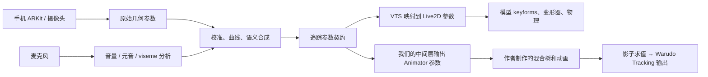

# VTS / VBridger 创作者路线与 Unity 面部动画预算

调查日期：2026-09-25。目的：决定 Warudo 复刻需要的**参数契约、姿势空间与动画制作量**。
这是一份设计调查，**没有生成控制器或动画，没有改变现行接收、处理链和 Warudo 蓝图**。

> 当前目标已经明确为“完整高质量模板、选择性填动画下放”，请以[全量参数与高级树契约](VTS_HIGH_QUALITY_FACE_CONTRACT.md)为设计入口；本篇预算演算只作历史例子。

已有依据：[控制器结构](FACE_TRACKING_CONTROLLER_STRUCTURE.md)、[中间层](FACE_TRACKING_MIDDLE_LAYER.md)、[参数标准](PARAMETER_STANDARDS.md)、[VB 旧取证](archive/VBRIDGER_IO_VOCABULARY.md)。
本轮逐项重新读取 `.research/vbridger/decrypted/` 十份预设，并核对官方资料、2024 官方教程章节及模型师本人发布的制作记录。

> **用户澄清后的阅读入口：** 当前要确定的是“哪些参数成二维矩阵、轴怎样产生”，采样格数由作者决定。
> 请先读[参数空间与轴来源](VTS_FACE_PARAMETER_SPACES.md)。本报告的69/99/104槽与旧槽清单仅保留为一次采样预算演算，**不作为推荐制作规格**。

**结论先行：如果目标是可定制、细腻的 VB 风格面捕，应以“高级嘴部语义 + 可编辑的组合姿势 + 少量修正”为制作目标。**
不能按 VB 预设列表行数、ARKit 52 个输入或麦克风音素数直接决定动画数量。
本轮曾演算一个例子：经典高级外嘴54格，附属动作后69槽，眉眼和视线后99槽，显式五元音再加5。
54格有创作者一手实例；69 / 99 / 104只是同一采样假设下的计算，不是VB官方模板统计或推荐规格。**实际要固定的是轴和耦合关系，格数由作者决定。**

## 1. “主流”实际应分三条路线

没有找到可信的预设使用率统计。**默认预设、教程中的常见做法、商业高定路线，不能互相当成使用率证据。**

| 路线 | 使用者实际交付/配置的东西 | 动画制作影响 |
| --- | --- | --- |
| VTS 普通模型；或 VB 的 VTS Compatible | 开合与嘴型为主，模型师交付模型与 VTS 映射。VB 可改善上游整形 | 典型嘴部是 Open × Form 的二维空间；9 格、25 格是两种制作采样密度，不是“9/25 种输入” |
| 完整 Advanced ARKit / VB 嘴 | 模型师额外做下颌、压唇、漏斗、嘴宽等，并配好对应映射与预设 | 外嘴内部有组合姿势；下颌与部分外围形变可独立。本文推荐作为复刻基线 |
| 自定义 / Perfect Sync 高定 | 创作者交付自己的一组输入公式、模型参数、绑定与示例；可保留左右嘴角、上下唇等更多自由度 | 真正新增可见动作才新增动画；没有通用的“Perfect Sync = N 份动画” |

官方入门明确说默认加载 **VTS compatible**，换其他设置应参考模型师要求。它是最宽泛的兼容入口，但不能据此说多数高品质模型也只用它。[VB 官方入门](https://github.com/PiPuProductions/VBridger-Documentation/wiki/1.-Getting-Started)

创作者样本：

- **みずのひら / 水平ななめ，2022-04-14**：本人记录外嘴与口内/下颌分开控制，另做 Funnel、PressLipOpen、Shrug、PuckerWiden。明确存在嘴唇闭合而下颌仍运动的需求。[制作记录](https://note.com/mzhrarara/n/ncb952254d590)
- **Pyroserenus，2022-06-24**：本人说明一份 VB 高级外嘴是 `3 × 3 × 2 × 3 = 54` keyforms，下颌与嘴宽独立；是实际作品说明，不能推广为所有作品的固定数量。[原帖与作者回复](https://www.reddit.com/r/Live2D/comments/vjdbr4/)
- **PiPuProductions，2024 官方教程**：口部章节专门讲参数叠加、跟随物理、QA；眉眼章节讲权重限制、眉眼碰撞与视线联动，见 §7。高级效果既依靠参数，也依靠作者修形。
- **iiiSekai / Bitsy**：公开展示面向 Live2D 的 Perfect Sync 定制，强调左右局部控制，产品同时交付模型源文件与参数导入文件。本轮只核对公开说明，未购买或检查其付费绑定，不能给它编造确切参数/叶子数。[作者说明](https://iiisekai.com/next-big-thing-in-vtubing-what-is-perfect-sync-for-3d-arkit-and-how-can-we-use-it-with-live2d/)、[交付内容](https://bepin.gumroad.com/l/PerfectSync)

Perfect Sync 的宣传经常使用“识别元音”描述视觉效果；**ARKit 形变系数本身不是音频识别出的 A/I/U/E/O**。不要把营销名称当成新的线协议。

## 2. 完整流程的契约边界



对应四个不同名字空间：

| 层 | 例子 | 不能混淆的地方 |
| --- | --- | --- |
| 手机原始输入 | `JawOpen`；中间层规范化为 `jawOpen` | 是设备观测；没有包含桌面 VTS 的全部计算结果 |
| VTS / VB 追踪参数 | `MouthOpen`、`MouthPressLipOpen`、`VoiceA` | 插件注入和 VTS 参数映射消费的数值 |
| Live2D 模型参数 ID | `ParamMouthOpenY`、`ParamJawOpen` 等 | 模型师实际绑定的自由度；自定义 ID 不保证一致 |
| 我们的姿势输入 | 例如 `Ho/Drive/Mouth/Open` | 下文示例是**提议的作者契约**，不是当前代码已经内置的新参数 |

**VB 发的是值，不会通过 API 把一张新嘴型或一段动画送给 VTS。** 新动作来自模型师预先做好的绑定。
VTS API 先声明自定义参数（名字、范围、默认值），再用 `InjectParameterDataRequest` 持续注入；映射仍由模型配置决定。
`set` 模式同参数只有一个插件覆盖写入者；`add` 允许多个插件累加；`weight` 的混合语义属于 `set`。持续控制要至少每秒续送一次。[VTS API](https://github.com/DenchiSoft/VTubeStudio#feeding-in-data-for-default-or-custom-parameters)

**我们的现行链路只接 VTS 手机 UDP 原始包。** `HoVtsPacket.cs` 读取 `BlendShapes`、头/眼向量、FaceFound、Hotkey 等；没有桌面 `Voice*` 音频适配器。
因此“电脑 VTS 打开麦克风”不能被当成“我们的中间层已经拿到 VoiceA”。手机第三方原始流与桌面 WebSocket 参数 API 是不同接口。[官方 UDP 示例](https://github.com/DenchiSoft/VTubeStudioBlendshapeUDPReceiverTest)、[现行解析器](../Runtime/FaceTracking/HoVtsPacket.cs)

以后做音频，需要实际接入一个音频数值来源，再合并到中间层输入：可评估读取桌面 VTS 的已计算参数、独立音频进程，或适合 Warudo 的音频模块。
**这不是本轮已实现功能**；也不能把带 Burst/Job/依赖包的 uLipSync 不经验证直接塞进 Warudo mod。先保留接口，部署按 [Warudo 限制](FACE_TRACKING_WARUDO_ROUTE.md) 单独验证。

对未来输入接口还应约定四件事：**来源/版本、值域与中性、逐源新鲜度、失效回退**。
脸丢失和麦克风断流要分开：没有脸仍可采用音频口型；音频关闭/失效时应归零音频权重并交还面捕，不能把失效误当成“还在持续发上一个元音”。
音频和视觉各带自己的采样/接收时间以便对齐。上述可用性与时间信息是控制数据，**不对应新增美术姿势**。

## 3. 本机十份 VB 预设到底差在哪

源：`D:/Steam/steamapps/common/VBridger/{Saves,DefaultSaves}` 与已有解码 JSON。
统计的“标量项”把 vector 行展开为 X/Y/Z，**不含运行期额外的健康标志，也不保证每项都实际映射到模型**。

| 预设（省略 VBridger_） | 存档行 → 展开项 | 作用 | 额外动画需求 |
| --- | --- | --- | --- |
| VTS_Compatible | 28 → 28 | 兼容普通 VTS；不含高级嘴的六个附加输出 | 不自动创造高级嘴 |
| AdvancedARKitSettings | 34 → 34 | 旧格式高级预设，头/身体分量分行 | 与后续版本的目标语义相近；不能按文件排序判“当前默认” |
| AdvancedARKit_V2.0 | 26 → 34 | 4 个 vector 行合并姿态；完整高级嘴 | 一套高级模型绑定 |
| …V2.0_PlusVolume | 26 → 34 | 相比 V2 **仅三行公式变了**，加入音量 | **0 个强制新增槽**，复用高级嘴 |
| …V2.0_Stepped | 26 → 34 | 相比 V2 仅 24 行的 step 开关/数据改变 | **0 个强制新增槽**；风格是分档/保持，可另做翻页美术 |
| …V3.0 | 26 → 34 | 眯眼改名，调整姿态、平滑、部分口部耦合 | 不凭版本号新增一套嘴型；范围/语义仍要迁移核对 |
| VisemesARKit | 34 → 34 | 用音频 viseme 合成既有高级嘴轴 | **不是 15 个 viseme 输出**，也不强制 +15 动画 |
| PNGTuber | 10 → 10 | 离散 Visemes、VoiceSilence、眨眼等 | 是另一种美术与显示方案，不是高级 Live2D 的下一档 |
| VMC_FaceOnly | 50 → 50 | 面向 VMC 的 ARKit 风格键名 | **仅 49 个唯一名**，有重复；不能当作完备52表 |
| VMC-Face-Head | 54 → 62 | 上述基础加4个向量行 | 61 个唯一展开名；旧研究已发现骨链表达式缺变量，不宜直接做标准 |

表中“六个附加输出”为：`JawOpen / MouthFunnel / MouthPressLipOpen / MouthPucker / MouthShrug / BrowInnerUp`。
兼容预设仍有 CheekPuff、TongueOut、MouthX、Eye_Squint 等输出，因此它也不是“只发两个嘴参数”。

三个特别容易误判的细节：

1. V2 / V3 中名叫 `VoiceVolumePlusMouthOpen` 的行与 `MouthOpen` 使用同一个**纯面捕**表达式；名字带 Voice 不等于读取麦克风。只有公式确实引用 `volume` 才有这层输入。
2. PlusVolume 的 `MouthOpen` 加的是 `(volume × .2)²`；`JawOpen` 与 `VoiceVolumePlusMouthOpen` 加的是 `volume × .2`。这些数值按本机预设记录，不能概括成三行相同音量混合。
3. V3 把 `Eye_Squint_L/R` 改为 `EyeSquintLeft/Right`；还去掉 MouthX、Pucker、Funnel、Press、Shrug 公式中的 `1 − tongueOut` 抑制。**输出数不变，组合冲突风险仍会变**，尤其伸舌＋嘟嘴/压唇。

逐字段 diff、所有公式/范围/曲线及源文件 SHA-256：[本轮审计 JSON](../.research/vts-creator-workflow/preset-audit.json)。
旧格式缺少现代 `on` 字段，不能按“字段缺失 = false”说它整份没启用。

## 4. 高级 VB 嘴的工作契约

以下是**本机 V3 存档声明范围与公式语义**，不是 VTS 内置参数的权威运行时范围。
实际映射还经过输入校准、输出曲线/平滑与 VTS 映射。特别是 `MouthSmile` 的公式在原始输入全零时算出 **0.5**，但存档默认值是 **0**；这两个不能当同一个“中性”。

| 输出 | 存档范围 | 需要模型师表达的动作 | 制作处理 |
| --- | --- | --- | --- |
| MouthOpen | 0…1 | 嘴唇开口；综合 jawOpen、mouthClose、roll、funnel | 外嘴组合空间 |
| MouthSmile | −1…1 | 嘴型/笑与垂嘴角的综合轴，公式中心约0.5 | 校准到模型的 Form 轴后进组合空间 |
| MouthFunnel | 0…1 | 漏斗口；`mouthFunnel − .2 × jawOpen` | 与开合、嘴型联合修形 |
| MouthPressLipOpen | −1.3…1.3 | 负侧收卷/压唇，正侧上下唇展开、露齿 | 两侧动作不同，不能当普通0…1权重 |
| JawOpen | 0…1 | 下颌/口内、下牙及下巴 | 与外嘴分开，避免全部绑在 Open 上 |
| MouthPucker | −1…1 | 负侧嘟/收窄，正侧 dimple 驱动的横向扩张 | 双向轴；不等于 ARKit `mouthPucker` 原值 |
| MouthX | −1…1 | 左右偏嘴，公式同时参考左右笑差 | 双向轴；左右方向要用模型实测确认 |
| MouthShrug | 0…1 | 耸唇/抬唇区，综合上下 shrug 与 press | 可独立，遇耦合再加修正 |
| CheekPuff | 0…1 | 鼓腮 | 附加形变 |
| TongueOut | 0…1 | 伸舌 | 附加形变，明确与嘴型冲突时的规则 |

眉眼另有：每侧 EyeOpen + Squint、BrowLeftY/RightY、BrowInnerUp，以及共用视线输入 EyeRightX/Y。
`Brows` 是综合眉量，`Voice…Plus…` 是别名/替代输入；**不能把它们都统计成必须额外制作的独立动作**。
V3 仅输出一组 EyeRightX/Y；如果要双眼完全独立注视，需要保留原始双眼数据或自定义输出。

建议我们在作者控制器内采用稳定的制作值域：Open/Jaw/Funnel 0…1，Form/Press/Pucker/X −1…1；设备与预设差异在中间层转换。
这只是提议，不机械执行 `Form = 2 × MouthSmile − 1`：它是否合适要按预设曲线、实际输入范围和模型中性校准，不能拿存档 min/max 猜。

### 4.1 官方示例模型实际怎样映射（已读取文件）

本轮下载了旧官方教程公开提供的 [VBridgerSampleModel](https://drive.google.com/file/d/1GNxI56un0Ze4P0jzCZxk0iiZHqjwirRw/view)，
并仅解析其中 `.cdi3.json / .model3.json / .vtube.json`。其配置保存元数据为 **2022-04-10、VTS 1.18.0**，不能当成2024教程或V3的现行成品。

它提供**同一模型的两份配置**：VB版28条映射、普通VTS版25条映射；两者引用同一个 `VBridgerSample.model3.json`。
显示信息 `.cdi3.json` 列出35个模型参数ID。**预设输出数、VTS映射数、模型参数数又一次明显不同。**

| VB版输入与范围 | 模型输出及映射端点 | 说明 |
| --- | --- | --- |
| MouthSmile 0…1 | ParamMouthForm −1…1 | 这个具体样例确实采用0.5对应Form中性0 |
| MouthOpen 0…1 | ParamMouthOpenY 0…1.5 | 开合输出可以超过默认“1”的习惯范围 |
| JawOpen 0…1 | ParamJawOpen 0…1.5 | 与外嘴分别控制 |
| MouthPucker −0.6…0.6 | ParamMouthPuckerWiden −1…1 | 不要求演员输入真的达到±1 |
| MouthFunnel 0…0.7 | ParamMouthFunnel −1…1 | 这是文件内的映射端点，不能据此臆测MOC真实参数范围/形状 |
| MouthPressLipOpen −1.3…1.3 | ParamMouthPressLipOpen −1…1 | 两边值域有转换 |
| MouthShrug 0…0.6 | ParamMouthShrug 0…1 | 以输入0.6作为满幅目标 |
| EyeOpenLeft/Right 0…1 | ParamEyeLOpen/ROpen 0…约1.9 | 眼睑具有超出普通开眼程度的范围 |

还有几个直接影响创作判断的事实：

- `MouthSmile` 同时驱动嘴型、左右 `EyeSmile` 和 `ParamCheek`；同一个输入能产生多个部位联动，**笑眼不一定需要独立输入**，但模型要有对应绑定。
- VB版口部关键映射的 VTS `Smoothing=0`；头/眼/脸颊有不同平滑值。追求清晰快速口型不能给全部通道再套一份相同平滑。
- 普通VTS版用 `MouthOpen` 代替 `JawOpen` 来驱动下颌，用 `MouthSmile` 代替独立 Pucker，并用笑去近似 Squint。**兼容模式可以复用高级模型既有姿势，只是失去独立控制信息。**
- 此旧样例用 `EyeSquintL/R` 输入名，和本机V2的 `Eye_Squint_L/R`、V3的 `EyeSquintLeft/Right` 都不同。旧样例不能直接充当新预设的即插即用绑定。
- 它没有把本机预设里的所有额外输出都接上；尤其不能由它反推“每个VB模型都必须有鼓腮、伸舌和BrowInnerUp”。

原文件、完整映射与校验哈希见 [官方样例审计](../.research/vts-creator-workflow/official-sample-audit.json)。
本轮未解读 `.cmo3/.moc3` 内部几何，**没有把35个参数ID误报为35个形态键或验证过的keyform数量**。

## 5. 麦克风究竟增加哪些契约、哪些动画

### 5.1 VTS Advanced Lipsync：10 个追踪参数

| 参数组 | 数量 | 范围 | 制作意义 |
| --- | --- | --- | --- |
| VoiceA / I / U / E / O | 5 | 0…1 | 5 个可混合元音权重；要采用显式元音姿势时才新增5份 |
| VoiceSilence | 1 | 0…1 | 静音趋向1；是接管控制量，不是必须新增的“第六张嘴” |
| VoiceVolume、VoiceVolumePlusMouthOpen | 2 | 0…1 | 音量与面捕开合辅助入口，可复用已有 Open 空间 |
| VoiceFrequency、VoiceFrequencyPlusMouthSmile | 2 | 0…1 | 元音合成的嘴型量及面捕辅助入口，**不是声学基频Hz** |

VTS 的 Advanced 基于 uLipSync；旧 Simple 基于 Oculus，官方推荐 Advanced。
uLipSync 本身是可校准的音频分析库，**其原始结果不等于 VTS 封装后的 Voice* 契约**。[VTS 音频说明](https://github.com/DenchiSoft/VTubeStudio/wiki/Lipsync)、[uLipSync 作者仓库](https://github.com/hecomi/uLipSync)

VTS 官方示例用 Silence 让摄像头嘴在有声时退向中性，再由五元音接管；不是十个输入全力叠加。
因此要区分两种投资：**只辅助现有嘴，+0；独立五元音嘴，+5**。后者若要开心/难过版本，应额外设计，不能假定自带情绪保留。
关闭麦克风时也必须明确回到面捕；VTS 的五元音权重限制只保证其自身输出，**我们自行接音频/做运算后需要自行约束**。

### 5.2 VB 音频：15 路分析结果可以被压成已有控制轴

官方 1.1 公告明确写的是 **OVR Audio Visemes**。此前本仓库把这15项归为“SAPI/JALI”不准确，已更正。
本地词表为 `SIL PP FF TH DD KK CH SS NN RR AA EE IH OH OU`，另有 `viseme_*_abs` 与 `volume`；这些是 VB 内部公式输入，不是 VTS 的 VoiceA…O。[官方更新说明](https://steamcommunity.com/app/1898830/announcements/)

VisemesARKit 实际输出仍为高级 MouthOpen、JawOpen、Funnel、Press、Pucker 等；例如 PP 参与压唇/闭口，OH/OU 参与收窄，音素加权和参与开合。
`viseme_SIL_abs` 在多条公式里选择音频或面捕来源；但**不是所有行都遵守一个统一完整的全嘴切换**，部分行有不同的门控或纯音频表达式。
所以可以借鉴它“音素 → 少数解剖/造型轴”的路线，但不能把整份旧预设描述成完美统一的混合策略。

### 5.3 我们更值得做的可选高定路线

日常面捕以视觉语义为主；音频主要补足说话时的嘴部 articulation，同时保留左右笑/情绪与眉眼。
一个可解释的参数融合提议是：对每根发音轴，`drive = (1 − a) × visual + a × audio`，`a` 由可用性、音量、静音与用户强度控制。
`a`、校准、迟滞与时间对齐放中间层；树只消费结果。只有统一成同语义/同量纲的轴才能这样融合。
该路线可先用现有高级嘴，不一定增加5个元音片段；缺点是要自己标定“元音 → 轴”的目标姿势。

若选择显式五元音，则另一条可行构图是面捕嘴子树按 Silence 衰减、五元音按有效权重叠加。
**不要把同一套音量/VoiceSilence门控重复乘两次**；也不要直接假定五元音的总和严格等于 `1 − Silence`，官方没有承诺该等式。

## 6. 叶子节点与动画数量怎样核算

### 6.1 四种计数必须分开

- **输入通道**：相机/音频观测数量，反映信息来源。
- **模型/控制器自由度**：比如 Open、Form、Funnel、Press 共4根轴。
- **组合采样槽**：4根轴各取3/3/2/3档，就是54个需要评价的姿势格。
- **唯一 .anim / 新雕刻形态键**：格子可共享片段，一片段可写多个形态键；新雕刻只由现有网格是否能做出目标姿势决定。

**不能把54格直接翻译为“必须雕54个 blendshape”。** 同样，一个叶子可以写嘴唇、牙齿、下巴多个权重。
也不能只看树节点个数推制作量：1D内部节点不对应新动画，零姿势/重复姿势还可复用。

### 6.2 一套完整、可核对的高级 VB 预算

假设：采用经典54格外嘴；附属动作可独立贡献；眼睑沿用我们现有 BlinkWide/Squint 语义；一格对应一个槽位，**先不做去重**。

| 区域 | 采样方案 | 叶子槽 |
| --- | --- | ---: |
| 外嘴 | Open 3 × Form 3 × Funnel 2 × Press 3 | 54 |
| 下颌/口内 | 闭、半开、全开 | 3 |
| 嘟嘴/扩宽 | 收窄、中性、扩宽 | 3 |
| 左右偏嘴 | 左、中、右 | 3 |
| 耸唇 | 中性、动作 | 2 |
| 鼓腮 | 中性、动作 | 2 |
| 伸舌 | 中性、动作 | 2 |
| **嘴部与附属小计** | | **69** |
| 左右眼睑 | 每眼 BlinkWide 3 × Squint 2 | 12 |
| 左右视线 | 每眼中心、左右、上下 | 10 |
| 左右眉高 | 每侧下、中、上 | 6 |
| 内眉抬起 | 中性、动作；先用合并轴 | 2 |
| **面部合计** | 不含头身骨骼、物理、热键表情 | **99** |
| 可选显式五元音 | A、I、U、E、O | **+5 = 104** |

这套预算不是“做完99个文件一定达到顶级效果”：它没有计入任意风格的专用修形。
如果眼球仍归 Warudo / LookAt，**去掉10个视线槽，89 / 94槽即可**。如果用既有五姿势眼睑而非每眼六格，再减2。
“闭＋眯”和“闭”往往可共用片段；中性格也可能共享。实际唯一文件数在完成曲线绑定/姿势去重后统计，不提前冒充精确制作量。

已列出104个唯一槽名及坐标：[制作槽清单 JSON](../.research/vts-creator-workflow/proposed-animation-slots.json)。其中99个 base、5个 audio_optional；没有创建占位 `.anim`。

### 6.3 混合树应该怎样表达54格

用四层嵌套1D可明确得到分段多线性插值：

```text
Press：3档
  每档 → Funnel：2档
    每档 → Form：3档
      每档 → Open：3档 → 外嘴姿势 .anim

1 + 3 + 6 + 18 = 28个内部1D树；54个叶子引用。
```

这是本文的 Unity 构图建议，不声称复现 Cubism 全部变形器求值。
也可用 `(Open,Form)` 二维树外包 Funnel/Press，但 Unity 不同二维算法的插值不必等于 Cubism 或嵌套1D，不能只看节点图相似就认为等效。[Unity 1D](https://docs.unity3d.com/Manual/BlendTree-1DBlending.html)

根部 Direct 汇总不同区域，保持现有影子台 + WD On 的约束；需要的常量权重/音频门控属于**作者自己的控制器参数与配置**，不恢复已经删掉的引擎区域门控。
同一区域的姿势应相对明确的中性基准制作，且保证曲线绑定集合一致。
**不能把多个完整绝对嘴姿势不归一化地相加，也不能让外嘴分支和 Jaw 分支无设计地重复拉同一个开口形态键。**[Unity Direct](https://docs.unity3d.com/Manual/BlendTree-DirectBlending.html)、[本仓库实测](BLEND_TREE_LIMITS.md)

### 6.4 什么时候不值得上54格

如果目标模型已经有良好分离的 ARKit 形态键，基础姿势近似可加，52个基函数叶子＋局部组合修正可能更有效。
这里只说“完整52键的基函数方案”，不是说所有角色都需要52个，或已有模型真的具备完整52键。
如果54格只是把同样的线性相加结果抄成54份，复杂度增加而造型没有增加；应只为确实需要人工修形的区域细化采样。

更硬的限制：目前会话只消费**形态键权重曲线**。现有网格缺少的卷唇、露齿、单侧笑、舌形变，不会因为多编树、多写 .anim 就被创造出来。
Cubism 的变形器父子关系、乘法形变和遮罩，也不能保证用 Unity 的几个加法权重直接等效；必要时补雕形态键或组合修正。

因此建议先把54个外嘴格作为**制作/验收表**。能由已有基函数准确表达的格共享逻辑，不能的格才制作独立修正，最终树可密可疏。

## 7. 更高级好看，实际该把制作量花在哪里

本轮成功读取了以下两段官方视频的**作者简介与章节**，保存在 `.research/vts-creator-workflow/`。
没有获取完整字幕，也没有逐帧审片；下面是明确的章节导航，不把章节标题冒充已经验证的每个内部绑定细节。

| 官方教程 | 建议重点章节 | 对我们意味着什么 |
| --- | --- | --- |
| [2024 Pt.2：眉眼](https://www.youtube.com/watch?v=pZx_I_Y6kq4) | 5:30左右内眉；8:20权重限制；19:30眉下压＋睁大碰撞；20:48内眉影响眼睑；22:05 EyeSmile；22:15 Squint；29:15睁大时视线；29:50眼睑方向 | 不能只做“闭/开”两个极端。眉眼、注视和笑眼的组合决定表现力 |
| [2024 Pt.3：VB嘴](https://www.youtube.com/watch?v=7ZpOy3_E3Zo) | 20:28/23:13内外下颌；24:47参数叠加；29:44漏斗；37:51压唇；43:28跟随物理；57:22 VTS设置；1:08:20 QA；1:13:32眼睑＋MouthX | 嘴唇与牙齿/下巴分工、自然跟随以及组合QA，比一味增加音素名更重要 |

建议的追加制作单，不把它冒充统一最低数量：

| 追加项 | 预算例子 | 新增条件 |
| --- | ---: | --- |
| 独立左右嘴角 | 左笑/右笑/左垂/右垂，4个非中性端点 | 要保留不对称表情；对称 Smile 与这些动作需分配职责，避免双驱动 |
| 独立上下唇 | 上/下抬唇与上/下卷唇，4个端点起 | 合并 PressLipOpen 不够表达，且模型有对应形变；可能再按左右细分 |
| 眉眼/视线修正 | 先挑2–6个最明显的冲突 | 例如睁大＋眉压、微笑＋半闭、视线侧转＋眼睑。数量由模型QA决定 |
| 伸舌＋开口/嘟嘴/压唇 | 先挑2–4个组合 | V3撤掉部分舌头抑制后尤其需要验证 |
| 带情绪的五元音 | 朴素三种情绪 × 5 = 15，较5元音多10 | 只有原有情绪轴叠加仍不好看，才整套新增；也可用少量修正代替 |

**选择这些项是在扩展/重构自由度，不一定能把表中数字直接加到99上。**
比如改成左右独立嘴角后，可能替换原来的整体Form空间；改成上下唇分离后，也可能替换合并Press轴。
所有轴相乘会爆炸：仅把上述54格再乘两档独立条件就108格，连续添加并不经济。

Cubism 有专门的 blendshape 权重限制来减轻组合破坏；我们应借鉴这种“明确允许怎样组合”的设计，而非相信增加通道后引擎自然会保持美观。[Cubism 权重限制](https://docs.live2d.com/en/cubism-editor-manual/limit-settings-for-blend-shape-weights/)

VTS 完整观感还含 idle、跟踪、一次性动画、表情、物理的优先级与淡入淡出；官方顺序低到高为默认→idle→tracking→一次性动画→expression→physics，表达式乘/加另有后处理。
**本报告的99槽是连续面部姿势预算，不代表已覆盖这套演出与物理系统。**[VTS 优先级说明](https://github.com/DenchiSoft/VTubeStudio/wiki/Interaction-between-Animations,-Tracking,-Physics,-etc.)

## 8. 初次调查的预算思路（采样建议已被用户澄清取代）

1. **先定高级VB语义，不把某一个预设文件当成模型契约。** 保留原始ARKit左右/上下分量，作者层以稳定语义轴工作；V2/V3/音频都作为供给这些轴的不同配置。
2. **先锁参数空间与轴来源，采样数由作者决定。** 69/99/89槽仅是本文举例，不能当作需要锁定的制作单；高级外嘴的重点是4轴耦合，见新报告的二维切片说明。
3. **音频先做“复用高级嘴轴”的可选模式。** 先验证效果与延迟；若显式五元音值得，再增加5槽，情绪扩展另算。日常模式保留演员的无声表情与不对称笑。
4. **高定优先左右嘴角与局部修正。** 不把15音素或52原始值直接全乘进笛卡尔网格；不为了预设名字听起来高级而复制动画。
5. **最终冻结动画数量的判据是目标网格能力和组合验收。** 逐项看：轻声快语、夸张元音、闭唇发声、无声微笑、单侧笑、闭嘴动下颌、伸舌混合、半闭笑眼、眉压睁大、视线极端、脸丢失/音频断流。不需要为每个验收动作都做独立动画。

本轮未做目标角色逐姿势视觉验证，所以不能宣称99槽已经足够或都是必须。已经完成的是：预设逐字段核对、官方/创作者证据核对、可复用契约划分及可计算的槽位预算。

## 9. 本轮工件与复核方法

- `.research/vts-creator-workflow/inspect_presets.py`：读取既有解码预设，输出参数审计、三组逐字段diff，以及99+5个槽的提议清单；只写本研究目录。
- `.research/vts-creator-workflow/preset-audit.json`：十份预设完整字段、展开计数、重复计数、音频引用、steps及源哈希。
- `.research/vts-creator-workflow/proposed-animation-slots.json`：每槽名称、区域、坐标、可选标志；可作为后续制作任务输入，**不是可加载的 hoface profile**。
- `.research/vts-creator-workflow/fetch_sources.py` 与 `source-fetch.json`：公开页面快照及获取结果。uLipSync内部单文件地址返回404，因此未据此声称检查过该结构源码；关于库的判断来自作者README。
- `vb-tutorial-*-description.json`：官方作者章节；VTS/VB官方wiki与API文本另存于同目录。
- `fetch_sample.py / inspect_sample.py / official-sample-audit.json`：公开旧官方示例的下载、JSON映射审计与哈希；同一模型两种配置是直接文件证据，分别使用18/11个不同的非空输入。

`.research` 在 gitignore 中；可提交的结论保存在本报告。核对脚本检查99/104计数与槽名唯一性，不涉及Unity行为测试；本轮没有改运行时代码。
