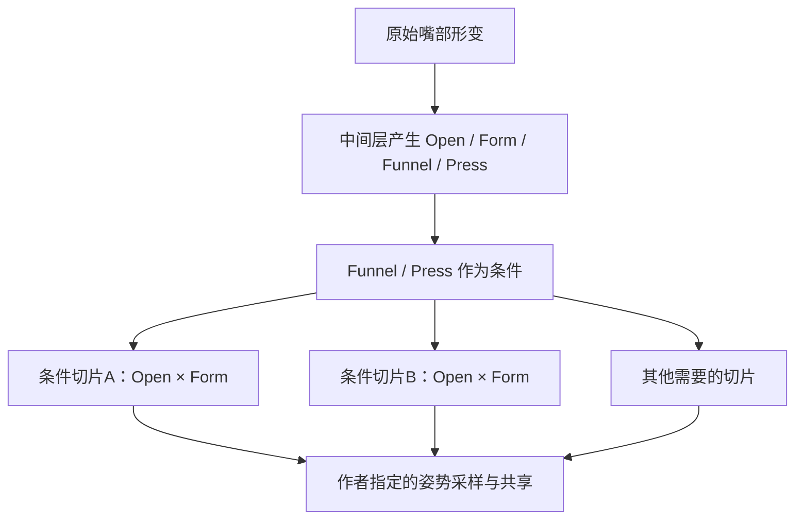

# VTS / VBridger 面部参数空间：哪些轴成矩阵，轴怎样产生

2026-09-25。按用户明确的设计问题整理：**确定需要共同评价的轴与条件；采多少点、是否方阵、每点做什么姿势，由模型/动画作者决定。**
此前[路线调查](VTS_CREATOR_WORKFLOW_RESEARCH.md)里的54/99等数字只是采样举例，不作为制作规格。

> **当前完整高级模板以[全量契约表](VTS_HIGH_QUALITY_FACE_CONTRACT.md)为准。** 本文保留轴关系的取证与解释；不再以“先少做一些”为设计目标，降配通过完整模板中选择性填动画实现。

**关键事实：VB预设保存“输入怎样算出输出”，VTS配置保存“输入映射到哪个模型参数”。两者都不保存模型的二维keyform组织。**
因此，预设可以精确证明轴来源；“哪些轴共同塑形”必须从模型绑定或创作者教程取证，或由我们明确作出设计选择。
本报告区分这几层，不把所有参数强行两两配成矩阵。

## 1. 先看空间清单

X/Y方向只是本文展示约定，可以交换；下表不规定格数。

| 区域/空间 | 横轴 | 纵轴 | 额外条件 | 依据与边界 |
| --- | --- | --- | --- | --- |
| **基础外嘴** | Form：嘴型/笑与垂嘴角 | Open：嘴唇开口 | 无，或固定Funnel/Press | **已证实的核心2D**：VTS基础嘴和VB创作者制作记录 |
| **高级VB外嘴** | 仍以 Form 为横轴 | 仍以 Open 为纵轴 | **Funnel、PressLipOpen** | **4D空间的二维切片**；经典创作者实例同时对这4轴打key，不是4轴可随便拆成两棵独立2D |
| **左眼睑** | Lid：闭合↔中性↔睁大 | Squint：眯眼 | 可加EyeSmile或注视条件 | **已证实的2D**：本地成熟控制器；VB输出恰好提供这两种独立语义 |
| **右眼睑** | 同上，右侧输入 | 右侧Squint | 同上 | 与左眼同构；镜像姿势是否复用由作者决定 |
| **眼球注视** | GazeX：左右 | GazeY：上下 | 需要时按眼睑状态修正 | **已证实的2D**：本地5点/9点资产；VB示例用同一组输入驱动两眼，独立双眼是另一种契约 |
| **眉毛协同（参考实现）** | BrowExpressionLeft | BrowExpressionRight | 无 | **已证实的2D，但来自VRCFT/Jerry血统**，不能冒称VB默认；用于合成内眉造型 |
| **单侧眉造型（VB取向）** | 该侧眉高BrowY | 内眉抬起BrowInnerUp | 另一侧/眼睑可作修正条件 | **可选设计**；VB有输入、官方教程有相关联动，未证明官方绑定固定采用这个2D配对 |
| **头部朝向造型** | FaceAngleX：左右转头 | FaceAngleY：抬低头 | FaceAngleZ一般另行旋转 | Live2D常用造型空间；在我们的真实3D/Warudo骨骼路径中，不默认算成面部动画矩阵 |
| **身体倾转造型** | BodyAngleX | BodyAngleY | Z/Position可另行处理 | 同上；VB这里可由头姿生成，不能假定有独立身体跟踪 |

**第一优先级应画的是外嘴空间、左右眼睑空间、注视空间。** 眉毛选择一套设计血统；其余根据角色需求加条件切片或修正。
“存在两个输入”不证明必须做完整二维笛卡尔网格；非方阵、边界共用、不同区域不同密度都成立。

## 2. 每根轴从哪里来

下面的公式来自本机 `VBridger_AdvancedARKit_V3.0.vbridger.txt`。
`_L/_R` 是**VB内部已校准的输入名**；不是我们手机UDP的大小写拼写，也不是最终模型参数ID。
表中表达式后还要经过该行的输出曲线、平滑等，再经过模型范围映射；**表达式值、存档default、最终模型中性不必相同**。

### 2.1 外嘴：多路原始形变压成4根造型轴

设：

```text
smile = mouthSmile_L + mouthSmile_R
frown = mouthFrown_L + mouthFrown_R
dimple = mouthDimple_L + mouthDimple_R
roll = mouthRollUpper + mouthRollLower
lipRaise = mouthUpperUp_L + mouthUpperUp_R
         + mouthLowerDown_L + mouthLowerDown_R
```

| 矩阵轴/条件 | VB公式的简写 | 最终用于制作的语义 |
| --- | --- | --- |
| **Open** | `jawOpen − mouthClose − .2×roll + .2×mouthFunnel` | 嘴唇开口程度；**不是单独jawOpen** |
| **Form**的来源 MouthSmile | `(2 − frown − mouthPucker + smile + .5×dimple) / 4` | 综合嘴型；原始形变全零时公式是0.5 |
| **Funnel** | `mouthFunnel − .2×jawOpen` | 漏斗/圆口控制 |
| **PressLipOpen** | `lipRaise / 1.8 − roll` | 负侧压/卷唇，正侧唇展开/露齿 |

这里还有模型映射这一步：旧官方样例实际为 `MouthSmile 0…1 → ParamMouthForm −1…1`，因此**在这份样例内**可写 `Form = 2×MouthSmile − 1`。
它同时把 Press 从±1.3映射到±1，把Funnel输入0…0.7映射到模型配置端点−1…1。
这些是具体样例的校准，不是所有模型通用的阈值。[样例文件审计](../.research/vts-creator-workflow/official-sample-audit.json)

为自己的树定值域时，应明确写出每根轴的**中性、两端含义和映射曲线**，之后所有矩阵用同一份约定。
例如可用Form −1…1、Open 0…1；但不能把VB的 `MouthSmile` 值未经映射直接塞进以0为中性的Form树。

### 2.2 眼睑：3个输入合成2根轴

每眼独立：

| 来源 | 横轴Lid | 纵轴Squint | 中性与方向 |
| --- | --- | --- | --- |
| **VB V3** | `.5 − .8×eyeBlink + .8×eyeWide` | `eyeSquint` | 横轴增加表示更睁开；公式静息约0.5，再经过曲线/映射 |
| **我们当前配置** | `eyeBlink − eyeWide` | `eyeSquint` | 横轴+1闭、0中性、−1睁大；Squint从0到1 |
| **VRCFT参考** | `.75×Openness + .25×EyeWide` | EyeSquint | 0闭、0.75中性、1睁大；Openness是其自身的观测语义 |

这三套是**同类姿势空间的不同坐标约定**，不能共用阈值不改坐标。
VB公式在未过曲线时与当前横轴有 `VB_Lid = .5 − .8×Our_BlinkWide` 的关系；加了各自校准、裁剪和非线性曲线后不能再称为精确全链路等价。

在该二维空间里，眯眼会改变半闭、正常开眼、睁大时的造型，所以需要联合评价。
但**闭眼边界上的多个Squint值可以是同一个闭眼姿势**，无需为了补成方阵制造不同动画。
这正是既有稀疏眼睑控制器值得借鉴的地方。[已验证的本地轴与控制器](FACE_TRACKING_CONTROLLER_STRUCTURE.md#41-成对通道与双向轴一手取证)

### 2.3 注视：4个方向合成2根轴

一般语义是：水平由 In/Out 合成，垂直由 Up/Down 合成。正负方向还要结合左右眼局部坐标与模型镜像约定。

**本机VB V3实际采用：**

```text
EyeRightX = (eyeLookIn_L − .1) − eyeLookOut_L
EyeRightY = (eyeLookUp_L − eyeLookDown_L) + .15×browOuterUp_L
```

名字虽然是EyeRight，公式实际引用`_L`，不能依输出名猜来源。
旧官方模型映射又把X从 `−1…1` 反向映射为 `1…−1`；它用同一对参数驱动模型的共用 `ParamEyeBallX/Y`。
**若你要独立左右眼矩阵，就在自己的中间层保留左右各自的GazeX/Y；不要从这个已合并的输出再“还原”双眼。**
单眼矩阵可用十字、带对角或不均匀采样；这不会改变它是GazeX×GazeY的二维语义。

### 2.4 眉毛：先选择你希望保留的自由度

VB V3提供：

```text
BrowLeftY  = .5 + browOuterUp_L − browDown_L + (mouthRight − mouthLeft)/8
BrowRightY = .5 + browOuterUp_R − browDown_R + (mouthLeft − mouthRight)/8
BrowInnerUp = browInnerUp
Brows = .5 + (browOuterUp_R + browOuterUp_L − browDown_L − browDown_R)/4
```

- 选择**单侧眉高×内眉抬起**：每侧一张矩阵；BrowInnerUp可共用。适合分别修平眉/八字/压眉的组合，但这是我们可选的绑定布局。
- 选择**左右眉情绪协同**：参考本地Jerry的 `Brow Inner Up Blend`。横纵轴为BrowExpressionLeft/Right，每侧先算 `min(1, .5×InnerUp + .5×OuterUp) − BrowDown`；二维树输出内眉形状。这是**另一套语义**，不是把VB的BrowLeftY和BrowRightY直接改名。
- 选择只用**Brows合并轴**：旧VB示例就是把它同时映射到两侧眉高、眉形。这是一维输入联动多个输出，**不是二维矩阵**。

VRCFT这里的BrowDown是其统一层语义；不要只凭同名假定与ARKit原始键数值一致。
本轮重新检查了真实 `.controller` 的 `m_BlendType` 与两根参数；没有拿1D树里残留的 `m_BlendParameterY` 冒充二维证据。

## 3. 高级外嘴为什么不能只列一堆独立2D对

经典VB嘴的一手创作者说明同时使用 **Open、Form、Funnel、Press**，而Jaw和Pucker独立。
该作者选了3/3/2/3档，但那是他的采样，**你不需要沿用档数**。[创作者原帖](https://www.reddit.com/r/Live2D/comments/vjdbr4/)

要忠实保留这类组合关系，应该把它记成：

```text
外嘴姿势 = Mouth(Open, Form, Funnel, Press)

给定一组 Funnel、Press 条件：
    画一张 Open × Form 的二维姿势表
换一组 Funnel、Press 条件：
    画另一张 Open × Form 的二维姿势表

每张表采哪些点、多少点、哪些点共享姿势：作者决定
不同表之间怎样过渡：由Funnel/Press控制
```



也可以换切片方式，例如固定Form/Funnel，编辑 `Open × Press`。**它仍是同一4D空间的另一种浏览方式**，不是又额外多了一类独立动作。

不能未经验证就替换为 `Tree(Open,Form) + Tree(Funnel,Press)`：这隐含所有交互都可加性分离，恰好丢掉“不同开口/笑容时，漏斗和压唇形状不一样”的能力。

如果你的形态键基础已经很好，可采用更疏的结构：基础Open×Form + 独立附加形变 + 少数条件修正。
这种缩减是**模型上成立的分解假设**；判断依据是组合后的实际造型，不是两个独立参数是否能写在两棵树上。

## 4. 哪些额外参数不应先硬配成矩阵

| 语义 | 本机VB V3轴来源 | 初始判断 |
| --- | --- | --- |
| JawOpen | `jawOpen` | 先保留独立轴；负责下颌/口内。需要闭唇下颌、牙唇关系修形时，再评估Jaw×Open条件修正 |
| Pucker/Widen | `2×(mouthDimple_L+mouthDimple_R) − mouthPucker` | 双向轴，先独立；与Open/Form的组合不理想才升级为条件 |
| MouthX | `mouthLeft−mouthRight + mouthSmile_L−mouthSmile_R` | 双向轴，先独立；与眼睑/嘴形的修正按风格决定 |
| Shrug | `(mouthShrugUpper+mouthShrugLower+mouthPress_R+mouthPress_L)/4` | 独立轴起步；与Pucker需要共同造型时可选配对 |
| CheekPuff | `cheekPuff` | 独立鼓腮；闭口条件可以先由中间层控制，不一定新增矩阵 |
| TongueOut | `tongueOut` | 独立伸舌；若与Open、Funnel或Press冲突，选必要的组合修正 |

V3去掉了部分嘴轴上的 `1−tongueOut` 抑制，所以这些轴会更容易同时有值；**这证明需要处理组合，不证明必须做一个完整Tongue×所有嘴参数的大矩阵**。

一对相反输入往往应该合成**一根**双向轴：Left/Right、Smile/Frown、Blink/Wide。两根原始通道不自动意味着二维。
反过来，多个原始输入也可以产生两根矩阵轴：眼睑就是Blink/Wide/Squint三路变成二维。

## 5. 高级好看的修正矩阵：候选关系，不是额外必做网格

| 候选交互 | 为什么要一起看 | 本轮证据强度 |
| --- | --- | --- |
| **Lid × EyeSmile** | 同样开合度下普通眼与笑眼轮廓不同 | 旧官方模型确有两种独立模型参数；2024 Pt.2有EyeSmile章节。**未从CMO证明固定2D打key结构** |
| **Lid × GazeY**，必要时含GazeX | 注视极端时眼睑应跟随，睁大时又不同 | 2024 Pt.2列出EyeWide Look Directions、Eyelids Directions；具体配对/拆分是作者选择 |
| **BrowY × Lid** | 眉下压＋睁大时碰撞/遮挡 | 2024 Pt.2 19:30专门列出该组合检查 |
| **InnerBrow × Lid** | 内眉情绪牵动上眼睑 | 2024 Pt.2 20:48列出内眉作用于眼睑 |
| **MouthX × Lid** | 偏嘴表情带动眼周，或需要局部校形 | 2024 Pt.3 1:13:32列出Eyelid Mouth X Blendshapes；未证明必须完整二维矩阵 |
| **Shrug × Pucker** | 耸唇与横向收扩可能共同改变嘴轮廓 | 2024 Pt.3 43:16章节名涉及两者；不据标题断言内部一定是单个2D变形器 |
| **Open × Tongue / Press** | 伸舌、牙唇接触、闭口关系 | 语义上合理的自定义修正候选，是否需要取决于目标模型 |

来源：[官方Pt.2](https://www.youtube.com/watch?v=pZx_I_Y6kq4)、[官方Pt.3](https://www.youtube.com/watch?v=7ZpOy3_E3Zo)。
本轮读到的是作者公开章节与旧官方配置，不把未观看的内部操作当成已证实的矩阵。

尤其要区分 **EyeSmile 与 Squint**：一个可以来自MouthSmile的表情联动，一个来自眼部眯眼观测。
若两者都要独立保留，眼睑实际是 `Lid × Squint × EyeSmile`，要条件切片或经过验证的叠加分解；不能把二者当同一根Y轴而不说明信息损失。

## 6. 麦克风怎样进入这些矩阵

| 音频路线 | 对矩阵轴的影响 | 是否新建矩阵 |
| --- | --- | --- |
| 音量辅助 | 修改已有Open/Jaw轴的数值 | 通常不改变姿势空间 |
| VTS VoiceFrequency辅助 | 把音频元音信息压成已有Form轴的来源 | 通常仍是Open×Form |
| VB VisemesARKit | 15路viseme被公式压成Open/Jaw/Funnel/Press/Pucker等现有轴 | 复用高级嘴空间；15不是矩阵边长或动画数 |
| VTS VoiceA/I/U/E/O显式嘴型 | 五种语音权重驱动姿势，Silence协调视觉嘴 | 这是多权重空间，**天然不是某两根连续轴的2D网格** |
| 显式元音还要保留情绪 | 对每个元音增加Form/情绪条件，或叠加已验证的情绪修正 | 可视为“元音选择/权重 + Form”条件族；不要把任意元音编号当有自然距离的连续X轴 |

VTS音频参数来自uLipSync封装；VB音频用OVR visemes。VoiceFrequency是合成嘴型量，不是Hz。
VoiceSilence是接管/回退信号；时间、新鲜度、开关也属于控制数据，不能全算成美术矩阵轴。[VTS音频文档](https://github.com/DenchiSoft/VTubeStudio/wiki/Lipsync)、[VB官方音频公告](https://steamcommunity.com/app/1898830/announcements/)

## 7. 控制器作者真正需要填写的“矩阵契约”

每个空间只确定下列项目，采样表留给作者：

```text
空间：左眼睑
X参数：Ho/Drive/Lid/Left/BlinkWide
X来源：eyeBlinkLeft − eyeWideLeft（当前中间层已有）
X含义：−1睁大，0中性，+1闭眼
Y参数：Ho/Drive/Lid/Left/Squint
Y来源：eyeSquintLeft（当前中间层已有）
Y含义：0不眯，1眯眼
控制属性：作者指定的左眼睑形态键集合
附加条件：是否保留EyeSmile/视线修正，由作者决定
采样点：[作者填写(x,y,动画)]；不规定方阵与格数
边界共享：作者决定哪些闭眼采样点可用同一动画
```

外嘴同理，但额外写上 `conditionAxes = [Funnel, Press]`；不要把条件偷偷塞进动画名，导致装配时不清楚该在哪一层插值。
对非方阵空间还应明确插值算法与未采样区域如何过渡；“有一张2D表”不意味着任意算法输出相同。

建议下一步的产物是**轴与空间定义表 + 空的作者采样清单**，不是固定叶子数的模板。现在先冻结“能表达什么”，再由你决定“要在哪些位置摆姿势”。
