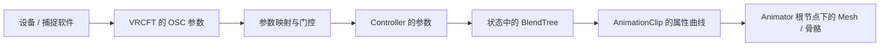

> **已归档（2026-09-23）。** 这份讲的是**怎么用 Jerry 的现成模板**（预制件、参数表、模板自带的手势控制层）。
> 我们后来改成**自己生成**驱动层，所以使用说明部分已经不适用了；
> 里面关于"参数 / 混合树 / 动画绑定"的机制解释，已被
> [混合树的能力边界](../BLEND_TREE_LIMITS.md)（更准）和
> [面捕工作流](../FACE_TRACKING_WORKFLOW.md)（我们自己的流程）覆盖。

# 面捕混合树入门与 Jerry ARKit 模板使用

调查日期：2026-09-22。本文是使用说明与源码调查；端到端链路已在独立 Unity 工程里用本地回环 UDP 跑通自动化验收，**真机联调未做**。组件方案见 [面捕调试组件设计](../FACE_TRACKING_DEBUGGER_DESIGN.md)。

**当前首期已确定使用 iFacialMocap 直连。** 本文保留 VRC/Jerry 模板教程，帮助理解和复用动画设计；第一版组件无需先安装或配置 VRCFT。手机输入会先驱动我们自己的纯 Unity ARKit Controller。

## 1. 先回答几个关键问题

**混合树负责根据参数混合动画；动画片段中的曲线才决定修改哪个 Mesh 的哪个键。** 使用 Unity 的 BlendTree，需要让包含它的 Animator Controller 被求值；可以由 Animator 直接播放，也可以通过 PlayableGraph 中的 AnimatorControllerPlayable 播放。不需要自己重写混合算法。

**混合树不持有场景里的 Mesh 对象引用。** 片段通常记录相对 Animator 根节点的路径、组件类型、属性名。换模型后，即使形态键名字相同，只要层级路径不同，绑定仍可能失败。

**LookAt 不必全部搬进 Animator Controller。** 当前 HoLookAt 的头部已经通过 OnAnimatorIK 参与动画流程，眼睛在 LateUpdate 写入。我们需要管理求值顺序和属性控制权；状态机可以控制 LookAt 权重，而方向解算仍由组件完成。

**ARKit 模型可以接收 VRCFT。** 模型的形态键规范、设备输出规范、网络参数名字是三件不同的事。Jerry 的 ARKit 模板正是在 VRCFT 参数与 ARKit 形态键之间做转换。

## 2. 从一个张嘴动作理解整条链路



例如，网络收到 `/avatar/parameters/FT/v2/JawOpen = 0.6`。接收器剥掉协议路径前缀，得到 Animator 参数 `FT/v2/JawOpen`，按目标声明的类型写入。Jerry 模板还会经过本地/远端处理和平滑代理参数，最后有树使用 `OSCm/Proxy/FT/v2/JawOpen`。

一个最简单的 1D 树可以这样配置：

| 子动画 | 阈值 | 写入内容 |
| --- | --- | --- |
| 闭嘴片段 | 0 | `Body / SkinnedMeshRenderer / blendShape.jawOpen = 0` |
| 张嘴片段 | 1 | 同一属性 = 100 |

当树参数为 0.6 时，这两个常量姿势在该树内混合，得到约 60 的形态键权重。这里的 60 只解释这棵简单树；上层树、图层权重、其他曲线和后续组件仍可能改变最后结果。

Jerry 的 `Animations/Face Blendshapes/ARkit/Jaw_Open.anim` 确实记录了 `path: Body`、`attribute: blendShape.jawOpen`、`classID: 137`、常量 100。相应的 `Jaw_Open 0.anim` 写 0。**这里没有场景对象的实例引用，也没有自动查找“所有叫 jawOpen 的键”。**

对于如下模型，动画路径应为 `Meshes/Face`，不是 `Face`，也不是模型文件名：

```text
Character                  ← Animator 所在物体 / 动画绑定根
├─ Armature
└─ Meshes
   └─ Face                 ← SkinnedMeshRenderer
      └─ sharedMesh 中有 jawOpen、mouthClose 等形态键
```

形态键存在于 Mesh 数据中；动画修改的是 **SkinnedMeshRenderer 实例上的权重**。正常调试无需改写 sharedMesh 顶点或源 FBX。

依据：[Unity 1D 混合](https://docs.unity3d.com/2021.3/Documentation/Manual/BlendTree-1DBlending.html)、[曲线绑定结构](https://docs.unity3d.com/2021.3/Documentation/ScriptReference/EditorCurveBinding.html)、[模板片段目录](https://github.com/Adjerry91/VRCFaceTracking-Templates/tree/14b650c9f6d18d24170e026fc84e94bc01aac48c/Packages/adjerry91.vrcft.templates/Animations/Face%20Blendshapes/ARkit)。

## 3. BlendShape、BlendTree、Controller、Animator 分别是什么

| 名称 | 可以把它理解为 | 是否知道场景对象 |
| --- | --- | --- |
| BlendShape / 形态键 | 模型中预先制作的一种形变，例如 jawOpen | Mesh 提供形变，Renderer 保存实例权重 |
| AnimationClip | 给一个或多个属性写曲线，也可以只是静态姿势 | 通常保存相对路径和属性绑定 |
| BlendTree | 根据参数决定子 Clip / 子树的混合权重 | 本身不选择场景 Mesh |
| Animator Controller | 参数、状态、转换、图层、树及行为的组织资产 | 通过 Animator 上下文解析绑定 |
| Animator 组件 | 角色上的动画执行与绑定入口；Humanoid 还提供 Avatar | 是，挂在场景对象上 |
| PlayableGraph | 用代码组织动画求值、多个 Controller 和混合节点 | AnimationPlayableOutput 指定目标 Animator |

1D 树用一个参数在多个姿势间混合；2D 树用两个参数，例如横向/纵向视线；Direct 树为每个子项指定权重参数，适合同时组合多个表情。**Direct 树不等于“每个形态键随便相加”**：仍要考虑 Normalize Blend Values、共享属性、嵌套树、图层混合方式及默认值。

AnimationClip 还可以驱动骨骼、材质或组件的可动画字段。曲线能写序列化字段不等于能直接调用 C# 属性 setter；HoLookAt 的 `Weight` 等公开属性是脚本接口，如需由控制器参数驱动，应加明确的桥接器。

依据：[Unity Direct Blending](https://docs.unity3d.com/2021.3/Documentation/Manual/BlendTree-DirectBlending.html)、[AnimatorControllerPlayable](https://docs.unity3d.com/2021.3/Documentation/ScriptReference/Animations.AnimatorControllerPlayable.html)。

## 4. Jerry 仓库里到底包含什么

本次核对包版本 `7.0.5`、提交 `14b650c9f6d18d24170e026fc84e94bc01aac48c`，不把这些数字当作未来版本的保证。

| 资产 | 作用 |
| --- | --- |
| `Prefabs/VF_ARKit_VRCFT.prefab` | VRCFury 装配入口 |
| `Prefabs/MA_ARKit_VRCFT.prefab` | Modular Avatar 装配入口；与 VF 二选一 |
| `Animators/ARkit Blendshapes/FX - Face Tracking - ARKit Blendshapes.controller` | 面部参数处理、状态和形态键动画 |
| 同目录的 `Parameters - Face Tracking - ARkit Blendshapes.asset` | VRC Expression Parameters 声明，区别于 Controller 参数 |
| 同目录的 `Face Tracking Control  - ARKit Blendshapes.asset` | 表情菜单 |
| `Animations/.../ARkit` / `ARKit` | 写 ARKit 形态键的动画片段 |
| `Prefabs/Sub/VF_EyeRotation.prefab` | 引入独立的 Additive 眼球旋转控制器 |
| `Face Tracking Debug` | 模板自己的角色内调试资产 |

静态解析该 ARKit FX Controller 得到 **3 个图层、206 个参数、412 棵 BlendTree 子资产、10 个状态和 10 个行为对象**。三层是 `FX - Face Tracking - ARKit Blendshapes`、`Tracking_State`、`Face_Tracking`。这说明它是完整系统，不是 52 个形态键对应 52 根直连线。

几个对实际使用有影响的发现：

- 输入含 `FT/v2/...`，下游大量使用 `OSCm/Proxy/FT/v2/...`，中间还有二进制解码、本地/远端选择及平滑。网络输入应进输入层，不能一边运行这些处理一边强写其代理输出。
- `IsLocal`、`EyeTrackingActive`、`LipTrackingActive` 在该 Controller 中是 Float；外部协议或 Expression Parameters 可能是 Bool。需要按目标类型转换，不能只猜名字。
- 10 个状态的序列化 `m_WriteDefaultValues` 均为 1。**不应为“规范化”批量改成 Off**；这是本次模板事实，与我们自己新建控制器的 WD 策略分开。
- ARKit 子目录动画中检出了 52 种形态键绑定，路径均指向 `Body`；这不代表每帧 52 项都会被写入，也不代表设备能追踪全部 52 项。
- `mouthClose` 并不是简单的 `1 - jawOpen`。模板有嘴闭合、下巴及其他口部之间的嵌套逻辑；调一个参数可能影响多项输出。排查这对通道时同时观察输入、代理参数及两个最终键值。
- VF ARKit Prefab 还实例化了眼球旋转子 Prefab。面捕和 LookAt 都用眼球骨骼时，必须关闭或隔离其中一路眼球输出；只看 FX 形态键列表会漏掉冲突。

依据：[包与 Prefab 源码](https://github.com/Adjerry91/VRCFaceTracking-Templates/tree/14b650c9f6d18d24170e026fc84e94bc01aac48c/Packages/adjerry91.vrcft.templates)、[ARKit 控制器](https://github.com/Adjerry91/VRCFaceTracking-Templates/blob/14b650c9f6d18d24170e026fc84e94bc01aac48c/Packages/adjerry91.vrcft.templates/Animators/ARkit%20Blendshapes/FX%20-%20Face%20Tracking%20-%20ARKit%20Blendshapes.controller)。

## 5. 现在就使用原版 ARKit 模板的步骤

这条流程用于 **VRC Avatar 工程**，用于先理解模板及验证模型；不是要求普通 HoUnityTools 工程引入整套 VRC SDK。

1. 使用满足上游要求的 Unity 2022 工程和 VRC Avatar SDK；上游说明要求 SDK 3.7.0+。安装 VRCFury 或 Modular Avatar，并通过 Jerry 的包列表安装模板。
2. 在 SkinnedMeshRenderer 上手调 `jawOpen`、`mouthClose`、`eyeBlinkLeft/Right`，确认模型自身形变正确、大小写匹配。面捕输入不能补出模型没有制作的形变。
3. 将 `VF_ARKit_VRCFT` 或 `MA_ARKit_VRCFT` 放到 Avatar 根节点下，选择与所安装装配插件对应的一种。
4. 默认绑定目标是根节点下的 `Body`。若模型是 `Meshes/Face`，VF 组件的 Advanced Options → Path Rewrite Rules 中把 `Body` 前缀改到 `Meshes/Face`。MA 版没有上游这项相同的重写功能，不应指望改一个 Renderer 引用就解决；可选 VF 路线。模板自带 Debug 面板的 Mesh 设置也需对应调整。
5. 处理原有手势表情和自动眨眼，让它们在面捕启用时让位。上游要求手势转换增加 `FacialExpressionsDisabled == false`；Prefab 不会自动修改这些手势转换。已有眨眼状态也需要退出条件。
6. 安装 Av3Emulator，进入 Play Mode，启用模拟器并选中角色。在角色菜单开启 eye/lip tracking。
7. **先不用设备**：在模拟器 User Input 中手调暴露的参数，验证脸能变化。眼睑、张嘴和左右笑分别测试；同一次测试只指定一个参数写入来源，避免 Inspector 与实时 OSC 互相覆盖。
8. 在 Lyuma Av3 Runtime 选择 `Animator To Debug` 指向 FX，打开 Animator 窗口；找到 `Face_Tracking` 层及 `FT Blendshape Driver (EDIT THIS)` 状态，双击进入树。观察 `OSCm/Proxy/FT/v2/...` 与实际 Renderer 键值一起变化。
9. 需要设备输入时，打开 `Tools/Avatars 3.0 Emulator/OSC Control Panel`，启用接收 Socket。核对本地接收端口、VRCFT 输出端口、所选 Avatar 和实际收到的 OSC 路径。默认端口对通常为接收 9000、发向本机 9001；不要让 VRChat 和模拟器同时占用同一个接收端口。
10. 若收到零参数，先看 VRCFT 模块状态和参数相关性，再看网络。Force Relevancy 可辅助发送 Float 参数诊断，但不是完整角色参数配置的替代品；版本差异详见设计文档。

额外表情应按上游建议消费代理参数，并通过附加装配资产扩展；学习时可以检查树，日常不要直接改包里的原始 Controller。官方流程及更新约束见 [模板 README](https://github.com/Adjerry91/VRCFaceTracking-Templates/blob/14b650c9f6d18d24170e026fc84e94bc01aac48c/README.md)、[Setup Wiki](https://github.com/Adjerry91/VRCFaceTracking-Templates/wiki/Face-Tracking-Template-Setup)、[Av3Emulator README](https://github.com/lyuma/Av3Emulator/blob/e015d6c94921cabda19cfdb119c15243fb3de93f/README.md)。

## 6. 为什么普通 Unity 工程不能只拖原版 Controller

原版 Prefab 负责合并多个控制器、表达参数与菜单、路径重写；Controller 还包含 VRC 参数驱动和 Tracking Control 行为。普通 Unity Animator 能执行标准树和曲线，但不会自动实现 VRChat 的这些协议语义。VRC 的多个 Playable Layers 也不等于一个 Unity Controller 内部的几个 Layers。

| 做法 | 能得到什么 | 适合用途 |
| --- | --- | --- |
| VRC 工程 + 原版 Prefab + 装配插件 + Av3Emulator | 最接近原版运行环境 | 学习、对照、验证原模板 |
| 普通 Animator 直接挂完整原版 FX Controller | 标准动画部分可能求值；特殊行为和外围装配不完整 | 不作为“已兼容”方案 |
| 我们自己的纯 Unity 面部 Controller | 清楚的输入、绑定、权重和输出集合 | HoUnityTools 首期受控调试 |
| 只挑一棵原版树做独立预览 | 能研究特定表情映射；依赖参数必须显式补齐 | 高级诊断，不代表原版运行结果 |

复用一棵树时，先递归检查子树、Clip、参数、被曲线驱动的参数及行为。需要临时包装 Controller 与 State，指定初始值；不能把 BlendTree 当作可直接绑定到 MonoBehaviour 的独立运行时播放器。

本次不把上游资产拷入 HoUnityTools。以后若分发其源码或片段副本，应保留上游 MIT 文件与版权声明；上游 README 还提出产品页面可见署名要求，应一并遵循。我们首期的 ARKit 调试资产由自身生成器创建。参考：[上游 LICENSE](https://github.com/Adjerry91/VRCFaceTracking-Templates/blob/14b650c9f6d18d24170e026fc84e94bc01aac48c/LICENSE.md)。

## 7. LookAt 与面捕应该怎样组合

推荐默认分工：嘴、眉、脸颊、眼睑由面捕；头颈和眼球方向由 HoLookAt；自动眨眼在有效眼睑面捕期间让位，失联后恢复。

即使眼球方向用骨骼，也要禁止面捕对凝视形态键或另一套眼球骨骼动画施加方向变化，否则视觉上会“转两次”。眨眼与凝视分组，不能为了禁视线把整个 EyeTrackingActive 清零，连真实眨眼也一并切掉。

```text
接收并解析参数
    → 决定这一帧各通道的输入来源（实时 / 手动 / 保持 / 中性 / 交还）
    → 把有效值写进影子的面部 Controller 参数
    → Unity 正常动画求值：角色的 Animator 跑自己的身体动画
                         影子 Animator 跑面部混合树
       → OnAnimatorIK：HoLookAt 交给 Unity 解算头颈
    → LateUpdate：HoLookAt 应用眼球方向
                  面捕把影子上的形态键值抄到真实 Renderer（只抄自己拥有的键）
    → 果冻/高光等后处理消费明确的输入并写各自拥有的键
```

**混合树和 LookAt 不是"都在动画控制器里做"的关系。** 具体到当前实现：

- **面捕的混合树在一台影子里求值**：隐藏的镜像层级 + 一个只跑面部 Controller 的 Animator。角色的 Animator 完全不被接管，身体动画、Timeline、其它工具都照常。
- **LookAt 走它自己的路**：头颈在 `OnAnimatorIK`，眼睛在 `LateUpdate`，方向解算由组件负责，控制器只管权重这类控制值。
- **两者唯一的交界是"谁写哪个形态键"**：面捕会话启动时把要写的键登记进占用表，Ho 写入器（眨眼、LookAt 形态键、果冻高光）遇到被占用的键就不写、也不在清理时覆盖它；面捕交还或断流后，基础动画按自己的节奏接回。
- 凝视形态键分组与 LookAt 眼球同时启用会**直接报冲突**，而不是各写一半造成"转两次"。

这条时序已经在独立 Unity 工程里跑通自动化验收（真实 UDP → 参数 → 混合树 → 形态键，以及交还、断流、停止恢复）。仍未验收的是人形 Avatar 下的眼球骨骼长时间无漂移。

“完全掌握动画控制”应体现为：每个参数来自哪里、每个最终属性由谁控制、何时混合、停用后交给谁，都能看见。它不要求把网络接收、目标方向解算和全部程序逻辑硬塞进状态机 —— 当前实现也确实没这么做：网络、门控、方向解算都在组件里，控制器只负责"参数 → 姿势"。具体门控与执行方案见 [设计文档](../FACE_TRACKING_DEBUGGER_DESIGN.md) 第 7 节。
